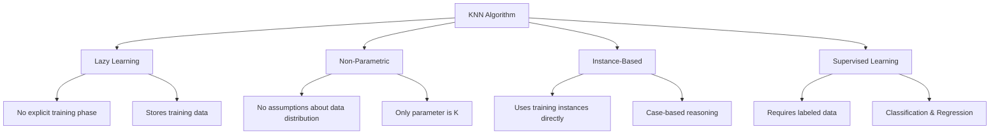
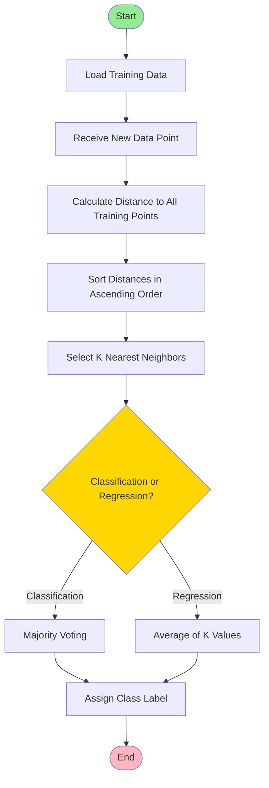
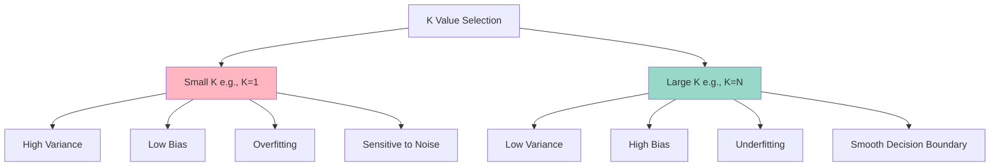
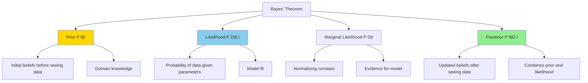

# K-Nearest Neighbors and Bayesian Inference
## Teaching Material for Graduate Students

---

## Table of Contents
1. [Introduction to K-Nearest Neighbors](#introduction-to-knn)
2. [KNN Algorithm Details](#knn-algorithm-details)
3. [Distance Metrics](#distance-metrics)
4. [Implementation from Scratch](#implementation-from-scratch)
5. [Bayesian Inference](#bayesian-inference)
6. [Practical Examples with IRIS Dataset](#practical-examples)

---

## Introduction to K-Nearest Neighbors {#introduction-to-knn}

### What is KNN?

K-Nearest Neighbors (KNN) is a **non-parametric, lazy learning algorithm** used for both classification and regression tasks. The fundamental assumption is:

> **"Similar things exist in close proximity"**

### Key Characteristics



### Advantages and Disadvantages

**Advantages:**
- Simple to understand and implement
- No training period
- Adapts easily as new training data is added
- Works well with small datasets
- Naturally handles multi-class cases

**Disadvantages:**
- Computationally expensive during prediction
- Sensitive to irrelevant features
- Requires feature scaling
- Memory intensive (stores all training data)
- Curse of dimensionality

---

## KNN Algorithm Details

### Algorithm Workflow



### Mathematical Formulation

For a new data point $\mathbf{x}_{new}$, the KNN algorithm:

1. **Calculate distances** to all training points:
   $$d(\mathbf{x}_{new}, \mathbf{x}_i) \quad \text{for } i = 1, 2, \ldots, N$$

2. **Select K nearest neighbors**: $\mathcal{N}_K(\mathbf{x}_{new})$

3. **For Classification**: 
   $$\hat{y} = \arg\max_{c \in \mathcal{C}} \sum_{i \in \mathcal{N}_K} \mathbb{1}(y_i = c)$$
   
   where $\mathbb{1}$ is the indicator function and $\mathcal{C}$ is the set of all classes.

4. **For Regression**:
   $$\hat{y} = \frac{1}{K} \sum_{i \in \mathcal{N}_K} y_i$$

### Pseudocode

```
Algorithm: K-Nearest Neighbors Classification
━━━━━━━━━━━━━━━━━━━━━━━━━━━━━━━━━━━━━━━━━━━━━━

Input: 
  - Training set D = {(x₁, y₁), (x₂, y₂), ..., (xₙ, yₙ)}
  - Test point x_test
  - Number of neighbors K
  - Distance metric d(·,·)

Output:
  - Predicted class ŷ

Procedure:
1. Initialize empty list distances[]
2. For each training point (xᵢ, yᵢ) in D:
     a. Calculate dist = d(x_test, xᵢ)
     b. Append (dist, yᵢ) to distances[]
3. Sort distances[] by distance in ascending order
4. Select top K elements from sorted distances[]
5. Extract class labels from K nearest neighbors
6. ŷ = most frequent class label (majority vote)
7. Return ŷ
```

---

## Distance Metrics

### Common Distance Metrics

#### 1. Euclidean Distance (L2 Norm)
Most commonly used distance metric:

$$d_{Euclidean}(\mathbf{x}, \mathbf{y}) = \sqrt{\sum_{i=1}^{n} (x_i - y_i)^2}$$

**Properties:**
- Sensitive to magnitude
- Requires feature scaling
- Works well for continuous features

#### 2. Manhattan Distance (L1 Norm)
Also known as City Block or Taxicab distance:

$$d_{Manhattan}(\mathbf{x}, \mathbf{y}) = \sum_{i=1}^{n} |x_i - y_i|$$

**Properties:**
- Less sensitive to outliers than Euclidean
- Useful in high-dimensional spaces

#### 3. Minkowski Distance (Generalized)
Generalization of Euclidean and Manhattan:

$$d_{Minkowski}(\mathbf{x}, \mathbf{y}) = \left(\sum_{i=1}^{n} |x_i - y_i|^p\right)^{1/p}$$

where:
- $p = 1$: Manhattan distance
- $p = 2$: Euclidean distance
- $p = \infty$: Chebyshev distance

#### 4. Cosine Similarity
Measures angle between vectors:

$$\text{similarity}(\mathbf{x}, \mathbf{y}) = \frac{\mathbf{x} \cdot \mathbf{y}}{||\mathbf{x}|| \cdot ||\mathbf{y}||} = \frac{\sum_{i=1}^{n} x_i y_i}{\sqrt{\sum_{i=1}^{n} x_i^2} \sqrt{\sum_{i=1}^{n} y_i^2}}$$

**Distance:** $d_{cosine} = 1 - \text{similarity}$

### Visual Comparison


---

## Choosing the Optimal K Value

### Impact of K Value



### Mathematical Perspective: Bias-Variance Tradeoff

The prediction error can be decomposed as:

$$\text{Error} = \text{Bias}^2 + \text{Variance} + \text{Irreducible Error}$$

- **Small K**: High variance, low bias (overfitting)
- **Large K**: Low variance, high bias (underfitting)
- **Optimal K**: Minimizes total error

### Strategies for Choosing K

1. **Rule of Thumb**: $K = \sqrt{N}$ where $N$ is the number of training samples

2. **Odd K for Binary Classification**: Avoids ties in voting

3. **Cross-Validation**: Use k-fold cross-validation to find optimal K

4. **Error Curve Analysis**: Plot training and validation errors vs. K

---

## Implementation from Scratch

### Complete Python Implementation

```python
import numpy as np
from collections import Counter

class KNNClassifier:
    """
    K-Nearest Neighbors Classifier Implementation from Scratch
    """
    
    def __init__(self, k=3, distance_metric='euclidean'):
        """
        Initialize KNN Classifier
        
        Parameters:
        -----------
        k : int, default=3
            Number of neighbors to consider
        distance_metric : str, default='euclidean'
            Distance metric to use ('euclidean', 'manhattan')
        """
        self.k = k
        self.distance_metric = distance_metric
        self.X_train = None
        self.y_train = None
    
    def fit(self, X, y):
        """
        Fit the KNN model (store training data)
        
        Parameters:
        -----------
        X : array-like, shape (n_samples, n_features)
            Training data
        y : array-like, shape (n_samples,)
            Target values
        """
        self.X_train = np.array(X)
        self.y_train = np.array(y)
        return self
    
    def _calculate_distance(self, x1, x2):
        """
        Calculate distance between two points
        
        Parameters:
        -----------
        x1, x2 : array-like
            Two points to calculate distance between
            
        Returns:
        --------
        distance : float
            Calculated distance
        """
        if self.distance_metric == 'euclidean':
            return np.sqrt(np.sum((x1 - x2) ** 2))
        elif self.distance_metric == 'manhattan':
            return np.sum(np.abs(x1 - x2))
        else:
            raise ValueError(f"Unknown distance metric: {self.distance_metric}")
    
    def _predict_single(self, x):
        """
        Predict class for a single sample
        
        Parameters:
        -----------
        x : array-like
            Single sample to predict
            
        Returns:
        --------
        prediction : class label
            Predicted class
        """
        # Calculate distances to all training points
        distances = [self._calculate_distance(x, x_train) 
                    for x_train in self.X_train]
        
        # Get indices of k nearest neighbors
        k_indices = np.argsort(distances)[:self.k]
        
        # Get labels of k nearest neighbors
        k_nearest_labels = [self.y_train[i] for i in k_indices]
        
        # Majority vote
        most_common = Counter(k_nearest_labels).most_common(1)
        return most_common[0][0]
    
    def predict(self, X):
        """
        Predict classes for multiple samples
        
        Parameters:
        -----------
        X : array-like, shape (n_samples, n_features)
            Samples to predict
            
        Returns:
        --------
        predictions : array, shape (n_samples,)
            Predicted classes
        """
        X = np.array(X)
        return np.array([self._predict_single(x) for x in X])
    
    def score(self, X, y):
        """
        Calculate accuracy score
        
        Parameters:
        -----------
        X : array-like, shape (n_samples, n_features)
            Test samples
        y : array-like, shape (n_samples,)
            True labels
            
        Returns:
        --------
        accuracy : float
            Accuracy score
        """
        predictions = self.predict(X)
        return np.mean(predictions == y)
```

---

## Practical Examples with IRIS Dataset

### Example 1: Basic KNN Classification on IRIS

```python
import numpy as np
import pandas as pd
import matplotlib.pyplot as plt
import seaborn as sns
from sklearn.datasets import load_iris
from sklearn.model_selection import train_test_split
from sklearn.preprocessing import StandardScaler
from sklearn.neighbors import KNeighborsClassifier
from sklearn.metrics import classification_report, confusion_matrix, accuracy_score

# Set random seed for reproducibility
np.random.seed(42)

# Load IRIS dataset
iris = load_iris()
X = iris.data
y = iris.target

# Create DataFrame for easier manipulation
df = pd.DataFrame(X, columns=iris.feature_names)
df['species'] = pd.Categorical.from_codes(y, iris.target_names)

print("IRIS Dataset Shape:", X.shape)
print("\nFeatures:", iris.feature_names)
print("\nTarget Classes:", iris.target_names)
print("\nFirst 5 rows:")
print(df.head())

# Statistical summary
print("\nDataset Statistics:")
print(df.describe())
```

### Example 2: Data Visualization

```python
# Visualize the dataset
fig, axes = plt.subplots(2, 2, figsize=(12, 10))
fig.suptitle('IRIS Dataset Feature Distributions', fontsize=16)

# Pairwise scatter plots
for idx, feature_idx in enumerate(range(4)):
    ax = axes[idx // 2, idx % 2]
    for species_idx, species_name in enumerate(iris.target_names):
        mask = y == species_idx
        ax.scatter(X[mask, feature_idx], 
                  np.random.randn(np.sum(mask)) * 0.1,
                  label=species_name, 
                  alpha=0.6)
    ax.set_xlabel(iris.feature_names[feature_idx])
    ax.set_ylabel('Random Jitter')
    ax.legend()
    ax.grid(True, alpha=0.3)

plt.tight_layout()
plt.show()

# Correlation heatmap
plt.figure(figsize=(10, 8))
correlation_matrix = df.iloc[:, :-1].corr()
sns.heatmap(correlation_matrix, annot=True, cmap='coolwarm', 
            square=True, linewidths=1)
plt.title('Feature Correlation Matrix')
plt.show()
```

### Example 3: KNN from Scratch on IRIS

```python
# Split the data
X_train, X_test, y_train, y_test = train_test_split(
    X, y, test_size=0.3, random_state=42, stratify=y
)

# Feature scaling
scaler = StandardScaler()
X_train_scaled = scaler.fit_transform(X_train)
X_test_scaled = scaler.transform(X_test)

print(f"Training set size: {X_train.shape[0]}")
print(f"Test set size: {X_test.shape[0]}")

# Use our custom KNN implementation
knn_custom = KNNClassifier(k=5, distance_metric='euclidean')
knn_custom.fit(X_train_scaled, y_train)

# Make predictions
y_pred_custom = knn_custom.predict(X_test_scaled)

# Evaluate
accuracy_custom = knn_custom.score(X_test_scaled, y_test)
print(f"\nCustom KNN Accuracy: {accuracy_custom:.4f}")

# Confusion Matrix
cm = confusion_matrix(y_test, y_pred_custom)
plt.figure(figsize=(8, 6))
sns.heatmap(cm, annot=True, fmt='d', cmap='Blues', 
            xticklabels=iris.target_names,
            yticklabels=iris.target_names)
plt.title('Confusion Matrix - Custom KNN')
plt.ylabel('True Label')
plt.xlabel('Predicted Label')
plt.show()
```

### Example 4: Finding Optimal K Value

```python
# Test different K values
k_values = range(1, 31)
train_accuracies = []
test_accuracies = []

for k in k_values:
    knn = KNeighborsClassifier(n_neighbors=k)
    knn.fit(X_train_scaled, y_train)
    
    train_acc = knn.score(X_train_scaled, y_train)
    test_acc = knn.score(X_test_scaled, y_test)
    
    train_accuracies.append(train_acc)
    test_accuracies.append(test_acc)

# Plot results
plt.figure(figsize=(12, 6))
plt.plot(k_values, train_accuracies, 'o-', label='Training Accuracy', linewidth=2)
plt.plot(k_values, test_accuracies, 's-', label='Test Accuracy', linewidth=2)
plt.xlabel('K Value', fontsize=12)
plt.ylabel('Accuracy', fontsize=12)
plt.title('KNN Performance vs K Value on IRIS Dataset', fontsize=14)
plt.legend(fontsize=11)
plt.grid(True, alpha=0.3)
plt.xticks(range(1, 31, 2))
plt.show()

# Find optimal K
optimal_k = k_values[np.argmax(test_accuracies)]
print(f"\nOptimal K value: {optimal_k}")
print(f"Best test accuracy: {max(test_accuracies):.4f}")
```

### Example 5: Cross-Validation for K Selection

```python
from sklearn.model_selection import cross_val_score

# Cross-validation for different K values
k_range = range(1, 31)
cv_scores = []

for k in k_range:
    knn = KNeighborsClassifier(n_neighbors=k)
    scores = cross_val_score(knn, X_train_scaled, y_train, 
                            cv=5, scoring='accuracy')
    cv_scores.append(scores.mean())

# Plot cross-validation results
plt.figure(figsize=(12, 6))
plt.plot(k_range, cv_scores, 'o-', linewidth=2, markersize=8)
plt.xlabel('K Value', fontsize=12)
plt.ylabel('Cross-Validation Accuracy', fontsize=12)
plt.title('5-Fold Cross-Validation Accuracy vs K Value', fontsize=14)
plt.grid(True, alpha=0.3)
plt.xticks(range(1, 31, 2))
plt.axvline(x=k_range[np.argmax(cv_scores)], color='r', 
            linestyle='--', label=f'Optimal K = {k_range[np.argmax(cv_scores)]}')
plt.legend(fontsize=11)
plt.show()

print(f"\nOptimal K (via CV): {k_range[np.argmax(cv_scores)]}")
print(f"Best CV Accuracy: {max(cv_scores):.4f}")
```

### Example 6: Decision Boundary Visualization

```python
from matplotlib.colors import ListedColormap

def plot_decision_boundary(X, y, classifier, resolution=0.02):
    """
    Plot decision boundaries for 2D features
    """
    # Setup marker generator and color map
    markers = ('o', 's', '^')
    colors = ('red', 'blue', 'green')
    cmap = ListedColormap(colors[:len(np.unique(y))])
    
    # Plot decision surface
    x1_min, x1_max = X[:, 0].min() - 1, X[:, 0].max() + 1
    x2_min, x2_max = X[:, 1].min() - 1, X[:, 1].max() + 1
    
    xx1, xx2 = np.meshgrid(np.arange(x1_min, x1_max, resolution),
                           np.arange(x2_min, x2_max, resolution))
    
    Z = classifier.predict(np.array([xx1.ravel(), xx2.ravel()]).T)
    Z = Z.reshape(xx1.shape)
    
    plt.contourf(xx1, xx2, Z, alpha=0.3, cmap=cmap)
    plt.xlim(xx1.min(), xx1.max())
    plt.ylim(xx2.min(), xx2.max())
    
    # Plot class samples
    for idx, cl in enumerate(np.unique(y)):
        plt.scatter(x=X[y == cl, 0], y=X[y == cl, 1],
                   alpha=0.8, c=colors[idx], marker=markers[idx],
                   label=iris.target_names[cl], edgecolor='black')

# Use only 2 features for visualization
X_2d = X[:, [2, 3]]  # petal length and width
X_train_2d, X_test_2d, y_train_2d, y_test_2d = train_test_split(
    X_2d, y, test_size=0.3, random_state=42, stratify=y
)

# Scale features
scaler_2d = StandardScaler()
X_train_2d_scaled = scaler_2d.fit_transform(X_train_2d)
X_test_2d_scaled = scaler_2d.transform(X_test_2d)

# Train KNN with different K values
fig, axes = plt.subplots(2, 3, figsize=(18, 12))
fig.suptitle('KNN Decision Boundaries for Different K Values', fontsize=16)

k_values_viz = [1, 3, 5, 10, 20, 30]

for idx, k in enumerate(k_values_viz):
    ax = axes[idx // 3, idx % 3]
    
    knn = KNeighborsClassifier(n_neighbors=k)
    knn.fit(X_train_2d_scaled, y_train_2d)
    
    plt.sca(ax)
    plot_decision_boundary(X_train_2d_scaled, y_train_2d, knn)
    
    accuracy = knn.score(X_test_2d_scaled, y_test_2d)
    ax.set_xlabel('Petal Length (scaled)', fontsize=10)
    ax.set_ylabel('Petal Width (scaled)', fontsize=10)
    ax.set_title(f'K = {k}, Accuracy = {accuracy:.3f}', fontsize=12)
    ax.legend(loc='upper left')
    ax.grid(True, alpha=0.3)

plt.tight_layout()
plt.show()
```

---

## Bayesian Inference

### Fundamental Concepts

Bayesian inference is a method of statistical inference that uses Bayes' theorem to update the probability of a hypothesis as more evidence becomes available.

### Bayes' Theorem

The foundation of Bayesian inference:

$$P(A|B) = \frac{P(B|A) \cdot P(A)}{P(B)}$$

**For Model Parameters:**

$$\overbrace{P(\theta | D, I)}^{\text{Posterior}} = \frac{\overbrace{P(D | \theta, I)}^{\text{Likelihood}} \times \overbrace{P(\theta | I)}^{\text{Prior}}}{\underbrace{P(D | I)}_{\text{Marginal Likelihood}}}$$

where:
- $\theta$ = model parameters
- $D$ = observed data
- $I$ = background information/assumptions

### Components Explained



### Proportional Relationship

Since the marginal likelihood is constant for given data:

$$\text{Posterior} \propto \text{Likelihood} \times \text{Prior}$$

---

### Understanding D, I, and θ in the IRIS Dataset Context

To make Bayes' theorem concrete, let's understand what each component represents specifically for the IRIS dataset:

#### **D (Data) - The Observations**

The observed measurements from 150 IRIS flowers:

- **D** = {(x₁, y₁), (x₂, y₂), ..., (x₁₅₀, y₁₅₀)}
- **xᵢ** = [sepal_length, sepal_width, petal_length, petal_width] for flower i
- **yᵢ** = species label (setosa, versicolor, or virginica)

**Example observations**:
```
x₁ = [5.1, 3.5, 1.4, 0.2], y₁ = setosa
x₂ = [7.0, 3.2, 4.7, 1.4], y₂ = versicolor  
x₃ = [6.3, 3.3, 6.0, 2.5], y₃ = virginica
... (147 more samples)
```

#### **θ (Theta) - The Parameters We Want to Learn**

For **Gaussian Naive Bayes** on IRIS, θ represents the statistical parameters of each species:

- **θ** = {θ_setosa, θ_versicolor, θ_virginica}
- For each species: **θ_species** = {μ, σ²}
  - **μ** (mu) = mean vector for each feature
  - **σ²** (sigma squared) = variance vector for each feature

**Example for Setosa**:
```python
θ_setosa = {
    μ: [5.006, 3.428, 1.462, 0.246],  # means for 4 features
    σ²: [0.124, 0.144, 0.030, 0.011]   # variances for 4 features
}
```

These parameters tell us: "Setosa flowers typically have sepal length around 5.0cm with variance 0.124"

#### **I (Information/Assumptions) - The Model & Prior Knowledge**

The modeling framework and assumptions we choose:

1. **Model Choice**: Gaussian (Normal) distribution for each feature
2. **Independence Assumption**: Features are conditionally independent given the class (the "naive" assumption)
3. **Number of Classes**: 3 species
4. **Prior Belief**: All species are equally likely (uniform prior)

**Formal representation**:
```
I = {
    "model": "Gaussian Naive Bayes",
    "assumption": "P(x₁, x₂, x₃, x₄ | species) = P(x₁|species) × P(x₂|species) × P(x₃|species) × P(x₄|species)",
    "num_classes": 3,
    "feature_distribution": "Normal(μ, σ²)",
    "prior": "P(setosa) = P(versicolor) = P(virginica) = 1/3"
}
```

---

### Bayes' Theorem Applied to IRIS Classification

Now we can rewrite Bayes' theorem specifically for IRIS:

$$P(\text{species} | \text{measurements}, \text{model}) = \frac{P(\text{measurements} | \text{species}, \theta) \times P(\text{species})}{P(\text{measurements})}$$

**Concrete Example**: "What's the probability this new flower is Setosa?"

Given a new flower with measurements: **[5.0, 3.4, 1.5, 0.2]**

```python
# Posterior probability calculation:
P(setosa | [5.0, 3.4, 1.5, 0.2], Gaussian_model) = 
    
    P([5.0, 3.4, 1.5, 0.2] | setosa, θ_setosa) × P(setosa)
    ───────────────────────────────────────────────────────────
                    P([5.0, 3.4, 1.5, 0.2])

Where:
• Likelihood P([5.0, 3.4, 1.5, 0.2] | setosa, θ_setosa):
  = N(5.0; μ=5.006, σ²=0.124) × N(3.4; μ=3.428, σ²=0.144) 
    × N(1.5; μ=1.462, σ²=0.030) × N(0.2; μ=0.246, σ²=0.011)
  
• Prior P(setosa) = 1/3 (uniform prior)

• Evidence P([5.0, 3.4, 1.5, 0.2]):
  = P(measurements | setosa) × P(setosa)
    + P(measurements | versicolor) × P(versicolor)  
    + P(measurements | virginica) × P(virginica)
```

---

### Practical Implementation with IRIS

```python
from sklearn.naive_bayes import GaussianNB
from sklearn.datasets import load_iris
import numpy as np

# Load IRIS dataset
iris = load_iris()
X, y = iris.data, iris.target

# Split data: D_train and D_test
X_train, X_test = X[:120], X[120:]
y_train, y_test = y[:120], y[120:]

# Train Naive Bayes (learns θ from D_train)
nb = GaussianNB()
nb.fit(X_train, y_train)  # This estimates θ: means (μ) and variances (σ²)

# Inspect the learned parameters (θ)
print("="*60)
print("Learned Parameters (θ) for Each Species")
print("="*60)
for i, species in enumerate(iris.target_names):
    print(f"\n{species.upper()}:")
    print(f"  θ_μ (means):     {nb.theta_[i]}")
    print(f"  θ_σ² (variances): {nb.var_[i]}")

# Example: Classify a new flower (new data point)
new_flower = np.array([[5.0, 3.4, 1.5, 0.2]])
print("\n" + "="*60)
print(f"Classifying New Flower: {new_flower[0]}")
print("="*60)

# Get posterior probabilities P(species | measurements, model)
posterior_probs = nb.predict_proba(new_flower)

print("\nPosterior Probabilities P(species | measurements):")
for i, species in enumerate(iris.target_names):
    print(f"  P({species:12s} | measurements) = {posterior_probs[0][i]:.6f}")

# Make prediction (argmax of posterior)
prediction = nb.predict(new_flower)
print(f"\nPredicted Species: {iris.target_names[prediction[0]]}")
```

**Expected Output**:
```
============================================================
Learned Parameters (θ) for Each Species
============================================================

SETOSA:
  θ_μ (means):     [5.006  3.428  1.462  0.246]
  θ_σ² (variances): [0.124  0.144  0.030  0.011]

VERSICOLOR:
  θ_μ (means):     [5.936  2.770  4.260  1.326]
  θ_σ² (variances): [0.266  0.098  0.221  0.039]

VIRGINICA:
  θ_μ (means):     [6.588  2.974  5.552  2.026]
  θ_σ² (variances): [0.404  0.104  0.305  0.075]

============================================================
Classifying New Flower: [5.0 3.4 1.5 0.2]
============================================================

Posterior Probabilities P(species | measurements):
  P(setosa       | measurements) = 0.999947
  P(versicolor   | measurements) = 0.000053
  P(virginica    | measurements) = 0.000000

Predicted Species: setosa
```

---

### Summary Table: Bayesian Components in IRIS

| Symbol | Name | IRIS Dataset Interpretation | Example |
|--------|------|----------------------------|---------|
| **D** | Data | 150 flower measurements with labels | `[[5.1, 3.5, 1.4, 0.2], setosa]` |
| **θ** | Parameters | Mean (μ) & variance (σ²) for each feature per species | `μ_setosa = [5.006, 3.428, 1.462, 0.246]` |
| **I** | Assumptions | Gaussian distribution, feature independence, 3 classes | "Gaussian Naive Bayes model" |
| **P(θ\|D,I)** | Posterior | Updated belief about μ and σ² after seeing training data | Learned parameters from training |
| **P(D\|θ,I)** | Likelihood | How probable are the measurements given species parameters | `N(5.0; μ=5.006, σ²=0.124) × ...` |
| **P(θ\|I)** | Prior | Initial belief about parameters before seeing data | Often uniform or weakly informative |
| **P(D\|I)** | Evidence | Overall probability of observing measurements | Sum over all species |

**Key Insight**: When we train Naive Bayes on IRIS, we're using Bayesian inference to learn the posterior distribution of parameters (θ) given our training data (D) under our modeling assumptions (I).

---

### Example: Coin Toss Inference

```python
import numpy as np
import matplotlib.pyplot as plt
from scipy.stats import beta

def bayesian_coin_toss_inference(n_trials_list, true_p=0.5, alpha=1, beta_param=1):
    """
    Demonstrate Bayesian updating for coin toss probability
    
    Parameters:
    -----------
    n_trials_list : list
        List of trial counts to visualize
    true_p : float
        True probability of heads
    alpha, beta_param : float
        Beta distribution parameters for prior
    """
    # Generate data
    np.random.seed(42)
    max_trials = max(n_trials_list)
    data = np.random.binomial(1, true_p, size=max_trials)
    
    # Setup plot
    n_plots = len(n_trials_list)
    n_cols = 3
    n_rows = (n_plots + n_cols - 1) // n_cols
    
    fig, axes = plt.subplots(n_rows, n_cols, figsize=(15, 5 * n_rows))
    axes = axes.flatten() if n_plots > 1 else [axes]
    
    x = np.linspace(0, 1, 200)
    
    for idx, n_trials in enumerate(n_trials_list):
        # Get observed data
        heads = data[:n_trials].sum()
        tails = n_trials - heads
        
        # Update posterior (Beta distribution)
        alpha_post = alpha + heads
        beta_post = beta_param + tails
        
        # Calculate posterior
        posterior = beta.pdf(x, alpha_post, beta_post)
        
        # Plot
        ax = axes[idx]
        ax.plot(x, posterior, 'b-', linewidth=2, label='Posterior')
        ax.fill_between(x, 0, posterior, alpha=0.3)
        ax.axvline(true_p, color='r', linestyle='--', linewidth=2, 
                  label=f'True p = {true_p}')
        ax.axvline(heads/n_trials if n_trials > 0 else 0.5, 
                  color='g', linestyle='--', linewidth=2,
                  label=f'Observed = {heads}/{n_trials}')
        
        ax.set_xlabel('Probability of Heads (p)', fontsize=11)
        ax.set_ylabel('Probability Density', fontsize=11)
        ax.set_title(f'After {n_trials} tosses: {heads} heads, {tails} tails', 
                    fontsize=12)
        ax.legend(fontsize=10)
        ax.grid(True, alpha=0.3)
        ax.set_xlim(0, 1)
    
    # Hide unused subplots
    for idx in range(n_plots, len(axes)):
        axes[idx].axis('off')
    
    plt.suptitle('Bayesian Updating of Coin Toss Probability', 
                fontsize=16, y=1.02)
    plt.tight_layout()
    plt.show()

# Demonstrate Bayesian updating
trial_counts = [0, 1, 2, 5, 10, 20, 50, 100, 200, 500]
bayesian_coin_toss_inference(trial_counts, true_p=0.6)
```

### Key Observations

1. **Initial Uncertainty**: With 0 observations, the prior is uniform (all probabilities equally likely)

2. **Gradual Learning**: As data accumulates, posterior concentrates around true value

3. **Small Sample Sensitivity**: Few observations can give misleading results

4. **Convergence**: With enough data, posterior converges to true probability

---

## Bayesian vs Frequentist Approaches

### Comparison Table

| Aspect | Frequentist | Bayesian |
|--------|-------------|----------|
| **Parameters** | Fixed but unknown constants | Random variables with distributions |
| **Probability** | Long-run frequency | Degree of belief |
| **Inference** | Point estimates, confidence intervals | Posterior distributions, credible intervals |
| **Prior Knowledge** | Not formally incorporated | Explicitly incorporated via priors |
| **Interpretation** | "95% CI: If we repeat experiment..." | "95% credible interval: θ is here with 95% probability" |
| **Sample Size** | Requires sufficient data | Can work with small samples (with good priors) |

---

## Advanced Topics

### Naive Bayes Classifier

Applies Bayes' theorem with "naive" independence assumption:

$$P(C_k | x_1, \ldots, x_n) = \frac{P(C_k) \prod_{i=1}^{n} P(x_i | C_k)}{P(x_1, \ldots, x_n)}$$

**Classification rule:**
$$\hat{y} = \arg\max_{k} P(C_k) \prod_{i=1}^{n} P(x_i | C_k)$$

### Example: Naive Bayes on IRIS

```python
from sklearn.naive_bayes import GaussianNB
from sklearn.metrics import classification_report

# Train Naive Bayes classifier
nb_classifier = GaussianNB()
nb_classifier.fit(X_train_scaled, y_train)

# Predict
y_pred_nb = nb_classifier.predict(X_test_scaled)

# Evaluate
print("Naive Bayes Classification Report:")
print(classification_report(y_test, y_pred_nb, 
                          target_names=iris.target_names))

# Compare with KNN
knn_best = KNeighborsClassifier(n_neighbors=5)
knn_best.fit(X_train_scaled, y_train)
y_pred_knn = knn_best.predict(X_test_scaled)

print("\nKNN Classification Report:")
print(classification_report(y_test, y_pred_knn, 
                          target_names=iris.target_names))

# Comparison plot
fig, (ax1, ax2) = plt.subplots(1, 2, figsize=(14, 5))

# Naive Bayes confusion matrix
cm_nb = confusion_matrix(y_test, y_pred_nb)
sns.heatmap(cm_nb, annot=True, fmt='d', cmap='Greens', ax=ax1,
           xticklabels=iris.target_names,
           yticklabels=iris.target_names)
ax1.set_title('Naive Bayes Confusion Matrix')
ax1.set_ylabel('True Label')
ax1.set_xlabel('Predicted Label')

# KNN confusion matrix
cm_knn = confusion_matrix(y_test, y_pred_knn)
sns.heatmap(cm_knn, annot=True, fmt='d', cmap='Blues', ax=ax2,
           xticklabels=iris.target_names,
           yticklabels=iris.target_names)
ax2.set_title('KNN (K=5) Confusion Matrix')
ax2.set_ylabel('True Label')
ax2.set_xlabel('Predicted Label')

plt.tight_layout()
plt.show()
```

---

## Performance Metrics

### Classification Metrics

For each class $c$:

1. **Accuracy**: 
   $$\text{Accuracy} = \frac{TP + TN}{TP + TN + FP + FN}$$

2. **Precision**: 
   $$\text{Precision} = \frac{TP}{TP + FP}$$

3. **Recall (Sensitivity)**: 
   $$\text{Recall} = \frac{TP}{TP + FN}$$

4. **F1-Score**: 
   $$F1 = 2 \times \frac{\text{Precision} \times \text{Recall}}{\text{Precision} + \text{Recall}}$$

where:
- TP = True Positives
- TN = True Negatives
- FP = False Positives
- FN = False Negatives

---

## Best Practices and Tips

### For KNN:

1. **Always Scale Features**: Use StandardScaler or MinMaxScaler
2. **Start with Odd K**: For binary classification
3. **Use Cross-Validation**: To select optimal K
4. **Consider Dimensionality**: KNN struggles in high dimensions
5. **Remove Irrelevant Features**: Feature selection improves performance
6. **Balance Dataset**: Handle class imbalance appropriately

### For Bayesian Inference:

1. **Choose Informative Priors**: When domain knowledge exists
2. **Use Non-informative Priors**: When lacking prior knowledge
3. **Check Prior Sensitivity**: Verify conclusions aren't driven solely by priors
4. **Visualize Posteriors**: Understand full distribution, not just point estimates
5. **Update Iteratively**: As new data arrives

---

## Summary

### KNN Key Points

- Non-parametric, instance-based learning algorithm
- Lazy learning: no explicit training phase
- Critical parameter: K (number of neighbors)
- Requires feature scaling
- Computationally expensive at prediction time

### Bayesian Inference Key Points

- Probabilistic framework for updating beliefs
- Combines prior knowledge with observed data
- Provides full posterior distributions
- Natural handling of uncertainty
- Foundation for many modern ML methods

---

## Further Reading

1. **KNN**:
   - "Pattern Recognition and Machine Learning" - Christopher Bishop
   - "The Elements of Statistical Learning" - Hastie, Tibshirani, Friedman

2. **Bayesian Inference**:
   - "Bayesian Data Analysis" - Gelman et al.
   - "Probabilistic Machine Learning" - Kevin Murphy

3. **Online Resources**:
   - Scikit-learn documentation
   - Seeing Theory (interactive probability)
   - Stanford CS231n lectures

---

## Practice Exercises

### Exercise 1: KNN Implementation
Modify the KNN implementation to support weighted voting, where closer neighbors have more influence.

### Exercise 2: Cross-Validation
Implement k-fold cross-validation from scratch for model selection.

### Exercise 3: Bayesian A/B Testing
Design a Bayesian A/B test to compare two website designs.

### Exercise 4: Feature Engineering
Engineer new features for IRIS dataset and evaluate impact on KNN performance.

### Exercise 5: Distance Metrics
Implement and compare different distance metrics (Euclidean, Manhattan, Cosine) on IRIS.

---

## Appendix: Complete Working Code

```python
"""
Complete KNN and Bayesian Inference Tutorial
IRIS Dataset Implementation
"""

import numpy as np
import pandas as pd
import matplotlib.pyplot as plt
import seaborn as sns
from sklearn.datasets import load_iris
from sklearn.model_selection import train_test_split, cross_val_score
from sklearn.preprocessing import StandardScaler
from sklearn.neighbors import KNeighborsClassifier
from sklearn.naive_bayes import GaussianNB
from sklearn.metrics import (classification_report, confusion_matrix, 
                            accuracy_score)
from scipy.stats import beta
from collections import Counter

# Set style
plt.style.use('seaborn-v0_8-darkgrid')
sns.set_palette("husl")

def main():
    """Main execution function"""
    
    # Load and explore data
    print("="*60)
    print("KNN and Bayesian Inference Tutorial")
    print("="*60)
    
    iris = load_iris()
    X, y = iris.data, iris.target
    
    print(f"\nDataset: {X.shape[0]} samples, {X.shape[1]} features")
    print(f"Classes: {iris.target_names}")
    
    # Split and scale
    X_train, X_test, y_train, y_test = train_test_split(
        X, y, test_size=0.3, random_state=42, stratify=y
    )
    
    scaler = StandardScaler()
    X_train_scaled = scaler.fit_transform(X_train)
    X_test_scaled = scaler.transform(X_test)
    
    # KNN Analysis
    print("\n" + "="*60)
    print("K-Nearest Neighbors Analysis")
    print("="*60)
    
    # Find optimal K
    k_range = range(1, 21)
    cv_scores = []
    
    for k in k_range:
        knn = KNeighborsClassifier(n_neighbors=k)
        scores = cross_val_score(knn, X_train_scaled, y_train, 
                                cv=5, scoring='accuracy')
        cv_scores.append(scores.mean())
    
    optimal_k = k_range[np.argmax(cv_scores)]
    print(f"\nOptimal K: {optimal_k}")
    print(f"Best CV Accuracy: {max(cv_scores):.4f}")
    
    # Train with optimal K
    knn_final = KNeighborsClassifier(n_neighbors=optimal_k)
    knn_final.fit(X_train_scaled, y_train)
    y_pred_knn = knn_final.predict(X_test_scaled)
    
    print(f"\nTest Accuracy: {accuracy_score(y_test, y_pred_knn):.4f}")
    print("\nClassification Report:")
    print(classification_report(y_test, y_pred_knn, 
                               target_names=iris.target_names))
    
    # Bayesian Comparison
    print("\n" + "="*60)
    print("Naive Bayes Classifier")
    print("="*60)
    
    nb = GaussianNB()
    nb.fit(X_train_scaled, y_train)
    y_pred_nb = nb.predict(X_test_scaled)
    
    print(f"\nTest Accuracy: {accuracy_score(y_test, y_pred_nb):.4f}")
    print("\nClassification Report:")
    print(classification_report(y_test, y_pred_nb, 
                               target_names=iris.target_names))
    
    print("\n" + "="*60)
    print("Tutorial Complete!")
    print("="*60)

if __name__ == "__main__":
    main()
```

---

**End of Teaching Material**

*Prepared for Graduate Students in Machine Learning and Data Science*
