# Comprehensive Guide to P, NP, and NP-Complete Problems

**A Research-Oriented Course for Graduate Students**

---

## Table of Contents

1. [Introduction](#introduction)
2. [Fundamental Definitions](#fundamental-definitions)
3. [Complexity Classes](#complexity-classes)
4. [NP-Completeness Theory](#np-completeness-theory)
5. [Classical NP-Complete Problems](#classical-np-complete-problems)
6. [Reduction Techniques](#reduction-techniques)
7. [Practical Examples with Code](#practical-examples-with-code)
8. [Research Approaches](#research-approaches)
9. [Knowledge Checkpoints](#knowledge-checkpoints)
10. [References](#references)

---

## Introduction

### What is Computational Complexity?

Computational complexity theory studies the resources (time, space, randomness) required to solve computational problems. The **P vs NP** question is one of the most important open problems in mathematics and computer science, with a $1,000,000 Clay Mathematics Institute Millennium Prize.

### Why Study NP-Complete Problems?

- **Theoretical Significance**: Understanding the boundaries of efficient computation
- **Practical Impact**: Many real-world problems (scheduling, routing, optimization) are NP-Complete
- **Research Opportunities**: Developing approximation algorithms, heuristics, and parameterized solutions

---

## Fundamental Definitions

### Decision Problems

A **decision problem** is a computational problem where the answer is YES or NO.

**Example**: 
- **PRIME**: Given an integer $n$, is $n$ a prime number?
- **HAMPATH**: Given a graph $G$, does it contain a Hamiltonian path?

### Turing Machines

A **Turing Machine (TM)** is a mathematical model of computation consisting of:
- An infinite tape divided into cells
- A read/write head
- A finite set of states
- A transition function $\delta: Q \times \Gamma \rightarrow Q \times \Gamma \times \{L, R\}$

Where:
- $Q$ = set of states
- $\Gamma$ = tape alphabet
- $L, R$ = head movement directions

### Polynomial Time

An algorithm runs in **polynomial time** if its worst-case time complexity is $O(n^k)$ for some constant $k$, where $n$ is the input size.

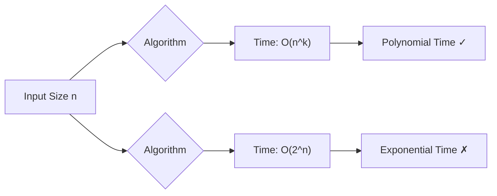

---

## Complexity Classes

### Class P

**Definition**: P is the class of decision problems solvable by a deterministic Turing machine in polynomial time.

$$P = \{L \mid L \text{ is decided by a polynomial-time TM}\}$$

**Examples of P problems**:
1. **SORTING**: Sort n numbers
2. **CONNECTED**: Is a graph connected?
3. **EULERIAN**: Does a graph have an Eulerian circuit?
4. **GCD**: Compute greatest common divisor
5. **PRIMES**: Is n prime? (AKS algorithm, 2002)

### Class NP

**Definition**: NP (Nondeterministic Polynomial) is the class of decision problems for which a "yes" answer can be **verified** in polynomial time.

$$NP = \{L \mid L \text{ is decided by a nondeterministic polynomial-time TM}\}$$

**Alternative Definition**: A problem is in NP if there exists a polynomial-time **verifier** $V$ such that:

$$x \in L \iff \exists \text{ certificate } c \text{ where } |c| = \text{poly}(|x|) \text{ and } V(x, c) = \text{YES}$$

**Examples of NP problems**:
1. **SAT**: Boolean satisfiability
2. **CLIQUE**: Does graph have a clique of size $k$?
3. **HAMPATH**: Hamiltonian path existence
4. **SUBSET-SUM**: Subset summing to target
5. **3-COLORING**: Can graph be colored with 3 colors?

### Comparison Table: P vs NP

| Aspect | P | NP |
|--------|---|-----|
| **Definition** | Solvable in poly-time | Verifiable in poly-time |
| **Machine Model** | Deterministic TM | Nondeterministic TM |
| **Solving** | We can find solution quickly | We might need exponential time |
| **Verification** | Implied (if we can solve, we can verify) | Can verify solution quickly |
| **Relationship** | $P \subseteq NP$ | Contains P |
| **Examples** | Sorting, GCD, Shortest Path | SAT, Clique, Hamiltonian Path |

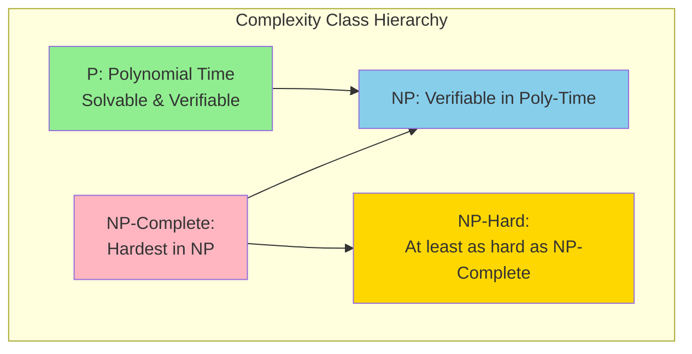

### The P vs NP Question

**The Million Dollar Question**: Does $P = NP$?

- **If P = NP**: Every problem whose solution can be verified quickly can also be solved quickly
- **If P ≠ NP**: There exist problems that are easy to verify but hard to solve

**Current Consensus**: Most researchers believe $P \neq NP$, but no proof exists.

---

## NP-Completeness Theory

### NP-Hard and NP-Complete

**Definition (NP-Hard)**: A problem $H$ is **NP-Hard** if every problem in NP can be reduced to $H$ in polynomial time.

**Definition (NP-Complete)**: A problem $C$ is **NP-Complete** if:
1. $C \in NP$ (verifiable in polynomial time)
2. $C$ is NP-Hard (every NP problem reduces to $C$)

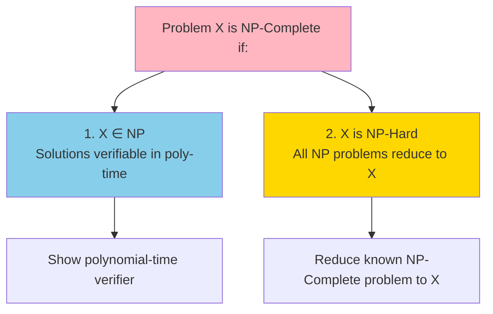

### Cook-Levin Theorem (1971)

**Theorem**: SAT (Boolean Satisfiability) is NP-Complete.

This was the **first** NP-Complete problem proven, establishing that:
1. SAT is in NP
2. Every problem in NP can be reduced to SAT

**Significance**: Once we have one NP-Complete problem, we can prove others by reduction.

### Polynomial-Time Reduction

A **polynomial-time reduction** from problem $A$ to problem $B$ (denoted $A \leq_p B$) is a function $f$ computable in polynomial time such that:

$$x \in A \iff f(x) \in B$$

**Visual Representation**:

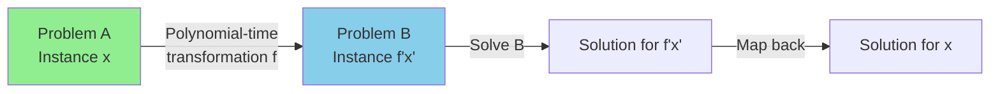

**Properties**:
- **Transitivity**: If $A \leq_p B$ and $B \leq_p C$, then $A \leq_p C$
- **Hardness Preservation**: If $A \leq_p B$ and $A$ is hard, then $B$ is at least as hard

---

## Classical NP-Complete Problems

### 1. Boolean Satisfiability (SAT)

**Problem**: Given a Boolean formula in CNF, is there an assignment that makes it TRUE?

**Example**:
$$\phi = (x_1 \lor \neg x_2 \lor x_3) \land (\neg x_1 \lor x_2) \land (x_2 \lor \neg x_3)$$

**Instance**: Can we assign TRUE/FALSE to $x_1, x_2, x_3$ to satisfy $\phi$?

**Why NP-Complete**: Cook-Levin Theorem (1971)

### 2. 3-SAT

**Problem**: SAT restricted to clauses with exactly 3 literals.

**Example**:
$$\phi = (x_1 \lor x_2 \lor \neg x_3) \land (\neg x_1 \lor x_2 \lor x_4) \land (x_3 \lor \neg x_4 \lor x_1)$$

**Reduction**: $\text{SAT} \leq_p \text{3-SAT}$ (proven by Karp, 1972)

### 3. Clique Problem

**Problem**: Given graph $G = (V, E)$ and integer $k$, does $G$ contain a clique of size $k$?

**Definition**: A **clique** is a complete subgraph where every pair of vertices is connected.

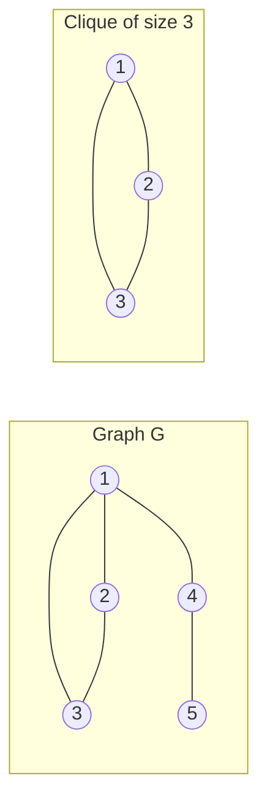

**Reduction**: $\text{3-SAT} \leq_p \text{CLIQUE}$

### 4. Vertex Cover

**Problem**: Given graph $G = (V, E)$ and integer $k$, is there a subset $S \subseteq V$ with $|S| \leq k$ such that every edge has at least one endpoint in $S$?

**Example**:
```
Graph: 1---2---3
       |   |
       4---5

Vertex Cover of size 2: {2, 4}
```

**Reduction**: $\text{CLIQUE} \leq_p \text{VERTEX-COVER}$

### 5. Hamiltonian Path/Cycle

**Problem**: Given graph $G$, does it contain a path (or cycle) that visits each vertex exactly once?

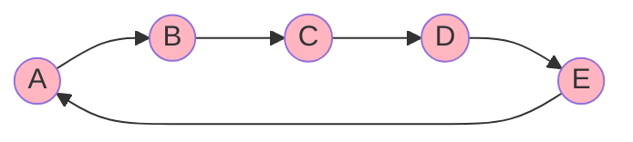

**Reduction**: $\text{VERTEX-COVER} \leq_p \text{HAM-CYCLE}$

### 6. Traveling Salesman Problem (TSP)

**Problem**: Given cities with distances, find shortest tour visiting each city exactly once.

**Decision Version**: Is there a tour of length $\leq k$?

$$\text{minimize } \sum_{i=1}^{n} d(c_{\pi(i)}, c_{\pi(i+1)})$$

**Reduction**: $\text{HAM-CYCLE} \leq_p \text{TSP}$

### 7. Subset Sum

**Problem**: Given set $S = \{a_1, a_2, \ldots, a_n\}$ and target $t$, is there a subset that sums to $t$?

**Example**:
- $S = \{3, 5, 11, 13, 17\}$, $t = 21$
- Answer: YES, $\{3, 5, 13\}$

### 8. Graph Coloring (3-COLORING)

**Problem**: Can graph $G$ be colored with $k$ colors such that no adjacent vertices share the same color?

**3-COLORING**: The case where $k = 3$ is NP-Complete.

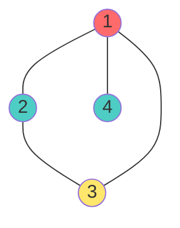

### Comparison of NP-Complete Problems

| Problem | Input | Question | Applications |
|---------|-------|----------|--------------|
| **SAT** | Boolean formula | Satisfiable? | Circuit design, AI planning |
| **3-SAT** | 3-CNF formula | Satisfiable? | Automated reasoning |
| **CLIQUE** | Graph G, integer k | k-clique exists? | Social networks, bioinformatics |
| **VERTEX-COVER** | Graph G, integer k | Cover with k vertices? | Network security, resource allocation |
| **HAM-CYCLE** | Graph G | Hamiltonian cycle? | DNA sequencing, routing |
| **TSP** | Cities, distances, k | Tour ≤ k? | Logistics, manufacturing |
| **SUBSET-SUM** | Set S, target t | Subset sums to t? | Cryptography, scheduling |
| **3-COLORING** | Graph G | 3-colorable? | Register allocation, scheduling |

---

## Reduction Techniques

### Standard Reduction Strategy

To prove problem $B$ is NP-Complete:

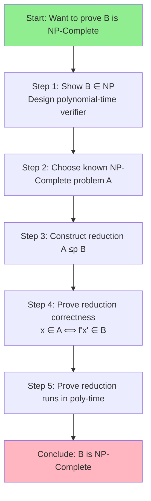

### Example Reduction: 3-SAT ≤ₚ CLIQUE

**Goal**: Prove CLIQUE is NP-Complete.

**Given**: 3-SAT instance $\phi$ with clauses $C_1, C_2, \ldots, C_k$

**Construct**: Graph $G$ where:
1. Create node for each literal in each clause
2. Connect two nodes if:
   - They are in different clauses, AND
   - They are not contradictory (e.g., $x$ and $\neg x$)

**Claim**: $\phi$ is satisfiable $\iff$ $G$ has a $k$-clique

**Proof**:
- **⇒**: If $\phi$ is satisfiable, pick one true literal from each clause. These $k$ literals form a clique.
- **⇐**: If $k$-clique exists, set corresponding literals to TRUE. This satisfies $\phi$.

**Example**:
$$\phi = (x_1 \lor x_2 \lor x_3) \land (\neg x_1 \lor \neg x_2 \lor \neg x_3) \land (x_1 \lor \neg x_2 \lor x_3)$$

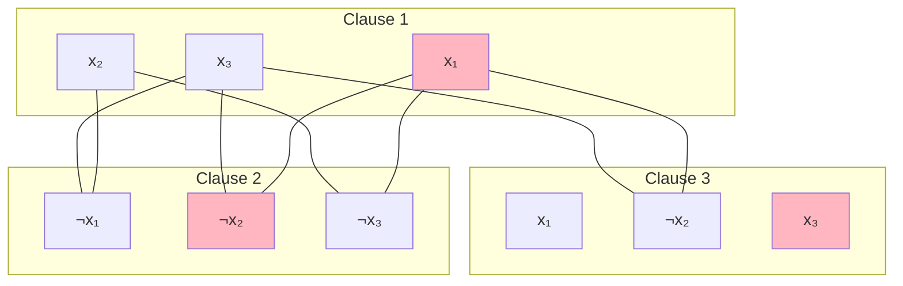

### Example Reduction: CLIQUE ≤ₚ VERTEX-COVER

**Key Insight**: Complementary relationship

**Theorem**: Graph $G$ has a clique of size $k$ $\iff$ complement graph $\bar{G}$ has a vertex cover of size $n - k$.

**Proof**:
- Let $S$ be a $k$-clique in $G$
- Then $V \setminus S$ is a vertex cover in $\bar{G}$ of size $n - k$
- Every edge in $\bar{G}$ connects a vertex in $S$ to one outside, so $V \setminus S$ covers all edges

---

## Practical Examples with Code

### Example 1: SAT Solver (Simple Backtracking)

```c
#include <stdio.h>
#include <stdbool.h>

#define MAX_VARS 20
#define MAX_CLAUSES 100
#define MAX_LITERALS 3

// Clause structure: array of literals (positive = var, negative = -var)
typedef struct {
    int literals[MAX_LITERALS];
    int size;
} Clause;

// SAT formula
typedef struct {
    Clause clauses[MAX_CLAUSES];
    int num_clauses;
    int num_vars;
} Formula;

// Variable assignment (0 = unassigned, 1 = true, -1 = false)
int assignment[MAX_VARS];

// Evaluate a clause under current assignment
bool evaluate_clause(Clause *c) {
    for (int i = 0; i < c->size; i++) {
        int lit = c->literals[i];
        int var = abs(lit) - 1;
        
        if (assignment[var] == 0) continue; // Unassigned
        
        // Check if literal is satisfied
        if ((lit > 0 && assignment[var] == 1) || 
            (lit < 0 && assignment[var] == -1)) {
            return true;
        }
    }
    return false;
}

// Check if all clauses are satisfied
bool is_satisfied(Formula *f) {
    for (int i = 0; i < f->num_clauses; i++) {
        if (!evaluate_clause(&f->clauses[i])) {
            return false;
        }
    }
    return true;
}

// Backtracking SAT solver
bool solve_sat(Formula *f, int var) {
    // Base case: all variables assigned
    if (var == f->num_vars) {
        return is_satisfied(f);
    }
    
    // Try assigning true
    assignment[var] = 1;
    if (solve_sat(f, var + 1)) {
        return true;
    }
    
    // Try assigning false
    assignment[var] = -1;
    if (solve_sat(f, var + 1)) {
        return true;
    }
    
    // Backtrack
    assignment[var] = 0;
    return false;
}

int main() {
    Formula f;
    f.num_vars = 3;
    f.num_clauses = 3;
    
    // (x1 OR x2 OR -x3) AND (-x1 OR x2) AND (x2 OR -x3)
    f.clauses[0] = (Clause){{1, 2, -3}, 3};
    f.clauses[1] = (Clause){{-1, 2}, 2};
    f.clauses[2] = (Clause){{2, -3}, 2};
    
    // Initialize assignment
    for (int i = 0; i < MAX_VARS; i++) {
        assignment[i] = 0;
    }
    
    printf("Solving SAT...\n");
    if (solve_sat(&f, 0)) {
        printf("SATISFIABLE\n");
        printf("Assignment: ");
        for (int i = 0; i < f.num_vars; i++) {
            printf("x%d=%s ", i+1, assignment[i] == 1 ? "T" : "F");
        }
        printf("\n");
    } else {
        printf("UNSATISFIABLE\n");
    }
    
    return 0;
}
```

**Complexity Analysis**:
- **Time**: $O(2^n \cdot m)$ where $n$ = variables, $m$ = clauses
- **Space**: $O(n)$ for recursion stack
- **Note**: Exponential worst-case, but practical with pruning

### Example 2: Subset Sum (Dynamic Programming)

```c
#include <stdio.h>
#include <stdbool.h>

#define MAX_N 100
#define MAX_SUM 10000

// Dynamic programming solution
bool subset_sum_dp(int arr[], int n, int target) {
    bool dp[n + 1][target + 1];
    
    // Base cases
    for (int i = 0; i <= n; i++) {
        dp[i][0] = true;  // Sum 0 is always achievable (empty set)
    }
    for (int j = 1; j <= target; j++) {
        dp[0][j] = false; // No elements, can't achieve positive sum
    }
    
    // Fill DP table
    for (int i = 1; i <= n; i++) {
        for (int j = 1; j <= target; j++) {
            // Don't include arr[i-1]
            dp[i][j] = dp[i-1][j];
            
            // Include arr[i-1] if possible
            if (j >= arr[i-1]) {
                dp[i][j] = dp[i][j] || dp[i-1][j - arr[i-1]];
            }
        }
    }
    
    return dp[n][target];
}

// Backtracking solution (exponential but can find actual subset)
bool subset_sum_backtrack(int arr[], int n, int target, int index, 
                          int current_sum, int solution[], int *sol_size) {
    // Base cases
    if (current_sum == target) {
        return true;
    }
    if (index == n || current_sum > target) {
        return false;
    }
    
    // Include current element
    solution[*sol_size] = arr[index];
    (*sol_size)++;
    if (subset_sum_backtrack(arr, n, target, index + 1, 
                            current_sum + arr[index], solution, sol_size)) {
        return true;
    }
    (*sol_size)--;
    
    // Exclude current element
    if (subset_sum_backtrack(arr, n, target, index + 1, 
                            current_sum, solution, sol_size)) {
        return true;
    }
    
    return false;
}

int main() {
    int arr[] = {3, 5, 11, 13, 17};
    int n = 5;
    int target = 21;
    
    printf("Set: {");
    for (int i = 0; i < n; i++) {
        printf("%d%s", arr[i], i < n-1 ? ", " : "");
    }
    printf("}\nTarget: %d\n\n", target);
    
    // DP solution
    if (subset_sum_dp(arr, n, target)) {
        printf("DP: YES, subset exists\n");
    } else {
        printf("DP: NO, subset doesn't exist\n");
    }
    
    // Backtracking solution (finds actual subset)
    int solution[MAX_N];
    int sol_size = 0;
    
    if (subset_sum_backtrack(arr, n, target, 0, 0, solution, &sol_size)) {
        printf("Backtracking: YES\nSubset: {");
        for (int i = 0; i < sol_size; i++) {
            printf("%d%s", solution[i], i < sol_size-1 ? ", " : "");
        }
        printf("}\n");
    } else {
        printf("Backtracking: NO\n");
    }
    
    return 0;
}
```

**Complexity Comparison**:
- **DP**: $O(n \cdot \text{target})$ - pseudo-polynomial
- **Backtracking**: $O(2^n)$ - exponential
- **Note**: DP is efficient when target is small

### Example 3: Graph Coloring

```c
#include <stdio.h>
#include <stdbool.h>

#define MAX_VERTICES 20

// Graph represented as adjacency matrix
int graph[MAX_VERTICES][MAX_VERTICES];
int color[MAX_VERTICES];
int num_vertices;

// Check if color c is safe for vertex v
bool is_safe(int v, int c) {
    for (int i = 0; i < num_vertices; i++) {
        if (graph[v][i] && color[i] == c) {
            return false;
        }
    }
    return true;
}

// Backtracking graph coloring
bool graph_coloring(int v, int num_colors) {
    // Base case: all vertices colored
    if (v == num_vertices) {
        return true;
    }
    
    // Try all colors
    for (int c = 1; c <= num_colors; c++) {
        if (is_safe(v, c)) {
            color[v] = c;
            
            if (graph_coloring(v + 1, num_colors)) {
                return true;
            }
            
            // Backtrack
            color[v] = 0;
        }
    }
    
    return false;
}

int main() {
    num_vertices = 4;
    
    // Example graph (triangle + one vertex)
    int adj[4][4] = {
        {0, 1, 1, 1},
        {1, 0, 1, 0},
        {1, 1, 0, 0},
        {1, 0, 0, 0}
    };
    
    // Copy to global graph
    for (int i = 0; i < num_vertices; i++) {
        for (int j = 0; j < num_vertices; j++) {
            graph[i][j] = adj[i][j];
        }
        color[i] = 0;
    }
    
    printf("Testing 3-coloring...\n");
    if (graph_coloring(0, 3)) {
        printf("3-COLORABLE: YES\n");
        printf("Coloring: ");
        for (int i = 0; i < num_vertices; i++) {
            printf("v%d=color%d ", i, color[i]);
        }
        printf("\n");
    } else {
        printf("3-COLORABLE: NO\n");
    }
    
    return 0;
}
```

### Algorithm Complexity Summary

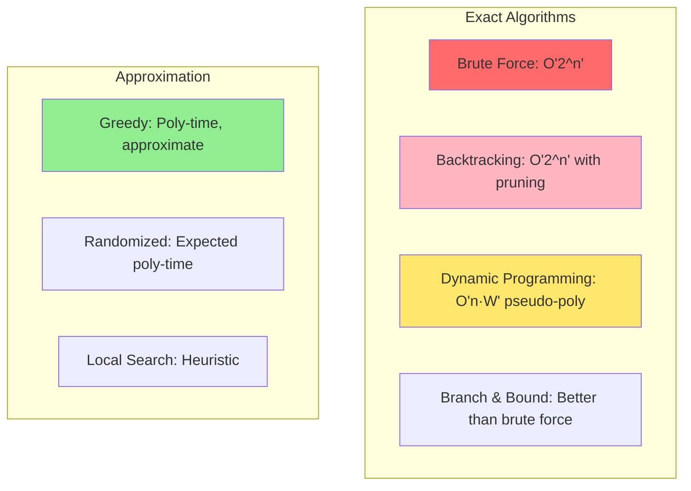

---

## Research Approaches

### 1. Proving P ≠ NP

**Approaches Being Explored**:

1. **Circuit Complexity**: Lower bounds on circuit size
2. **Algebraic Methods**: Geometric complexity theory
3. **Proof Complexity**: Limitations of proof systems
4. **Communication Complexity**: Information-theoretic arguments

**Barriers**:
- **Relativization** (Baker-Gill-Solovay, 1975)
- **Natural Proofs** (Razborov-Rudich, 1997)
- **Algebrization** (Aaronson-Wigderson, 2008)

### 2. Approximation Algorithms

Since exact solutions are hard, find **approximate** solutions efficiently.

**Approximation Ratio**: Algorithm has ratio $\rho$ if:
$$\frac{ALG(I)}{OPT(I)} \leq \rho \text{ (minimization)}$$
$$\frac{OPT(I)}{ALG(I)} \leq \rho \text{ (maximization)}$$

**Examples**:
- **Vertex Cover**: 2-approximation via maximal matching
- **TSP (metric)**: 1.5-approximation (Christofides algorithm)
- **Set Cover**: $\ln n$-approximation (greedy)

```c
// 2-approximation for Vertex Cover
#include <stdio.h>
#include <stdbool.h>

#define MAX_V 100

typedef struct {
    int u, v;
} Edge;

void vertex_cover_approx(Edge edges[], int num_edges, int num_vertices) {
    bool covered[MAX_V] = {false};
    bool in_cover[MAX_V] = {false};
    
    printf("Approximate Vertex Cover:\n");
    
    for (int i = 0; i < num_edges; i++) {
        int u = edges[i].u;
        int v = edges[i].v;
        
        // If edge not covered, add both endpoints
        if (!covered[u] && !covered[v]) {
            in_cover[u] = in_cover[v] = true;
            covered[u] = covered[v] = true;
            printf("Added vertices: %d, %d\n", u, v);
        }
    }
    
    printf("Cover size: ");
    int count = 0;
    for (int i = 0; i < num_vertices; i++) {
        if (in_cover[i]) count++;
    }
    printf("%d\n", count);
}
```

### 3. Parameterized Complexity

**Idea**: Some NP-Complete problems become tractable when a **parameter** $k$ is small.

**Fixed-Parameter Tractable (FPT)**: Solvable in time $f(k) \cdot n^{O(1)}$

**Example**: Vertex Cover is FPT with parameter $k$ (cover size)
- Algorithm: $O(1.2738^k + kn)$ (Chen et al., 2010)

### 4. Heuristics and Metaheuristics

**Common Approaches**:
1. **Simulated Annealing**
2. **Genetic Algorithms**
3. **Ant Colony Optimization**
4. **Tabu Search**
5. **Local Search**

**Example: 2-OPT for TSP**:
```c
void two_opt(int tour[], int n, int dist[][MAX_V]) {
    bool improved = true;
    
    while (improved) {
        improved = false;
        
        for (int i = 0; i < n - 1; i++) {
            for (int j = i + 2; j < n; j++) {
                // Try reversing tour[i+1..j]
                int delta = dist[tour[i]][tour[j]] + 
                           dist[tour[i+1]][tour[(j+1)%n]] -
                           dist[tour[i]][tour[i+1]] - 
                           dist[tour[j]][tour[(j+1)%n]];
                
                if (delta < 0) {
                    // Reverse the segment
                    reverse_segment(tour, i + 1, j);
                    improved = true;
                }
            }
        }
    }
}
```

### 5. Special Cases and Restrictions

**Research Direction**: Find polynomial-time algorithms for **restricted versions**.

**Examples**:
- **2-SAT**: Polynomial-time (via implication graph)
- **Planar Graph Coloring**: Polynomial-time for $k \geq 5$ (4-color theorem)
- **Tree Graphs**: Many problems become polynomial
- **Bounded Treewidth**: FPT algorithms exist

### Research Problem Categories

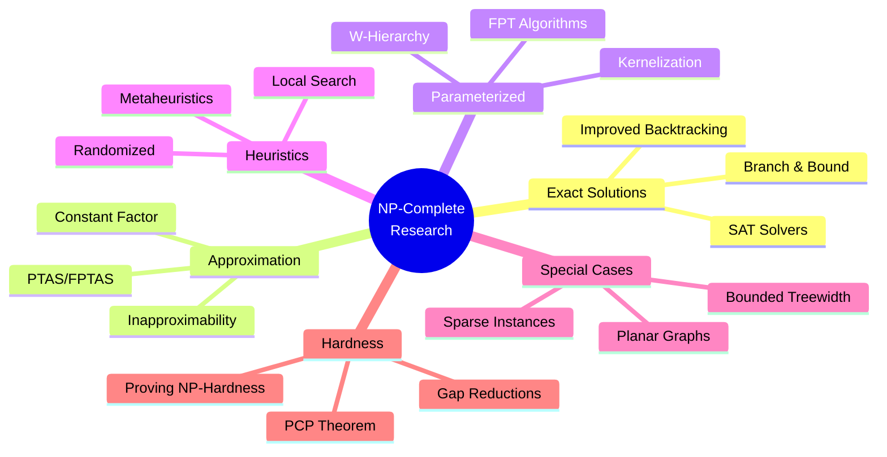

---

## Knowledge Checkpoints

### Checkpoint 1: Fundamental Concepts

**Q1**: Explain the difference between P and NP in your own words.

**Q2**: Why is it significant that $P \subseteq NP$? Can you prove this?

**Q3**: What does it mean for a problem to be in NP? Give an example with a verifier.

**Q4**: True or False: If we find a polynomial-time algorithm for any NP-Complete problem, then P = NP. Explain.

**Q5**: Construct a polynomial-time verifier for the CLIQUE problem.

<details>
<summary>Solution Hints</summary>

**A1**: P = efficiently solvable, NP = efficiently verifiable

**A2**: If we can solve efficiently, we can verify efficiently (just solve and check)

**A3**: Certificate can be verified in poly-time. Example: HAM-PATH - certificate is the path sequence

**A4**: TRUE. All NP problems reduce to any NP-Complete problem. If one is in P, all are in P.

**A5**: 
```
Verifier(G, k, certificate C):
  1. Check |C| = k
  2. Check all vertices in C are in G
  3. Check all pairs in C are connected
  4. Return YES if all checks pass
Time: O(k²)
```
</details>

### Checkpoint 2: Reductions

**Q6**: What is a polynomial-time reduction? Why is it useful?

**Q7**: Prove that if $A \leq_p B$ and $B \in P$, then $A \in P$.

**Q8**: Describe the reduction from 3-SAT to CLIQUE at a high level.

**Q9**: Why can't we reduce CLIQUE to 3-SAT to prove CLIQUE is NP-Complete?

**Q10**: Design a reduction from VERTEX-COVER to SET-COVER.

<details>
<summary>Solution Hints</summary>

**A6**: Function $f$ computable in poly-time where $x \in A \iff f(x) \in B$. Useful for proving hardness.

**A7**: To solve $A$: reduce to $B$ (poly-time), solve $B$ (poly-time). Total: poly-time.

**A8**: Create node per literal per clause. Connect non-contradictory literals from different clauses. $k$-clique ↔ satisfying assignment.

**A9**: Reduction goes wrong way! Need to reduce FROM known NP-Complete problem TO the new problem.

**A10**: Map each edge to a set containing its endpoints. Cover of size $k$ ↔ set cover with $k$ sets.
</details>

### Checkpoint 3: Algorithm Design

**Q11**: Analyze the time complexity of the backtracking SAT solver provided. Can it be improved?

**Q12**: Why is Subset Sum considered "pseudo-polynomial" with DP? What does this mean?

**Q13**: Implement a greedy 2-approximation for Vertex Cover. Prove the approximation ratio.

**Q14**: Design a branch-and-bound algorithm for the TSP. What makes it more efficient than brute force?

**Q15**: Compare dynamic programming vs. backtracking for Subset Sum. When is each preferred?

<details>
<summary>Solution Hints</summary>

**A11**: $O(2^n \cdot m)$ worst-case. Improvements: unit propagation, pure literal elimination, clause learning (DPLL, CDCL).

**A12**: Complexity depends on numeric value (target), not input size. NOT truly polynomial.

**A13**: Pick edge, add both endpoints to cover, remove covered edges. OPT covers edge with ≥1 endpoint, we use 2. Ratio ≤ 2.

**A14**: Prune branches exceeding current best. Use lower bounds (MST, nearest neighbor). Reduces average-case dramatically.

**A15**: DP when target is small (pseudo-poly). Backtracking when need actual subset or target is huge.
</details>

### Checkpoint 4: Research Directions

**Q16**: What is the PCP Theorem and how does it relate to approximation hardness?

**Q17**: Explain the concept of Fixed-Parameter Tractability with an example.

**Q18**: What are the three main barriers to proving P ≠ NP?

**Q19**: Design a PTAS (Polynomial-Time Approximation Scheme) for a problem of your choice.

**Q20**: Research Question: How might quantum computing affect NP-Complete problems?

<details>
<summary>Solution Hints</summary>

**A16**: NP = PCP(log n, 1). Implies many problems are hard to approximate (e.g., MAX-3SAT).

**A17**: FPT = $f(k) \cdot n^{O(1)}$. Example: Vertex Cover with $O(1.2738^k + kn)$.

**A18**: Relativization, Natural Proofs, Algebrization.

**A19**: Example: PTAS for Knapsack using FPTAS with rounding. $(1 + \epsilon)$-approximation in $O(n^3/\epsilon)$.

**A20**: Grover's gives $O(\sqrt{2^n})$ speedup for NP. Still exponential. BQP vs NP relationship unclear.
</details>

### Checkpoint 5: Advanced Topics

**Q21**: Prove that 2-SAT is in P using the implication graph method.

**Q22**: What is the relationship between NP-Complete and co-NP-Complete? Are they the same?

**Q23**: Explain why the naive TSP algorithm takes $O(n!)$ time. How can we reduce this to $O(n^2 \cdot 2^n)$ using DP?

**Q24**: Design a kernelization algorithm for Vertex Cover with parameter $k$.

**Q25**: Research the state-of-the-art SAT solvers. What techniques make them practical despite theoretical hardness?

<details>
<summary>Solution Hints</summary>

**A21**: Build implication graph. $(x \lor y) \equiv (\neg x \Rightarrow y)$. Check if $x$ and $\neg x$ in same SCC. Linear time!

**A22**: co-NP = complement of NP problems. If NP = co-NP, would imply P ≠ NP likely false. Not known to be equal.

**A23**: Held-Karp DP: $dp[S][i]$ = min cost to visit set $S$ ending at $i$. Subset enumeration gives $2^n$ subsets.

**A24**: Remove vertices of degree >k (must be in cover if solution exists). Reduce to kernel of size $O(k^2)$.

**A25**: CDCL (conflict-driven clause learning), watched literals, variable ordering heuristics (VSIDS), restarts, preprocessing.
</details>

---

## Real-World Applications

### 1. Logistics and Transportation

**Problem**: Vehicle Routing (variant of TSP)

**NP-Complete Aspect**: Finding optimal routes for multiple vehicles

**Practical Solutions**:
- Heuristics (nearest neighbor, savings algorithm)
- Metaheuristics (genetic algorithms, simulated annealing)
- Column generation for large instances

**Companies Using**: UPS, FedEx, Amazon

### 2. Scheduling

**Problem**: Job Shop Scheduling

**NP-Complete Aspect**: Assigning jobs to machines to minimize makespan

**Approaches**:
- List scheduling (greedy, 2-approximation)
- Constraint programming
- Mixed Integer Programming (MIP)

**Applications**: Manufacturing, cloud computing resource allocation

### 3. Bioinformatics

**Problem**: Protein Folding, DNA Sequence Assembly

**NP-Complete Aspects**: Finding minimum energy configuration

**Solutions**:
- Monte Carlo methods
- Molecular dynamics simulation
- Approximation algorithms

**Impact**: Drug discovery, personalized medicine

### 4. VLSI Design

**Problem**: Circuit Layout, Gate Placement

**NP-Complete Aspects**: Minimizing chip area and wire length

**Techniques**:
- Simulated annealing
- Genetic algorithms
- Partition and placement heuristics

**Industry**: Semiconductor manufacturing

### 5. Cryptography

**Problem**: Integer Factorization, Discrete Logarithm

**Relationship to NP**: Believed hard but not proven NP-Complete

**Application**: RSA encryption relies on factorization hardness

**Quantum Threat**: Shor's algorithm breaks RSA in polynomial time on quantum computer

### 6. Machine Learning

**Problem**: Feature Selection, Neural Architecture Search

**NP-Complete Aspects**: Optimal subset of features

**Approaches**:
- Greedy forward/backward selection
- Regularization (Lasso)
- Evolutionary algorithms

**Modern Relevance**: AutoML, neural network pruning

---

## References

### Textbooks

1. **Cormen, T. H., Leiserson, C. E., Rivest, R. L., & Stein, C.** (2022). *Introduction to Algorithms* (4th ed.). MIT Press.
   - Chapter 34: NP-Completeness
   - Comprehensive coverage with rigorous proofs

2. **Sipser, M.** (2012). *Introduction to the Theory of Computation* (3rd ed.). Cengage Learning.
   - Chapter 7: Time Complexity
   - Excellent theoretical foundation

3. **Garey, M. R., & Johnson, D. S.** (1979). *Computers and Intractability: A Guide to the Theory of NP-Completeness*. W. H. Freeman.
   - Classic reference with 300+ NP-Complete problems
   - Essential for reduction techniques

4. **Arora, S., & Barak, B.** (2009). *Computational Complexity: A Modern Approach*. Cambridge University Press.
   - Advanced graduate-level treatment
   - Covers PCP theorem, hardness of approximation

5. **Vazirani, V. V.** (2001). *Approximation Algorithms*. Springer.
   - Focus on practical approximation techniques
   - Linear programming relaxations

### Seminal Papers

1. **Cook, S. A.** (1971). "The complexity of theorem-proving procedures". *STOC '71*, 151-158.
   - First proof of NP-Completeness (SAT)

2. **Karp, R. M.** (1972). "Reducibility among combinatorial problems". *Complexity of Computer Computations*, 85-103.
   - 21 NP-Complete problems

3. **Levin, L. A.** (1973). "Universal sequential search problems". *Problems of Information Transmission*, 9(3), 115-116.
   - Independent discovery of NP-Completeness

4. **Arora, S., Lund, C., Motwani, R., Sudan, M., & Szegedy, M.** (1998). "Proof verification and the hardness of approximation problems". *Journal of the ACM*, 45(3), 501-555.
   - PCP theorem

### Online Resources

1. **Complexity Zoo**: https://complexityzoo.net/
   - Comprehensive list of complexity classes

2. **NP-Complete Problems**: https://www.ics.uci.edu/~eppstein/cgt/hard.html
   - David Eppstein's collection

3. **P vs NP Page**: https://www.claymath.org/millennium-problems/p-vs-np-problem
   - Clay Mathematics Institute official page

4. **SAT Competition**: http://www.satcompetition.org/
   - Annual SAT solver competition

### Research Journals

1. *Journal of the ACM* (JACM)
2. *SIAM Journal on Computing*
3. *Computational Complexity*
4. *Theory of Computing*
5. *ACM Transactions on Algorithms*

### Conferences

1. **STOC** (Symposium on Theory of Computing)
2. **FOCS** (Foundations of Computer Science)
3. **SODA** (Symposium on Discrete Algorithms)
4. **ICALP** (International Colloquium on Automata, Languages, and Programming)
5. **CCC** (Computational Complexity Conference)

---

## Appendix: Proof Techniques

### Technique 1: Reduction from 3-SAT

**Template**:
1. Given 3-SAT instance $\phi$ with $n$ variables and $m$ clauses
2. Construct instance of new problem in polynomial time
3. Prove: $\phi$ satisfiable $\iff$ new instance has solution

### Technique 2: Gadget Construction

**Approach**: Build "gadgets" that simulate logical behavior

**Example** (3-SAT to 3-COLORING):
- Variable gadget: Forces two colors (TRUE/FALSE)
- Clause gadget: Ensures at least one literal is TRUE

### Technique 3: Local Replacement

**Approach**: Replace parts of solution with equivalent structures

**Example** (Hamiltonian Path variations)

### Complexity Class Relationships

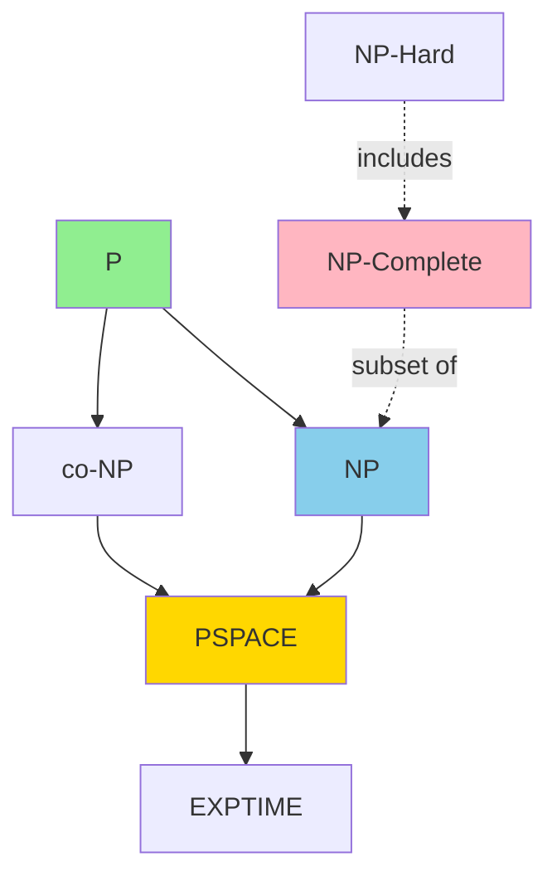

---

## Conclusion

The study of P, NP, and NP-Complete problems represents one of the most profound challenges in theoretical computer science. While we await a resolution to the P vs NP question, the practical implications of NP-Completeness drive innovation in algorithm design, approximation techniques, and computational thinking.

**For Research Students**:
- Focus on **approximation algorithms** for practical impact
- Explore **parameterized complexity** for tractable special cases
- Investigate **heuristics and metaheuristics** for real-world instances
- Stay current with **SAT solver** and **optimization** research
- Consider **interdisciplinary applications** (ML, bioinformatics, etc.)

**Final Thought**: "The question of whether P = NP is not just about theoretical computer science—it's about the fundamental limits of what can be efficiently computed, and thus, what can be efficiently known." — Scott Aaronson

---

**Document Version**: 1.0 (Research Graduate Level)  
**Last Updated**: November 2025  
**Author**: Algorithms Research Group  
**License**: Educational Use