# Visual Study Guide: P vs NP and NP-Complete Problems

**Quick Reference for Graduate Students**

---

## 1. The Complexity Landscape

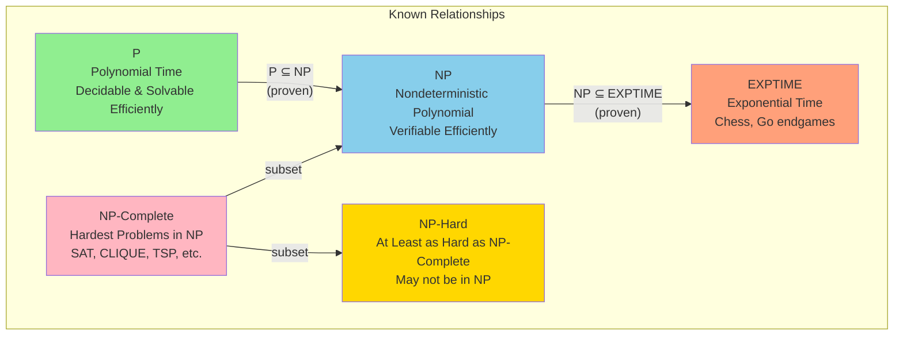

**Key Question**: Does P = NP? (Unknown, believed NO)

---

## 2. Problem Classification Flowchart

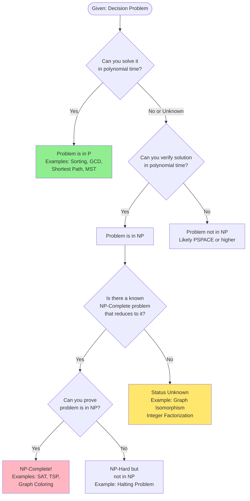

---

## 3. Reduction Proof Template

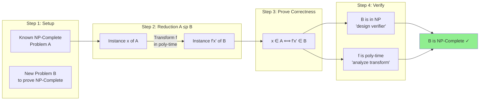

---

## 4. The Reduction Network

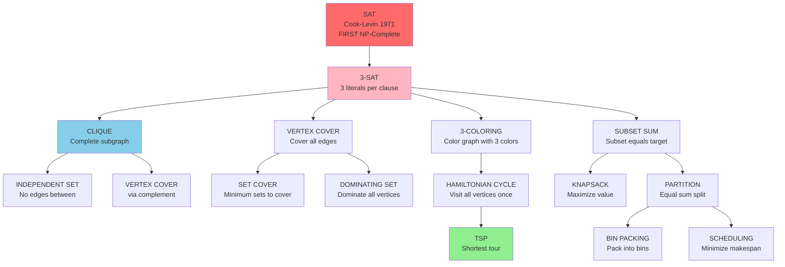

---

## 5. Algorithm Strategy Selection

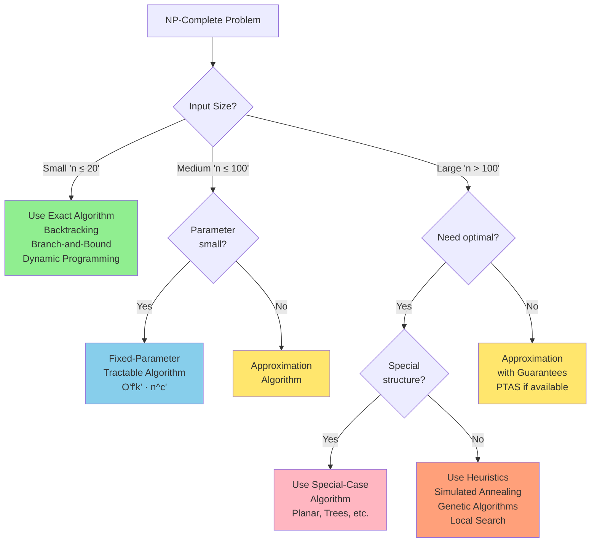

---

## 6. Time Complexity Comparison

| Algorithm Type | Complexity | n=10 | n=20 | n=50 | n=100 |
|----------------|------------|------|------|------|-------|
| **Linear** | O(n) | 10 | 20 | 50 | 100 |
| **Quadratic** | O(n²) | 100 | 400 | 2,500 | 10,000 |
| **Cubic** | O(n³) | 1K | 8K | 125K | 1M |
| **Polynomial** | O(n⁵) | 100K | 3.2M | 312M | 10B |
| **Exponential** | O(2ⁿ) | 1K | 1M | 1.1×10¹⁵ | 1.3×10³⁰ |
| **Factorial** | O(n!) | 3.6M | 2.4×10¹⁸ | ~ ∞ | ~ ∞ |

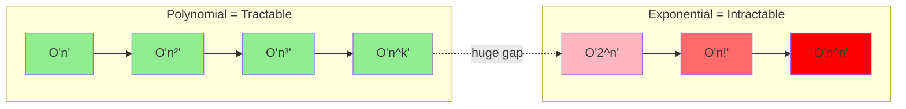

---

## 7. Verifier Design Pattern

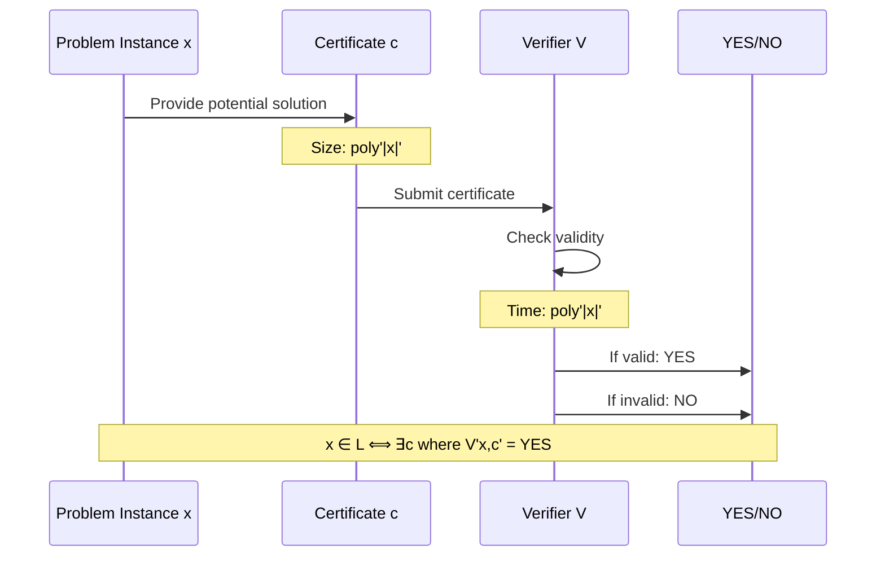

**Example: CLIQUE**
- **Input x**: Graph G, integer k
- **Certificate c**: Set S of k vertices
- **Verifier V**: 
  1. Check |S| = k  (O(1))
  2. Check all pairs in S connected (O(k²))
  3. Return YES if both true
- **Time**: O(k²) = poly(|x|)

---

## 8. Approximation Algorithm Guarantees

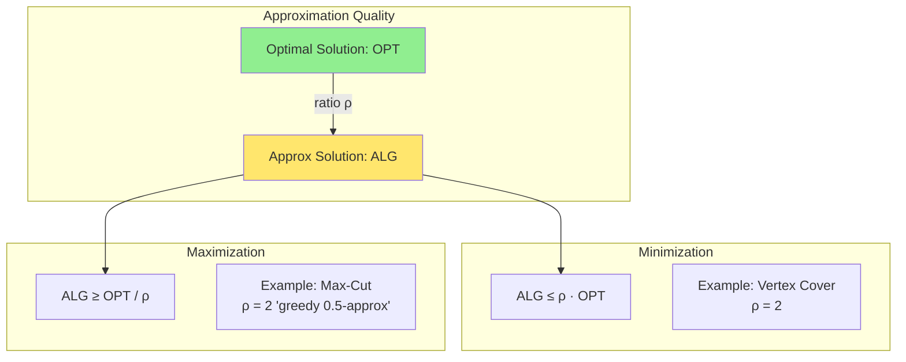

**PTAS (Polynomial-Time Approximation Scheme)**:
- (1 + ε)-approximation for any ε > 0
- Time: poly(n, 1/ε)
- Example: Euclidean TSP

**FPTAS (Fully PTAS)**:
- PTAS with poly(n, 1/ε) time
- Example: Knapsack

---

## 9. NP-Complete Problems by Domain

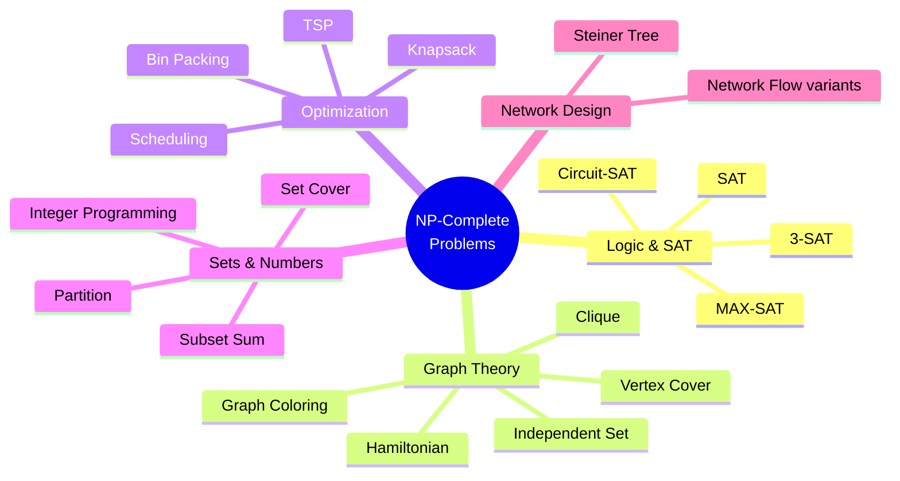

---

## 10. Research Approach Map

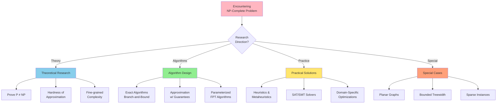

---

## 11. Proof Techniques Cheatsheet

### Proving Problem is in NP

1. **Design verifier V(x, c)**
   - Input: instance x, certificate c
   - Output: YES/NO
   - Time: polynomial in |x|

2. **Prove correctness**
   - x ∈ L ⇒ ∃c where V(x,c) = YES
   - x ∉ L ⇒ ∀c, V(x,c) = NO

### Proving NP-Completeness

1. **Show problem is in NP** (design verifier)
2. **Choose known NP-Complete problem A**
3. **Design reduction f: A → B**
   - Polynomial-time transformation
   - x ∈ A ⟺ f(x) ∈ B
4. **Prove reduction correctness**
   - Forward: x ∈ A ⇒ f(x) ∈ B
   - Backward: f(x) ∈ B ⇒ x ∈ A

### Common Reduction Sources

- **From SAT/3-SAT**: Most problems
- **From CLIQUE**: Graph problems
- **From SUBSET-SUM**: Numeric problems
- **From HAM-CYCLE**: Path problems

---

## 12. Quick Problem Identification Guide

### Indicators a Problem Might Be NP-Complete

✓ Requires finding "best" subset/permutation  
✓ Involves optimization with constraints  
✓ "At least k" or "at most k" questions  
✓ Combines multiple conflicting objectives  
✓ Known to be hard in practice  
✓ Similar to known NP-Complete problem  

### Problems Likely in P

✓ Has greedy solution that works  
✓ Can be solved by sorting  
✓ Graph has special structure (tree, DAG)  
✓ Local property that's easy to verify  
✓ Can be formulated as linear program  

---

## 13. Complexity Class Zoo (Simplified)

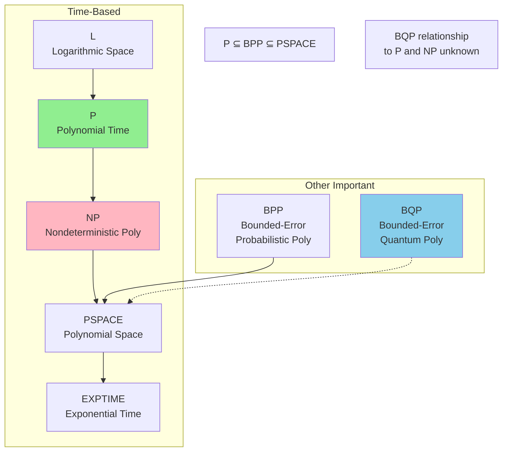

---

## 14. Study Strategy Flowchart

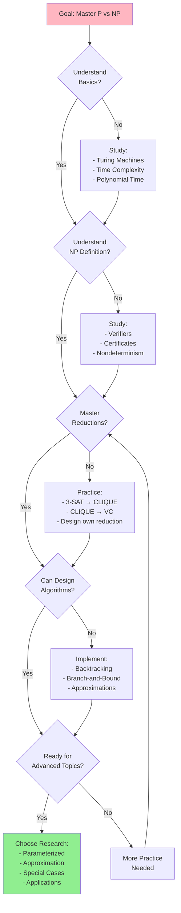

---

## 15. Common Pitfalls and Misconceptions

### ❌ Wrong Thinking

- "NP means non-polynomial" → **NO!** NP = Nondeterministic Polynomial
- "NP-Complete means impossible" → **NO!** Hard, but solvable (just not efficiently for large n)
- "All hard problems are NP-Complete" → **NO!** Halting Problem is undecidable, not NP-Complete
- "Heuristics solve NP-Complete" → **NO!** They give approximate/good solutions, not always optimal

### ✓ Correct Thinking

- NP = efficiently **verifiable**
- NP-Complete = **hardest** in NP
- P ≠ NP implies NP-Complete problems have no poly-time algorithm
- Can still solve in practice with:
  - Small instances (exact)
  - Approximations (guaranteed bounds)
  - Heuristics (good in practice)
  - Special cases (restricted inputs)

---

## 16. Your Research Roadmap

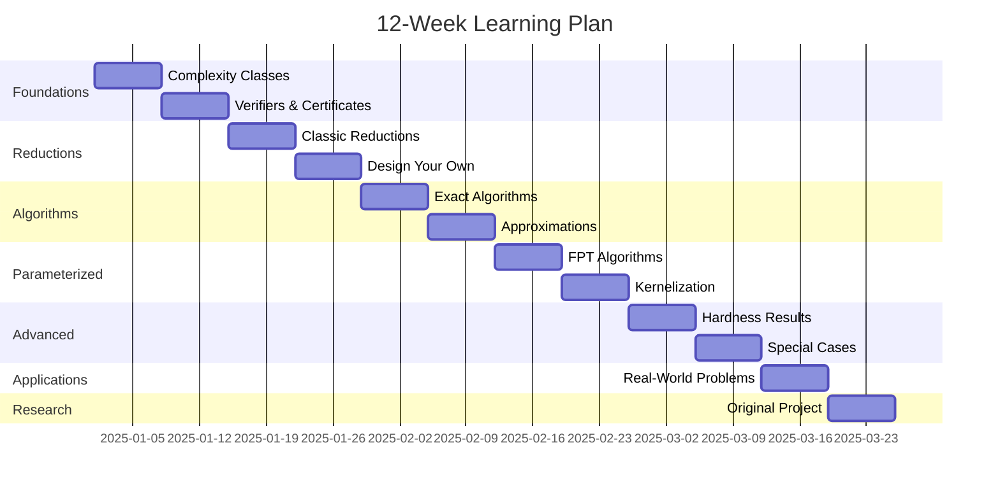

---

## Quick Reference Tables

### Decision vs Optimization vs Counting

| Type | Example | Complexity |
|------|---------|------------|
| **Decision** | Is there a tour ≤ k? | NP-Complete |
| **Optimization** | Find shortest tour | NP-Hard |
| **Counting** | How many tours ≤ k? | #P-Complete |

### Approximation Hardness

| Problem | Best Known | Hardness |
|---------|------------|----------|
| Vertex Cover | 2-approx | 2-ε is hard (UGC) |
| Set Cover | ln n-approx | (1-ε)ln n is hard |
| TSP (general) | None | No c-approx (unless P=NP) |
| TSP (metric) | 1.5-approx | Open |
| Max-3SAT | 7/8-approx | 7/8+ε is hard (PCP) |

---

**Pro Tip**: Print this guide and keep it handy while studying! Use it as a visual companion to the main textbook.

---

*Version 1.0 - Graduate Study Guide*  
*Companion to P, NP, and NP-Complete Problems Course*
