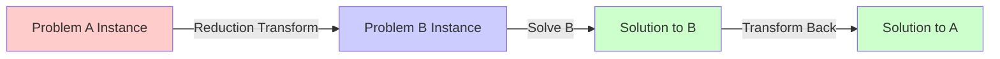
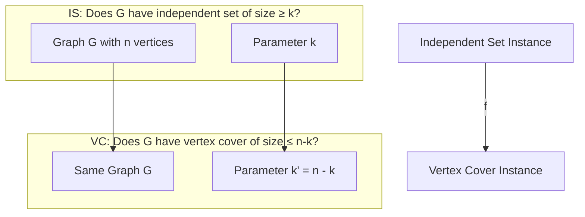
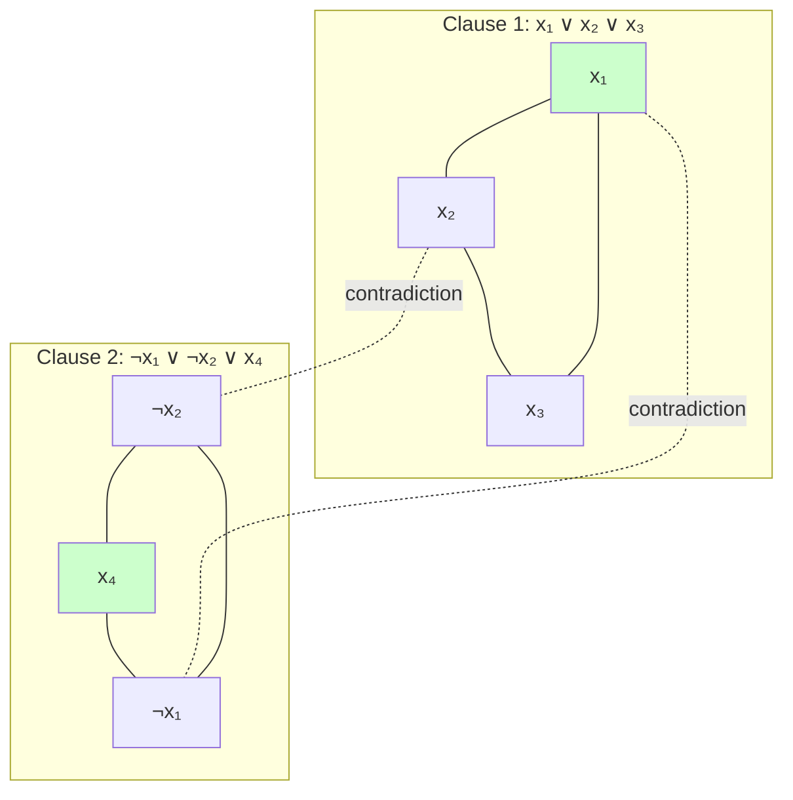
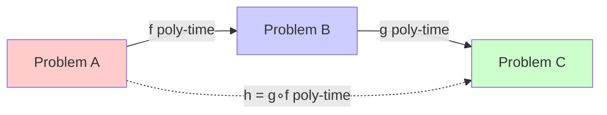

# Chapter 1: Polynomial Time Reductions

## 🎯 Learning Objectives
- Understand the concept of polynomial-time reductions
- Learn how to prove problem hardness using reductions
- Master the notation and formal definitions
- Apply reductions to compare problem complexity
- Recognize common reduction patterns

---

## 1.1 Introduction to Reductions

### 📚 **What is a Reduction?**

A **reduction** is a transformation of one problem into another. If we can solve problem B, and we have a way to transform problem A into problem B, then we can solve problem A.

**Intuition:** "Problem A is at least as hard as problem B"

---

### 🎭 **The Unforgettable Family Analogy**

**Let me explain reductions through a story you'll NEVER forget:**

#### **The Father's "Solution Technique"**

**Problem A (Child Problem):**
- **Situation:** Father has one child who is bored and keeps irritating him
- **Unknown:** How to keep the father relaxed?
- **Father's knowledge:** He doesn't have a direct solution for "bored child"

**Problem B (Companionship Problem):**
- **Situation:** When someone is bored/alone, give them company
- **Known solution:** "Get a companion" → Two people play together → Both happy
- **Father's knowledge:** This solution works! (He knows the algorithm for B)

**The Transformation (Reduction: A ≤_p B):**
```
Transform "bored child irritating father" 
    ↓
Into "child needs a companion"
    ↓
Apply known solution B: "Get another child"
    ↓
Result: Two children play together, father is relaxed ✓
```

**SUCCESS!** The father **reduced** his unknown problem A to a known problem B.

---

#### **The Crucial Mistake: Misunderstanding the Reduction!**

**Years later, Problem A' (Wife Problem):**
- **Situation:** Mother is quarreling with father
- **Father thinks:** "Hey, I solved a similar problem before!"
- **Father's WRONG reasoning:** 
  - "Last time someone was irritating me (child)"
  - "I gave them a companion and MY problem was solved"
  - "Now wife is irritating me"
  - "So I'll give HER a companion (another wife)!"

**The Fatal Flaw:**
```
Father tried to reduce: "Wife quarreling" → "Get companion for wife"
                                            ↓
                                    "Marry another woman"
                                            ↓
                                    DISASTER! ✗
```

**Why did it fail?** Because the problems are NOT equivalent!
- Original problem: Bored child needs playmate ✓
- New problem: Marital conflict needs resolution ✗
- **Same transformation ≠ Valid reduction**

---

### 🔑 **Mapping to Reduction Definition**

Let's map the family story to the formal definition:

| Family Story Element | Reduction Concept | Explanation |
|---------------------|-------------------|-------------|
| **Father has "bored child" problem** | **Problem A (unknown how to solve)** | You don't know the direct solution |
| **Father knows "companionship" solution** | **Problem B (known algorithm)** | You have a reliable algorithm for B |
| **Transform "bored child" → "needs companion"** | **Transform instance α of A → instance β of B** | Map your problem to the known problem |
| **Apply "get another child"** | **Use algorithm for B on β** | Run the known algorithm |
| **Two kids play → Father relaxed** | **Obtain solution for α from solution β** | Transform result back to original problem |
| **"Child problem REDUCES TO companionship problem"** | **A ≤_p B (A reduces to B)** | Formal notation |

---

### ✅ **The KEY Insight: Why Reduction Works**

**For the child problem (VALID reduction):**

1. **Transformation preserves meaning:**
   - α (bored child) → β (child needs companion) ✓
   - The essence is captured correctly

2. **Known solution applies:**
   - Algorithm B: "Provide companion" works for β ✓

3. **Reverse transformation works:**
   - Solution to β (two kids playing) → Solution to α (father relaxed) ✓

4. **Equivalence holds:**
   - α is solved ⟺ β is solved ✓

**For the wife problem (INVALID "reduction"):**

1. **Transformation BREAKS meaning:**
   - α' (wife quarreling) → β' (wife needs companion) ✗
   - The essence is NOT captured correctly

2. **Known solution doesn't apply:**
   - Algorithm B: "Provide companion" DOESN'T solve marital conflict ✗

3. **Reverse transformation fails:**
   - Solution to β' (two wives) → MORE problems, not less! ✗

4. **Equivalence BROKEN:**
   - α' is solved ⟺ β' is solved is FALSE ✗

---

### 🎯 **The Reduction Principle (Remember FOREVER)**

```
┌─────────────────────────────────────────────────────────┐
│  A valid reduction requires:                            │
│                                                         │
│  1. Transform A → B (like "bored" → "needs companion") │
│  2. Solve B (apply known algorithm)                    │
│  3. Transform back (B's solution → A's solution)       │
│                                                         │
│  CRITICAL: The transformation must PRESERVE the        │
│            problem's solvability!                       │
│                                                         │
│  If α is solvable ⟺ β is solvable                     │
│  Then A ≤_p B ✓                                        │
└─────────────────────────────────────────────────────────┘
```

**Father's mistake:** He confused "pattern matching" with "reduction"
- ✓ Both situations had someone irritating him
- ✗ But they required DIFFERENT solution strategies
- ✗ The "companionship" algorithm doesn't generalize

**Lesson:** Just because you solved a "similar-looking" problem doesn't mean the same transformation works!

---

### 🧠 **Memory Aid**

**When you think of REDUCTION, remember:**

1. **The Father's SUCCESS (Child):** 
   - "I don't know how to handle a bored child (A)"
   - "But I know how to provide companionship (B)"
   - "Let me REDUCE my problem to companionship"
   - **A ≤_p B means: "A is at most as hard as B"**

2. **The Father's FAILURE (Wife):**
   - "Just because transformation LOOKS similar"
   - "Doesn't mean it's a VALID reduction"
   - "You must PRESERVE the if-and-only-if relationship"

3. **The Golden Rule:**
   ```
   A reduces to B means:
   "If I can solve B, I can solve A by transformation"
   
   NOT:
   "If problems look similar, use same solution"
   ```

---

### 📊 **Visual Comparison**

```mermaid
graph TD
    subgraph "Valid Reduction: Child Problem"
    A1[Bored Child<br/>Problem A] -->|Transform| B1[Need Companion<br/>Problem B]
    B1 -->|Known Algorithm:<br/>Get another child| C1[Two kids play<br/>Solution to B]
    C1 -->|Reverse| D1[Father relaxed<br/>Solution to A ✓]
    end
    
    subgraph "Invalid 'Reduction': Wife Problem"
    A2[Wife Quarreling<br/>Problem A'] -->|Wrong Transform| B2[Need Companion?<br/>Problem B]
    B2 -->|Same Algorithm:<br/>Get another wife| C2[Two wives<br/>Solution to B?]
    C2 -->|Reverse?| D2[Father in MORE trouble<br/>NOT a solution ✗]
    end
    
    style D1 fill:#ccffcc
    style D2 fill:#ffcccc
```



---

### 🎓 **Exam Tip: How to Check if Reduction is Valid**

**Ask these questions (like the father should have!):**

1. ✅ **Does transformation preserve structure?**
   - Child bored → Need companion (YES)
   - Wife quarrels → Need companion (NO - oversimplified!)

2. ✅ **Does known algorithm actually solve transformed problem?**
   - Provide companion → Kids play (YES)
   - Provide companion → Wives quarrel MORE (NO!)

3. ✅ **Can you reverse the transformation?**
   - Kids playing → Father happy (YES)
   - Wives present → Father happy (NO!)

4. ✅ **Is the equivalence TRUE?**
   - Child problem solved ⟺ Companion problem solved (YES)
   - Wife problem solved ⟺ Companion problem solved (NO!)

**If ANY answer is NO → NOT a valid reduction!**

---

### 💡 **Why This Matters in Complexity Theory**

When we say "3-SAT reduces to Independent Set" (3-SAT ≤_p IS):

- **Like father with child:** We don't know how to solve 3-SAT efficiently
- **Like companionship solution:** We have an algorithm for Independent Set (hypothetically)
- **Like the transformation:** We carefully map SAT formulas to graphs
- **Unlike the wife mistake:** We PROVE the transformation preserves solvability
- **Result:** If IS is in P, then 3-SAT is in P (but we believe neither is!)

**The father's failure teaches us:**
- Reductions need RIGOROUS proof
- Similarity ≠ Equivalence  
- The if-and-only-if must hold
- Otherwise, your "reduction" is like getting a second wife! 😱



### 🔑 **Formal Definition**

**Problem A reduces to Problem B** (written A ≤_p B) if:
- There exists a polynomial-time computable function f such that:
- For all instances x of A: **x is a YES instance of A ⟺ f(x) is a YES instance of B**

**Key Components:**
1. **Transformation function f:** Converts A-instances to B-instances
2. **Polynomial time:** f runs in O(n^k) for some constant k
3. **Correctness:** Preserves YES/NO answers

---

## 1.2 Why Reductions Matter

### 🎯 **Uses of Reductions**

1. **Algorithm Design:** Solve new problems using known algorithms
2. **Hardness Proofs:** Show a problem is hard by reducing from a known hard problem
3. **Problem Classification:** Organize problems by difficulty
4. **Optimality Arguments:** Prove lower bounds on complexity

### 📊 **Reduction Types**

| Type | Notation | Meaning | Time Bound |
|------|----------|---------|------------|
| **Polynomial-time** | A ≤_p B | A reduces to B in polynomial time | O(n^k) |
| **Log-space** | A ≤_L B | A reduces to B using O(log n) space | O(log n) |
| **Turing reduction** | A ≤_T B | A solvable with oracle for B | Multiple calls |

---

## 1.3 How to Perform a Reduction

### 🔧 **Step-by-Step Process**

```
Algorithm: Reduce Problem A to Problem B

1. **Choose the target problem B**
   - B should be well-understood or known to be hard
   - Should have structural similarity to A

2. **Design transformation f**
   - Map instances of A to instances of B
   - Ensure f is computable in polynomial time

3. **Prove correctness**
   - Show: x ∈ A ⟺ f(x) ∈ B
   - Prove both directions (if and only if)

4. **Analyze complexity**
   - Show transformation runs in O(n^k)
   - Account for size increase

5. **Conclude**
   - If B is solvable in time T(n), then A is solvable in time T(n^k) + O(n^k)
```

### 🔍 **Correctness Requirements**

**Must prove two directions:**

**Forward (⇒):** If x is YES for A, then f(x) is YES for B
**Backward (⇐):** If f(x) is YES for B, then x is YES for A

---

## 1.4 Example 1: Independent Set ≤p Vertex Cover

### 📚 **Problem Definitions**

**Independent Set (IS):**
- **Input:** Graph G = (V, E), integer k
- **Question:** Does G have an independent set of size ≥ k?
- Independent set: No two vertices are adjacent

**Vertex Cover (VC):**
- **Input:** Graph G = (V, E), integer k'
- **Question:** Does G have a vertex cover of size ≤ k'?
- Vertex cover: Every edge has at least one endpoint in the set

### 🔧 **The Reduction**

```
Reduction: IS ≤_p VC

Transformation f:
  Input: (G = (V, E), k) for IS
  Output: (G' = (V, E), k' = |V| - k) for VC

Algorithm:
  1. f(G, k) = (G, |V| - k)
  2. Return the same graph with k' = |V| - k
```

### 📊 **Visualization**



### ✅ **Correctness Proof**

**Claim:** G has an independent set of size k ⟺ G has a vertex cover of size n - k

**Proof:**

**Part 1 (⇒):** IS of size k → VC of size n - k
- Let S ⊆ V be an independent set of size k
- Claim: V \ S is a vertex cover
- **Proof:** For any edge (u,v) ∈ E:
  - u and v cannot both be in S (S is independent)
  - Therefore, at least one of {u, v} is in V \ S
  - So V \ S covers all edges ✓
- |V \ S| = n - k ✓

**Part 2 (⇐):** VC of size n - k → IS of size k
- Let C ⊆ V be a vertex cover of size n - k
- Claim: V \ C is an independent set
- **Proof:** For any u, v ∈ V \ C:
  - If (u,v) ∈ E, then C doesn't cover it (contradiction!)
  - Therefore, no edge between u and v
  - So V \ C is independent ✓
- |V \ C| = n - (n - k) = k ✓

**Time Complexity:** O(1) - just rename parameter!

### 💻 **C Implementation**

```c
#include <stdio.h>
#include <stdbool.h>

typedef struct {
    int n;  // Number of vertices
    int k;  // Parameter for IS
} IndependentSetInstance;

typedef struct {
    int n;   // Number of vertices (same graph)
    int k_prime;  // Parameter for VC = n - k
} VertexCoverInstance;

// Reduction from IS to VC
VertexCoverInstance reduce_IS_to_VC(IndependentSetInstance is_instance) {
    printf("=== Reduction: Independent Set → Vertex Cover ===\n");
    printf("Input: Graph with %d vertices, looking for IS of size %d\n", 
           is_instance.n, is_instance.k);
    
    VertexCoverInstance vc_instance;
    vc_instance.n = is_instance.n;  // Same graph
    vc_instance.k_prime = is_instance.n - is_instance.k;  // Transform parameter
    
    printf("Output: Same graph, looking for VC of size %d\n", vc_instance.k_prime);
    printf("Transformation: k' = n - k = %d - %d = %d\n", 
           is_instance.n, is_instance.k, vc_instance.k_prime);
    
    return vc_instance;
}

// Example verification
void verify_reduction() {
    printf("\n=== Verification Example ===\n");
    printf("Graph: Triangle (3 vertices, 3 edges)\n");
    printf("  1---2\n");
    printf("   \\ /\n");
    printf("    3\n\n");
    
    // Check IS of size 1
    IndependentSetInstance is1 = {3, 1};
    VertexCoverInstance vc1 = reduce_IS_to_VC(is1);
    
    printf("\nIS of size 1: Any single vertex {1} or {2} or {3} ✓\n");
    printf("VC of size 2: Remove one vertex, remaining 2 cover all edges ✓\n");
    printf("Examples: {1,2}, {1,3}, {2,3}\n");
    
    // Check IS of size 2
    IndependentSetInstance is2 = {3, 2};
    VertexCoverInstance vc2 = reduce_IS_to_VC(is2);
    
    printf("\nIS of size 2: No two non-adjacent vertices exist ✗\n");
    printf("VC of size 1: Single vertex cannot cover all 3 edges ✗\n");
    printf("Both answers are NO - reduction preserves correctness ✓\n");
}

int main() {
    verify_reduction();
    return 0;
}
```

---

## 1.5 Example 2: 3-SAT ≤p Independent Set

### 📚 **Problem Definitions**

**3-SAT:**
- **Input:** Boolean formula in CNF with 3 literals per clause
- **Question:** Is there a satisfying assignment?
- Example: (x₁ ∨ x₂ ∨ x₃) ∧ (¬x₁ ∨ x₂ ∨ ¬x₄)

**Independent Set:**
- Already defined above

### 🔧 **The Reduction**

```
Reduction: 3-SAT ≤_p IS

Transformation f(φ):
  Input: 3-SAT formula φ with m clauses
  Output: (G, k) where k = m

Construction of G = (V, E):
  1. For each clause Cᵢ = (l₁ ∨ l₂ ∨ l₃):
     - Create 3 vertices v₁ⁱ, v₂ⁱ, v₃ⁱ (one per literal)
     
  2. Add edges:
     a) Triangle edges: Connect all 3 vertices in same clause
     b) Contradiction edges: Connect vertices for contradicting literals
        (e.g., connect xⱼ in clause i to ¬xⱼ in clause j)
  
  3. Set k = m (one vertex per clause)
```

### 📊 **Example Visualization**

**Formula:** φ = (x₁ ∨ x₂ ∨ x₃) ∧ (¬x₁ ∨ ¬x₂ ∨ x₄)



### ✅ **Correctness Proof**

**Claim:** φ is satisfiable ⟺ G has independent set of size k = m

**Proof (⇒):** φ satisfiable → IS of size m exists
- Let τ be a satisfying assignment
- For each clause Cᵢ, τ makes at least one literal true
- Pick one true literal from each clause → m vertices
- **No triangle edges:** We pick only 1 vertex per clause
- **No contradiction edges:** Can't pick both x and ¬x (τ is consistent)
- Therefore, these m vertices form an independent set ✓

**Proof (⇐):** IS of size m → φ is satisfiable
- Let S be an independent set of size m
- Since |S| = m and graph has m triangles, S contains exactly 1 vertex per clause
- **Construct assignment:** Set literal to TRUE if its vertex is in S
- **No contradictions:** S is independent, so can't have both x and ¬x
- **All clauses satisfied:** Each clause has one vertex in S (one true literal)
- Therefore, this assignment satisfies φ ✓

**Time Complexity:** O(m × n) where m = clauses, n = variables

### 💻 **C Implementation**

```c
#include <stdio.h>
#include <stdlib.h>
#include <stdbool.h>
#include <string.h>

#define MAX_VARS 100
#define MAX_CLAUSES 100

typedef struct {
    int var;      // Variable index (1 to n)
    bool negated; // True if negated
} Literal;

typedef struct {
    Literal literals[3];  // Exactly 3 literals per clause
} Clause;

typedef struct {
    int num_vars;
    int num_clauses;
    Clause clauses[MAX_CLAUSES];
} SAT3_Instance;

typedef struct {
    int clause_id;  // Which clause this vertex belongs to
    int literal_id; // Which literal in the clause (0, 1, or 2)
    Literal literal;
} Vertex;

typedef struct {
    int num_vertices;
    Vertex vertices[MAX_CLAUSES * 3];
    bool adj_matrix[MAX_CLAUSES * 3][MAX_CLAUSES * 3];
    int k;  // Independent set size = num_clauses
} IS_Instance;

// Check if two literals contradict each other
bool are_contradicting(Literal l1, Literal l2) {
    return (l1.var == l2.var) && (l1.negated != l2.negated);
}

// Reduction from 3-SAT to Independent Set
IS_Instance reduce_3SAT_to_IS(SAT3_Instance sat) {
    printf("=== Reduction: 3-SAT → Independent Set ===\n");
    printf("Input: 3-SAT formula with %d variables, %d clauses\n", 
           sat.num_vars, sat.num_clauses);
    
    IS_Instance is;
    is.num_vertices = sat.num_clauses * 3;
    is.k = sat.num_clauses;
    
    // Initialize adjacency matrix
    memset(is.adj_matrix, 0, sizeof(is.adj_matrix));
    
    // Step 1: Create vertices (3 per clause)
    int vertex_idx = 0;
    for (int i = 0; i < sat.num_clauses; i++) {
        printf("\nClause %d: (", i + 1);
        for (int j = 0; j < 3; j++) {
            is.vertices[vertex_idx].clause_id = i;
            is.vertices[vertex_idx].literal_id = j;
            is.vertices[vertex_idx].literal = sat.clauses[i].literals[j];
            
            if (sat.clauses[i].literals[j].negated) printf("¬");
            printf("x%d", sat.clauses[i].literals[j].var);
            if (j < 2) printf(" ∨ ");
            
            vertex_idx++;
        }
        printf(")\n");
    }
    
    // Step 2a: Add triangle edges (within same clause)
    printf("\nAdding triangle edges (within clauses):\n");
    for (int i = 0; i < sat.num_clauses; i++) {
        int v1 = i * 3;
        int v2 = i * 3 + 1;
        int v3 = i * 3 + 2;
        
        is.adj_matrix[v1][v2] = is.adj_matrix[v2][v1] = true;
        is.adj_matrix[v2][v3] = is.adj_matrix[v3][v2] = true;
        is.adj_matrix[v3][v1] = is.adj_matrix[v1][v3] = true;
        
        printf("  Clause %d: vertices %d-%d-%d form triangle\n", i + 1, v1, v2, v3);
    }
    
    // Step 2b: Add contradiction edges
    printf("\nAdding contradiction edges:\n");
    int contradiction_count = 0;
    for (int i = 0; i < is.num_vertices; i++) {
        for (int j = i + 1; j < is.num_vertices; j++) {
            if (is.vertices[i].clause_id != is.vertices[j].clause_id) {
                if (are_contradicting(is.vertices[i].literal, is.vertices[j].literal)) {
                    is.adj_matrix[i][j] = is.adj_matrix[j][i] = true;
                    
                    printf("  Edge between v%d (", i);
                    if (is.vertices[i].literal.negated) printf("¬");
                    printf("x%d) and v%d (", is.vertices[i].literal.var, j);
                    if (is.vertices[j].literal.negated) printf("¬");
                    printf("x%d)\n", is.vertices[j].literal.var);
                    
                    contradiction_count++;
                }
            }
        }
    }
    
    printf("\nGraph created:\n");
    printf("  Vertices: %d (3 per clause)\n", is.num_vertices);
    printf("  Triangle edges: %d (%d clauses × 3)\n", sat.num_clauses * 3, sat.num_clauses);
    printf("  Contradiction edges: %d\n", contradiction_count);
    printf("  Looking for independent set of size k = %d\n", is.k);
    
    return is;
}

// Example: Create and reduce a 3-SAT instance
int main() {
    SAT3_Instance sat;
    sat.num_vars = 4;
    sat.num_clauses = 2;
    
    // Clause 1: (x₁ ∨ x₂ ∨ x₃)
    sat.clauses[0].literals[0] = (Literal){1, false};
    sat.clauses[0].literals[1] = (Literal){2, false};
    sat.clauses[0].literals[2] = (Literal){3, false};
    
    // Clause 2: (¬x₁ ∨ ¬x₂ ∨ x₄)
    sat.clauses[1].literals[0] = (Literal){1, true};
    sat.clauses[1].literals[1] = (Literal){2, true};
    sat.clauses[1].literals[2] = (Literal){4, false};
    
    IS_Instance is = reduce_3SAT_to_IS(sat);
    
    printf("\n=== Verification ===\n");
    printf("Satisfying assignment: x₁=F, x₂=F, x₃=T, x₄=T\n");
    printf("  Clause 1: (F ∨ F ∨ T) = T (pick x₃)\n");
    printf("  Clause 2: (T ∨ T ∨ T) = T (pick x₄)\n");
    printf("Independent set: {v2 (x₃), v5 (x₄)} - size 2 ✓\n");
    printf("No edges between these vertices (different clauses, no contradiction) ✓\n");
    
    return 0;
}
```

---

## 1.6 Properties of Reductions

### 📊 **Transitivity**

**Property:** If A ≤_p B and B ≤_p C, then A ≤_p C

**Proof:**
- Let f: A → B in time O(n^k₁)
- Let g: B → C in time O(n^k₂)
- Compose: h(x) = g(f(x))
- Time: O(n^k₁) + O((n^k₁)^k₂) = O(n^(k₁×k₂)) = polynomial ✓



### 🔑 **Hardness Implications**

**If A ≤_p B:**
1. **B is at least as hard as A**
2. If B is in P, then A is in P
3. If A is NP-hard, then B is NP-hard
4. Algorithm for B gives algorithm for A

**Contrapositive:**
- If A is not in P, then B is not in P
- If B is easy, then A is easy

---

## 1.7 Common Reduction Patterns

### 🎯 **Pattern 1: Direct Construction**

**Example:** IS ≤_p VC
- Use same graph, transform parameter
- Minimal transformation

### 🎯 **Pattern 2: Gadget Construction**

**Example:** 3-SAT ≤_p IS
- Create "gadgets" for each component
- Connect gadgets to enforce constraints
- Size blowup is polynomial

### 🎯 **Pattern 3: Component Simulation**

**Example:** Circuit-SAT ≤_p 3-SAT
- Simulate each gate with clauses
- Use auxiliary variables

### 🎯 **Pattern 4: Local Replacement**

**Example:** Hamilton Cycle ≤_p TSP
- Replace each edge with weighted edge
- Set weights to enforce structure

---

## 1.8 Proving NP-Hardness via Reduction

### 📚 **Standard Approach**

```
To prove problem X is NP-hard:

1. Choose a known NP-hard problem Y
   (Common choices: 3-SAT, Vertex Cover, Clique, etc.)

2. Show Y ≤_p X (reduce Y to X)

3. Since Y is NP-hard and Y ≤_p X:
   → X is at least as hard as Y
   → X is NP-hard ✓

Note: Reduction direction matters!
  - Y ≤_p X proves X is hard
  - X ≤_p Y proves X is easy (if Y is easy)
```

### ⚠️ **Common Mistakes**

1. **Wrong direction:** Reducing X to known problem doesn't prove X is hard!
2. **Non-polynomial time:** Reduction must run in polynomial time
3. **Size explosion:** Output size must be polynomial in input size
4. **Incomplete proof:** Must prove both directions of if-and-only-if

---

## 1.9 Practice Problems

### 🧪 **Problem 1: Clique ≤_p Independent Set**

**Task:** Show that finding a clique of size k reduces to finding an independent set.

**Hint:** Consider the complement graph G̅.

**Solution:**
```
Reduction: Clique ≤_p IS

Transformation:
  Input: (G, k) for Clique
  Output: (G̅, k) for IS where G̅ is complement of G

Correctness:
  G has clique of size k ⟺ G̅ has independent set of size k
  
Proof:
  - Vertices in clique are all pairwise adjacent in G
  - In G̅, these vertices have NO edges between them
  - Therefore, they form an independent set in G̅ ✓
```

### 🧪 **Problem 2: Subset Sum ≤_p Knapsack**

**Task:** Reduce Subset Sum to 0-1 Knapsack.

**Solution:**
```
Reduction: Subset Sum ≤_p Knapsack

Input: Set S = {a₁, ..., aₙ}, target T
Output: Knapsack instance with:
  - Items: same as S with weight[i] = value[i] = aᵢ
  - Capacity: W = T
  - Target value: V = T

Correctness:
  Subset sums to T ⟺ Knapsack achieves value T with capacity T
```

---

## 📋 Summary

### 🎯 **Key Concepts**

1. **Reduction:** Transforming one problem to another
2. **Polynomial-time:** Transformation must be efficient (O(n^k))
3. **Correctness:** Must preserve YES/NO answers (if-and-only-if)
4. **Hardness:** A ≤_p B means B is at least as hard as A

### 🔑 **Applications**

- **Algorithm design:** Solve new problems using existing algorithms
- **Complexity theory:** Classify problems by difficulty
- **NP-hardness proofs:** Show problems are computationally hard
- **Lower bounds:** Prove no efficient algorithm exists

### 📊 **Reduction Checklist**

- [ ] Choose appropriate target problem
- [ ] Design polynomial-time transformation
- [ ] Prove forward direction (⇒)
- [ ] Prove backward direction (⇐)
- [ ] Analyze time and space complexity
- [ ] Verify polynomial size increase

---

## 📚 References

1. **Cormen, T. H., et al. (2009).** *Introduction to Algorithms* (3rd ed.). MIT Press.
   - Chapter 34: NP-Completeness

2. **Kleinberg, J., & Tardos, É. (2005).** *Algorithm Design*. Pearson.
   - Chapter 8: NP and Computational Intractability

3. **Sipser, M. (2012).** *Introduction to the Theory of Computation* (3rd ed.). Cengage Learning.
   - Chapter 7: Time Complexity

4. **Garey, M. R., & Johnson, D. S. (1979).** *Computers and Intractability: A Guide to the Theory of NP-Completeness*. W.H. Freeman.
   - The definitive reference for NP-completeness

---

**Next Chapter:** [NP, NP-Complete, and NP-Hard Problems →](02_np_completeness.md)
