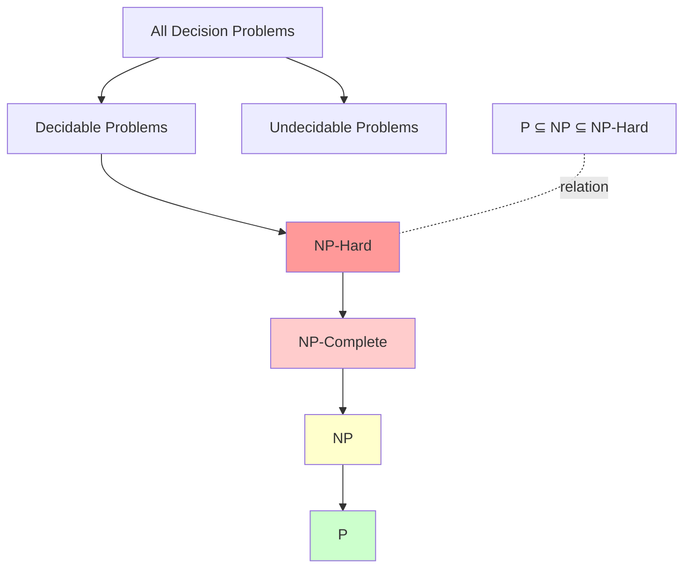
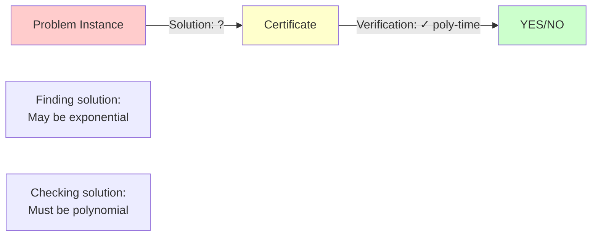
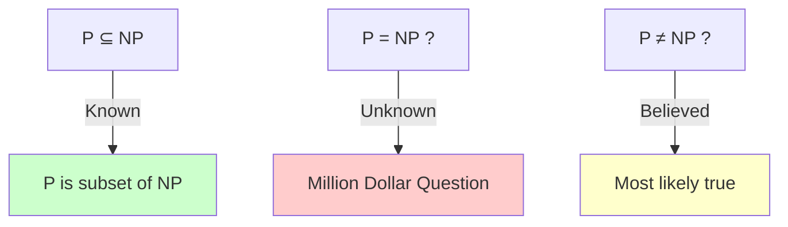
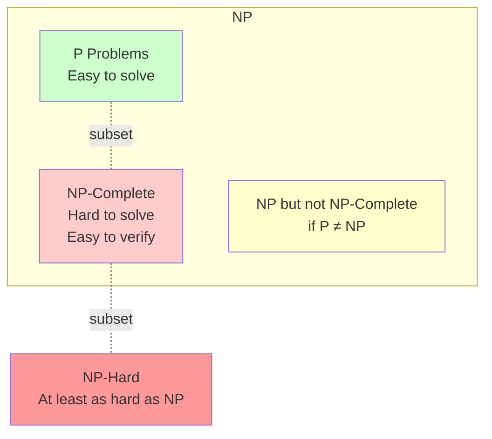
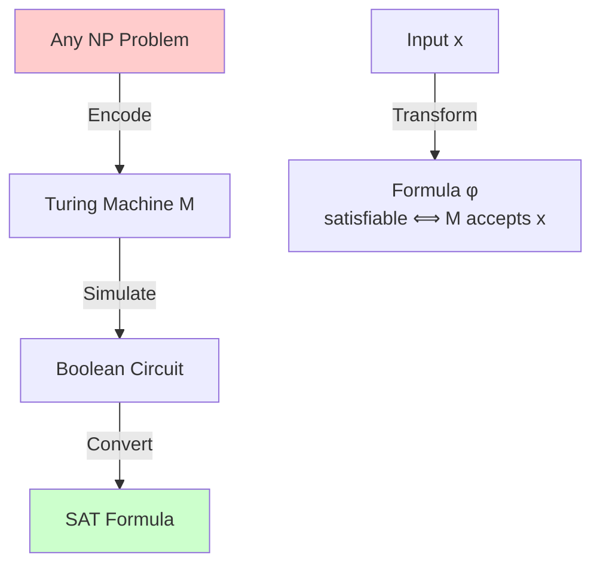
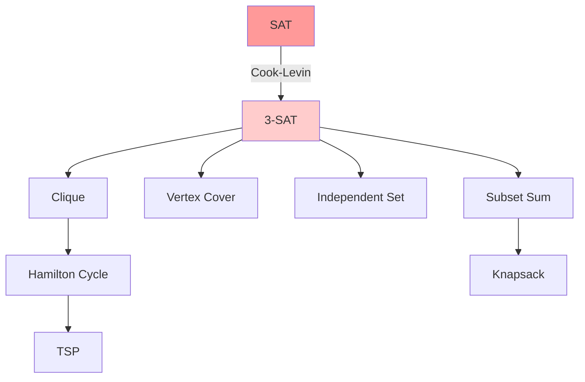
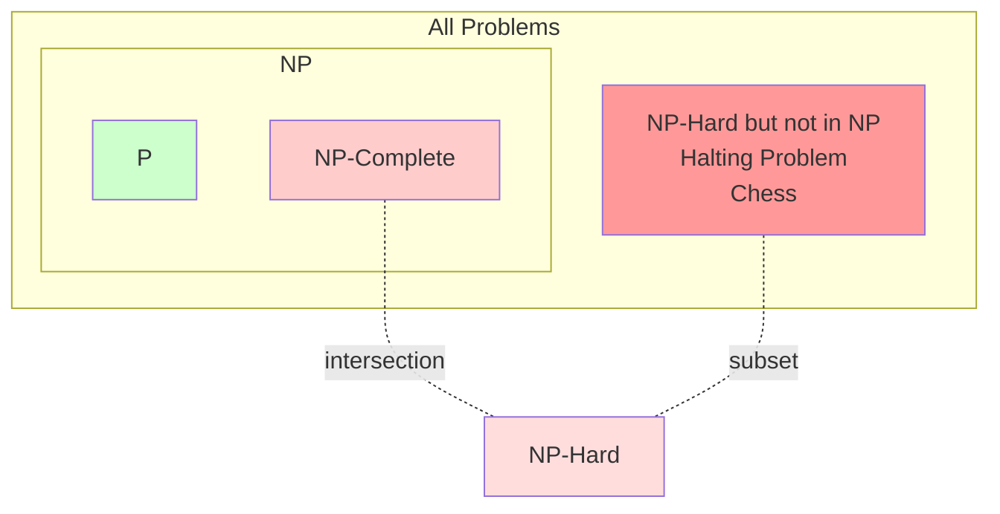
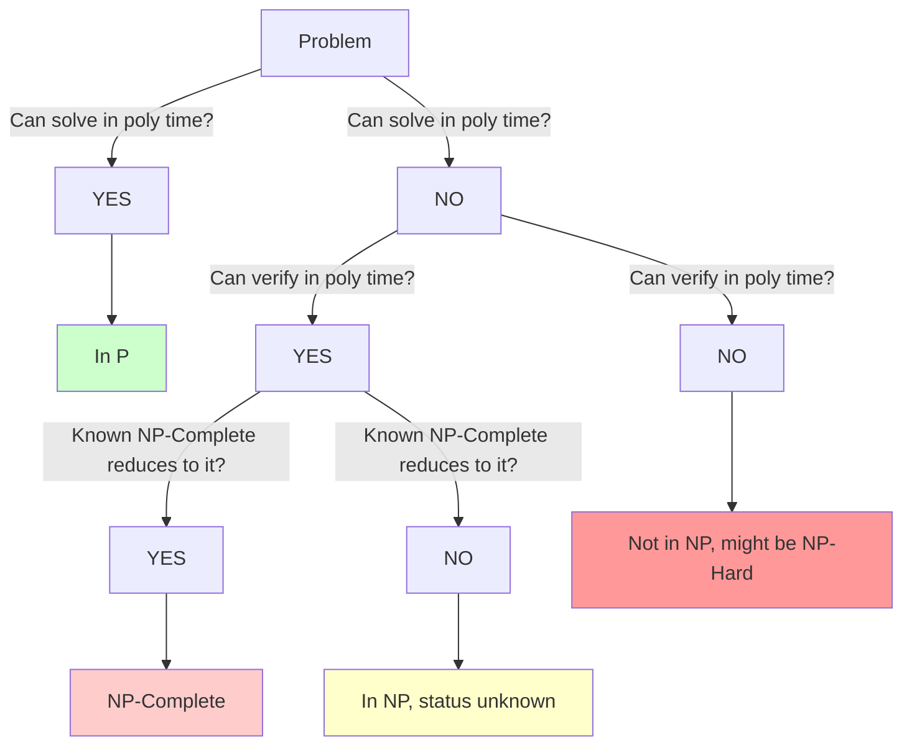

# Chapter 2: NP, NP-Complete, and NP-Hard Problems

## 🎯 Learning Objectives
- Understand complexity classes P, NP, NP-Complete, NP-Hard
- Learn the formal definitions and relationships
- Master Cook-Levin theorem and its significance
- Identify NP-Complete problems
- Apply techniques to prove NP-Completeness

---

## 2.1 Complexity Classes: The Big Picture

### 📊 **The Complexity Hierarchy**



### 🔑 **Class Definitions Overview**

| Class | Full Name | Verifier Time | Solver Time | Examples |
|-------|-----------|---------------|-------------|----------|
| **P** | Polynomial | O(n^k) | O(n^k) | Sorting, Shortest Path |
| **NP** | Nondeterministic Polynomial | O(n^k) | Unknown | SAT, Clique, TSP |
| **NP-Complete** | NP-Complete | O(n^k) | Unknown | 3-SAT, Vertex Cover |
| **NP-Hard** | NP-Hard | Not necessarily | Unknown | Halting Problem |

---

## 2.2 Class P: Polynomial Time

### 📚 **Formal Definition**

**Class P** = {L | L is decidable in polynomial time}

A language L is in P if there exists:
- A deterministic Turing machine M
- A polynomial p(n)
- Such that for all inputs x:
  - M decides if x ∈ L in time O(p(|x|))

**Intuition:** Problems we can **solve efficiently**

### 🎯 **Examples of P Problems**

```c
// Example 1: Sorting (P problem)
// Time: O(n log n)
void merge_sort(int arr[], int n) {
    // Polynomial time algorithm
    // Definitely in P
}

// Example 2: Shortest Path (P problem)
// Time: O(V²) or O(E log V) with heap
int dijkstra(Graph G, int source, int target) {
    // Polynomial time algorithm
    // Definitely in P
}

// Example 3: Maximum Flow (P problem)
// Time: O(V²E) for Ford-Fulkerson
int max_flow(Graph G, int source, int sink) {
    // Polynomial time algorithm
    // Definitely in P
}
```

### 📊 **Characteristics of P**

1. **Closed under complement:** If L ∈ P, then L̅ ∈ P
2. **Closed under union:** If L₁, L₂ ∈ P, then L₁ ∪ L₂ ∈ P
3. **Closed under intersection:** If L₁, L₂ ∈ P, then L₁ ∩ L₂ ∈ P
4. **Robust:** Same for all reasonable computation models

---

## 2.3 Class NP: Nondeterministic Polynomial Time

### 📚 **Formal Definition (Verifier Approach)**

**Class NP** = {L | L has a polynomial-time verifier}

A language L is in NP if there exists:
- A polynomial-time algorithm V (verifier)
- A polynomial p(n)
- Such that for all x:
  - x ∈ L ⟺ ∃ certificate c (|c| ≤ p(|x|)) where V(x, c) = YES

**Intuition:** Problems where solutions can be **verified quickly**, even if we don't know how to **find** them quickly.

### 🔍 **The Verifier Perspective**

```
NP Problem Structure:

Input: Instance x
Question: Is x a YES instance?

To prove x is in NP:
  1. Define what a "certificate" (proof/witness) looks like
  2. Show that given x and certificate c:
     - We can verify c is valid in polynomial time
     - If valid certificate exists, x is YES
     - If no valid certificate exists, x is NO
```

### 📊 **Verification vs. Solution**



### 🎯 **Example 1: Hamilton Cycle (NP)**

```c
#include <stdio.h>
#include <stdbool.h>

#define MAX_V 100

typedef struct {
    int n;  // Number of vertices
    bool adj[MAX_V][MAX_V];  // Adjacency matrix
} Graph;

typedef struct {
    int path[MAX_V];  // Permutation of vertices
    int length;       // Should be n
} HamiltonCycle_Certificate;

// VERIFIER for Hamilton Cycle (runs in polynomial time)
bool verify_hamilton_cycle(Graph *G, HamiltonCycle_Certificate *cert) {
    printf("=== Verifying Hamilton Cycle Certificate ===\n");
    
    // Step 1: Check certificate length
    if (cert->length != G->n) {
        printf("✗ Certificate length %d ≠ n = %d\n", cert->length, G->n);
        return false;
    }
    printf("✓ Certificate has correct length: %d\n", cert->length);
    
    // Step 2: Check all vertices appear exactly once
    bool visited[MAX_V] = {false};
    for (int i = 0; i < cert->length; i++) {
        int v = cert->path[i];
        if (v < 0 || v >= G->n) {
            printf("✗ Invalid vertex %d\n", v);
            return false;
        }
        if (visited[v]) {
            printf("✗ Vertex %d appears multiple times\n", v);
            return false;
        }
        visited[v] = true;
    }
    printf("✓ All vertices appear exactly once\n");
    
    // Step 3: Check all consecutive edges exist
    for (int i = 0; i < cert->length; i++) {
        int u = cert->path[i];
        int v = cert->path[(i + 1) % cert->length];  // Wrap around for cycle
        
        if (!G->adj[u][v]) {
            printf("✗ No edge between %d and %d\n", u, v);
            return false;
        }
    }
    printf("✓ All edges in path exist in graph\n");
    
    // Step 4: Verify it's a cycle (first = last)
    printf("✓ Path forms a cycle (wraps around)\n");
    
    printf("=== Certificate VALID ✓ ===\n");
    return true;
}

// Example usage
int main() {
    // Create a simple 4-vertex cycle graph
    Graph G = {4};
    
    // Edges: 0-1, 1-2, 2-3, 3-0
    G.adj[0][1] = G.adj[1][0] = true;
    G.adj[1][2] = G.adj[2][1] = true;
    G.adj[2][3] = G.adj[3][2] = true;
    G.adj[3][0] = G.adj[0][3] = true;
    
    // Valid certificate: 0 → 1 → 2 → 3 → 0
    HamiltonCycle_Certificate valid_cert = {{0, 1, 2, 3}, 4};
    
    printf("Graph: 4 vertices in a cycle\n");
    printf("Certificate: 0 → 1 → 2 → 3 → 0\n\n");
    
    bool result = verify_hamilton_cycle(&G, &valid_cert);
    printf("\nVerification result: %s\n", result ? "ACCEPT" : "REJECT");
    
    printf("\n--- Time Complexity Analysis ---\n");
    printf("Step 1 (length check): O(1)\n");
    printf("Step 2 (vertex check): O(n)\n");
    printf("Step 3 (edge check): O(n)\n");
    printf("Total: O(n) = POLYNOMIAL ✓\n");
    
    return 0;
}
```

**Output:**
```
=== Verifying Hamilton Cycle Certificate ===
✓ Certificate has correct length: 4
✓ All vertices appear exactly once
✓ All edges in path exist in graph
✓ Path forms a cycle (wraps around)
=== Certificate VALID ✓ ===

Verification result: ACCEPT

--- Time Complexity Analysis ---
Step 1 (length check): O(1)
Step 2 (vertex check): O(n)
Step 3 (edge check): O(n)
Total: O(n) = POLYNOMIAL ✓
```

### 🎯 **Example 2: SAT (NP)**

```c
#include <stdio.h>
#include <stdbool.h>

#define MAX_VARS 100
#define MAX_CLAUSES 100

typedef struct {
    int var;      // Variable index
    bool negated; // True if negated
} Literal;

typedef struct {
    Literal literals[3];
    int num_literals;
} Clause;

typedef struct {
    int num_vars;
    int num_clauses;
    Clause clauses[MAX_CLAUSES];
} SAT_Instance;

typedef struct {
    bool assignment[MAX_VARS];  // TRUE/FALSE for each variable
} SAT_Certificate;

// Evaluate a literal given assignment
bool eval_literal(Literal lit, SAT_Certificate *cert) {
    bool value = cert->assignment[lit.var];
    return lit.negated ? !value : value;
}

// Evaluate a clause (OR of literals)
bool eval_clause(Clause *clause, SAT_Certificate *cert) {
    for (int i = 0; i < clause->num_literals; i++) {
        if (eval_literal(clause->literals[i], cert)) {
            return true;  // At least one literal is true
        }
    }
    return false;  // All literals are false
}

// VERIFIER for SAT (runs in polynomial time)
bool verify_sat(SAT_Instance *inst, SAT_Certificate *cert) {
    printf("=== Verifying SAT Certificate ===\n");
    
    // Print assignment
    printf("Assignment: ");
    for (int i = 0; i < inst->num_vars; i++) {
        printf("x%d=%s ", i + 1, cert->assignment[i] ? "T" : "F");
    }
    printf("\n\n");
    
    // Check each clause
    for (int i = 0; i < inst->num_clauses; i++) {
        printf("Clause %d: ", i + 1);
        bool satisfied = eval_clause(&inst->clauses[i], cert);
        
        // Print clause evaluation
        printf("(");
        for (int j = 0; j < inst->clauses[i].num_literals; j++) {
            Literal lit = inst->clauses[i].literals[j];
            if (lit.negated) printf("¬");
            printf("x%d", lit.var + 1);
            
            bool lit_value = eval_literal(lit, cert);
            printf("=%s", lit_value ? "T" : "F");
            
            if (j < inst->clauses[i].num_literals - 1) printf(" ∨ ");
        }
        printf(") = %s ", satisfied ? "T" : "F");
        
        if (!satisfied) {
            printf("✗ UNSATISFIED\n");
            printf("=== Certificate INVALID ✗ ===\n");
            return false;
        }
        printf("✓\n");
    }
    
    printf("\n=== Certificate VALID ✓ ===\n");
    return true;
}

int main() {
    // Create SAT instance: (x₁ ∨ x₂) ∧ (¬x₁ ∨ x₃) ∧ (¬x₂ ∨ ¬x₃)
    SAT_Instance sat = {3, 3};
    
    // Clause 1: (x₁ ∨ x₂)
    sat.clauses[0].literals[0] = (Literal){0, false};
    sat.clauses[0].literals[1] = (Literal){1, false};
    sat.clauses[0].num_literals = 2;
    
    // Clause 2: (¬x₁ ∨ x₃)
    sat.clauses[1].literals[0] = (Literal){0, true};
    sat.clauses[1].literals[1] = (Literal){2, false};
    sat.clauses[1].num_literals = 2;
    
    // Clause 3: (¬x₂ ∨ ¬x₃)
    sat.clauses[2].literals[0] = (Literal){1, true};
    sat.clauses[2].literals[1] = (Literal){2, true};
    sat.clauses[2].num_literals = 2;
    
    // Certificate: x₁=F, x₂=T, x₃=F
    SAT_Certificate cert = {{false, true, false}};
    
    printf("Formula: (x₁ ∨ x₂) ∧ (¬x₁ ∨ x₃) ∧ (¬x₂ ∨ ¬x₃)\n\n");
    
    bool result = verify_sat(&sat, &cert);
    printf("\nVerification result: %s\n", result ? "ACCEPT" : "REJECT");
    
    printf("\n--- Time Complexity Analysis ---\n");
    printf("For each clause: O(k) where k = literals per clause\n");
    printf("Total: O(m × k) where m = number of clauses\n");
    printf("For 3-SAT: O(3m) = O(m) = POLYNOMIAL ✓\n");
    
    return 0;
}
```

---

## 2.4 Relationship: P vs NP

### 📊 **What We Know**

**Theorem:** P ⊆ NP

**Proof:**
- If problem L is in P, we can solve it in polynomial time
- Verifier: Ignore certificate, just solve the problem
- Time: O(n^k) = polynomial ✓
- Therefore, L is also in NP ✓



### 🔑 **The P vs NP Question**

**Open Problem:** Is P = NP?

**If P = NP:**
- Every problem with fast verification also has fast solution
- Cryptography breaks (factoring, discrete log become easy)
- Optimization becomes easy (TSP, scheduling, etc.)
- **Most computer scientists believe this is FALSE**

**If P ≠ NP:**
- There exist problems with fast verification but no fast solution
- NP-Complete problems have no polynomial-time algorithms
- Current cryptography remains secure
- **This is the widely believed answer**

---

## 2.5 NP-Complete: The Hardest Problems in NP

### 📚 **Formal Definition**

A language L is **NP-Complete** if:
1. **L ∈ NP** (L has polynomial-time verifier)
2. **L is NP-hard** (Every problem in NP reduces to L)

**Equivalent formulation:**
L is NP-Complete if:
1. L ∈ NP
2. For some known NP-Complete problem L', we have L' ≤_p L

### 🎯 **Significance**

```
NP-Complete problems are the "hardest" problems in NP:

- If ANY NP-Complete problem is in P → P = NP
- If P ≠ NP → NO NP-Complete problem is in P
- All NP-Complete problems are "equally hard"
```

### 📊 **Visual Representation**



---

## 2.6 Cook-Levin Theorem: The First NP-Complete Problem

### 📚 **Statement**

**Cook-Levin Theorem (1971):** SAT is NP-Complete.

Specifically, **Boolean Satisfiability (SAT)** is the first problem proven to be NP-Complete.

### 🔑 **Why This Matters**

This theorem is revolutionary because:
1. **Proves NP-Complete class is non-empty**
2. **Provides starting point for all other NP-Completeness proofs**
3. **Shows computational limits of logical reasoning**

### 📊 **Proof Sketch**

```
Proof that SAT is NP-Complete:

Part 1: SAT ∈ NP ✓
  - Certificate: Variable assignment
  - Verifier: Evaluate formula (polynomial time)
  
Part 2: SAT is NP-hard
  - For ANY problem L in NP:
    * L has polynomial-time verifier V
    * V can be simulated by boolean circuit
    * Boolean circuit can be encoded as SAT formula φ
    * x ∈ L ⟺ φ is satisfiable
  - Therefore: L ≤_p SAT for all L in NP ✓
  
Conclusion: SAT is NP-Complete ✓
```

### 🔧 **The Reduction Mechanism**



---

## 2.7 Classic NP-Complete Problems

### 📋 **The Core Set**

| Problem | Input | Question | Certificate |
|---------|-------|----------|-------------|
| **SAT** | Boolean formula | Satisfiable? | Assignment |
| **3-SAT** | CNF, 3 lit/clause | Satisfiable? | Assignment |
| **Clique** | Graph G, integer k | Clique of size k? | Set of vertices |
| **Vertex Cover** | Graph G, integer k | Cover of size ≤k? | Set of vertices |
| **Hamilton Cycle** | Graph G | Ham. cycle exists? | Permutation |
| **TSP** | Weighted graph, k | Tour of cost ≤k? | Permutation |
| **Subset Sum** | Set S, target T | Subset sums to T? | Subset |
| **Knapsack (decision)** | Items, capacity | Value ≥ V? | Subset of items |

### 🔗 **Reduction Chain**



---

## 2.8 Proving NP-Completeness

### 📚 **Standard Recipe**

```
To prove problem X is NP-Complete:

Step 1: Show X ∈ NP
  - Define certificate structure
  - Give polynomial-time verification algorithm
  - Prove correctness

Step 2: Choose known NP-Complete problem Y
  - Common choices: 3-SAT, Vertex Cover, Clique
  - Should have structural similarity to X

Step 3: Show Y ≤_p X
  - Design polynomial-time transformation f
  - Prove: y is YES for Y ⟺ f(y) is YES for X
  - Analyze running time

Conclusion: X is NP-Complete ✓
```

### 🎯 **Example: Proving Vertex Cover is NP-Complete**

```c
/*
Proof that VERTEX COVER is NP-Complete

Problem: Given graph G=(V,E) and integer k,
         does G have a vertex cover of size ≤ k?
*/

#include <stdio.h>
#include <stdbool.h>
#include <string.h>

#define MAX_V 100

typedef struct {
    int n;  // Number of vertices
    int m;  // Number of edges
    int edges[MAX_V][2];  // Edge list
    int k;  // Target cover size
} VertexCover_Instance;

typedef struct {
    bool in_cover[MAX_V];  // Which vertices are in cover
    int size;              // Size of cover
} VertexCover_Certificate;

// STEP 1: Show Vertex Cover ∈ NP

bool verify_vertex_cover(VertexCover_Instance *inst, 
                        VertexCover_Certificate *cert) {
    printf("=== Verifying Vertex Cover Certificate ===\n");
    
    // Count vertices in cover
    int count = 0;
    printf("Vertices in cover: ");
    for (int i = 0; i < inst->n; i++) {
        if (cert->in_cover[i]) {
            printf("%d ", i);
            count++;
        }
    }
    printf("\n");
    
    // Check size constraint
    if (count > inst->k) {
        printf("✗ Cover size %d > k = %d\n", count, inst->k);
        return false;
    }
    printf("✓ Cover size %d ≤ k = %d\n", count, inst->k);
    
    // Check each edge is covered
    for (int i = 0; i < inst->m; i++) {
        int u = inst->edges[i][0];
        int v = inst->edges[i][1];
        
        if (!cert->in_cover[u] && !cert->in_cover[v]) {
            printf("✗ Edge (%d,%d) not covered\n", u, v);
            return false;
        }
    }
    printf("✓ All %d edges are covered\n", inst->m);
    
    printf("=== Certificate VALID ✓ ===\n");
    return true;
}

/*
STEP 2 & 3: Show Vertex Cover is NP-hard

We reduce from 3-SAT (known NP-Complete problem)
Proof sketch in comments:

Given 3-SAT formula φ with m clauses and n variables:

Construction of Vertex Cover instance:
1. For each variable xᵢ:
   - Create two vertices: vᵢ (for xᵢ) and v̄ᵢ (for ¬xᵢ)
   - Add edge (vᵢ, v̄ᵢ)
   
2. For each clause Cⱼ = (l₁ ∨ l₂ ∨ l₃):
   - Create 3 vertices: c¹ⱼ, c²ⱼ, c³ⱼ
   - Add triangle: edges between all pairs
   - Connect each cᵏⱼ to corresponding literal vertex
   
3. Set k = n + 2m

Correctness:
- φ is satisfiable ⟺ G has vertex cover of size k
- Each variable edge forces one of {vᵢ, v̄ᵢ} in cover (like assignment)
- Each clause triangle needs 2 vertices in cover
- Literal connections ensure clause satisfaction

Time: O(m × n) = polynomial ✓

Therefore: 3-SAT ≤_p Vertex Cover
Since 3-SAT is NP-Complete and Vertex Cover ∈ NP:
→ Vertex Cover is NP-Complete ✓
*/

int main() {
    // Example: Graph with 4 vertices and 4 edges
    VertexCover_Instance inst = {
        .n = 4,
        .m = 4,
        .edges = {{0,1}, {1,2}, {2,3}, {3,0}},
        .k = 2
    };
    
    // Certificate: vertices {0, 2} form a vertex cover
    VertexCover_Certificate cert = {{0}};
    cert.in_cover[0] = true;
    cert.in_cover[2] = true;
    cert.size = 2;
    
    printf("Graph: 4 vertices in a cycle\n");
    printf("Edges: (0,1), (1,2), (2,3), (3,0)\n");
    printf("Looking for vertex cover of size ≤ %d\n\n", inst.k);
    
    bool result = verify_vertex_cover(&inst, &cert);
    printf("\nVerification result: %s\n", result ? "ACCEPT" : "REJECT");
    
    printf("\n--- Time Complexity Analysis ---\n");
    printf("Counting vertices: O(n)\n");
    printf("Checking edges: O(m)\n");
    printf("Total: O(n + m) = POLYNOMIAL ✓\n");
    
    printf("\n--- NP-Completeness Status ---\n");
    printf("✓ Vertex Cover ∈ NP (verified above)\n");
    printf("✓ 3-SAT ≤_p Vertex Cover (reduction exists)\n");
    printf("∴ Vertex Cover is NP-Complete\n");
    
    return 0;
}
```

---

## 2.9 NP-Hard: Beyond NP

### 📚 **Formal Definition**

A problem L is **NP-hard** if:
- Every problem in NP reduces to L (L ≤_p NP for all in NP)
- **Note:** L does NOT need to be in NP itself!

### 🔑 **Key Differences**

| Property | NP-Complete | NP-Hard |
|----------|-------------|---------|
| In NP? | **YES** (must be) | **NO** (not required) |
| NP reduces to it? | **YES** | **YES** |
| Decision problem? | Usually | Can be optimization |
| Examples | 3-SAT, Clique | Halting Problem, TSP (optimization) |

### 📊 **Venn Diagram**



### 🎯 **Examples of NP-Hard but NOT NP-Complete**

1. **Halting Problem:** Not even decidable, so not in NP
2. **Traveling Salesman (optimization):** Find shortest tour (not decision problem)
3. **Generalized Chess:** On n×n board (not in NP, game is EXPTIME-complete)

---

## 2.10 Coping with NP-Completeness

### 🔧 **Practical Approaches**

When faced with an NP-Complete problem:

#### 1. **Exact Algorithms with Improved Constants**
```c
// Improved backtracking with pruning
// Still exponential, but faster in practice
int tsp_branch_and_bound(Graph G) {
    // Use clever pruning strategies
    // Typical speedup: 2^n → 1.5^n
}
```

#### 2. **Approximation Algorithms**
```c
// Vertex Cover 2-approximation
// Guarantee: solution ≤ 2 × OPT
Set approximate_vertex_cover(Graph G) {
    Set C = empty;
    while (edges remain) {
        Pick arbitrary edge (u,v);
        Add both u and v to C;
        Remove all edges incident to u or v;
    }
    return C;
}
```

#### 3. **Parameterized Algorithms**
```c
// Fixed-parameter tractable for parameter k
// Time: O(2^k × n^c) instead of O(2^n)
bool vertex_cover_fpt(Graph G, int k) {
    // Efficient when k is small
    // Practical for k ≤ 20
}
```

#### 4. **Heuristics and Local Search**
```c
// Hill climbing for TSP
// No guarantees, but often good solutions
Tour tsp_local_search(Graph G) {
    Tour T = random_tour(G);
    while (improvement possible) {
        T = improve_by_2opt(T);
    }
    return T;
}
```

#### 5. **Special Case Analysis**
```c
// If input has special structure, might be polynomial
bool two_sat(Formula f) {
    // 2-SAT is in P (unlike 3-SAT)
    // O(n + m) using SCC algorithm
}
```

---

## 2.11 Summary Table

### 📊 **Complexity Class Comparison**

| Class | Solve Time | Verify Time | Contains | Hardest? |
|-------|------------|-------------|----------|----------|
| **P** | Poly | Poly | Sort, Search | No |
| **NP** | ? | Poly | P, NP-C | No |
| **NP-C** | ? | Poly | Hardest in NP | Yes (in NP) |
| **NP-H** | ? | ? | NP-C, more | Yes |

### 🔑 **Key Relationships**

```
P ⊆ NP
NP-Complete ⊆ NP
NP-Complete ⊆ NP-Hard
P ∩ NP-Complete = ∅ (if P ≠ NP)
```

### 📋 **Decision Tree for Classification**



---

## 📚 References

1. **Cormen, T. H., et al. (2009).** *Introduction to Algorithms* (3rd ed.). MIT Press.
   - Chapter 34: NP-Completeness
   - Chapter 35: Approximation Algorithms

2. **Sipser, M. (2012).** *Introduction to the Theory of Computation* (3rd ed.). Cengage Learning.
   - Chapter 7.4: The Class NP
   - Chapter 7.5: NP-Completeness

3. **Garey, M. R., & Johnson, D. S. (1979).** *Computers and Intractability: A Guide to the Theory of NP-Completeness*. W.H. Freeman.
   - Comprehensive catalog of NP-Complete problems

4. **Cook, S. A. (1971).** "The complexity of theorem-proving procedures." *STOC 1971*.
   - Original Cook-Levin theorem paper

5. **Karp, R. M. (1972).** "Reducibility among combinatorial problems." *Complexity of Computer Computations*.
   - 21 classic NP-Complete problems

---

**Next Chapter:** [Longest Increasing Subsequence →](03_longest_increasing_subsequence.md)
