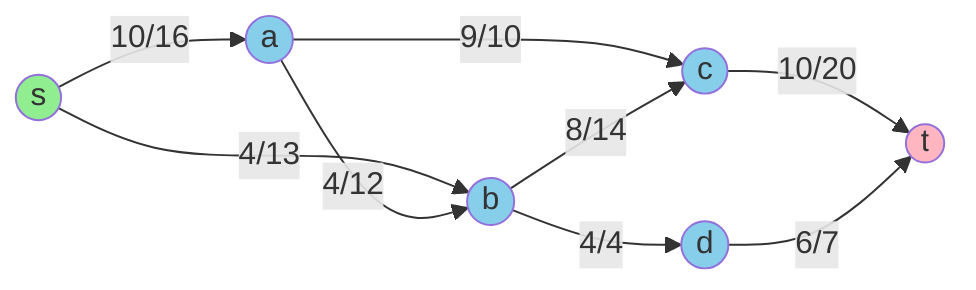
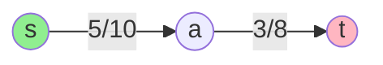
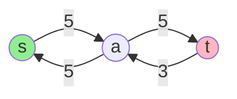
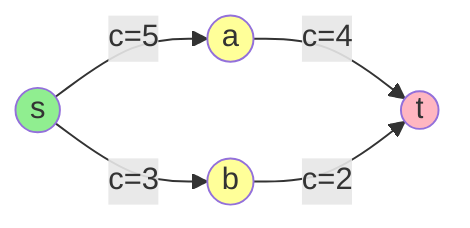
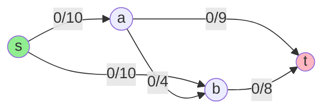
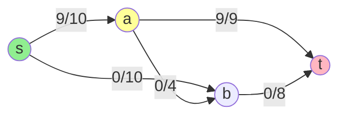
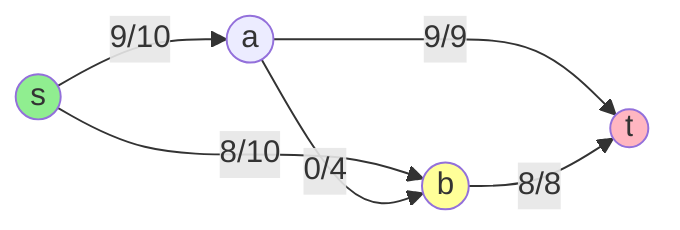

# Chapter 4: Network Flow - Ford-Fulkerson Method

## 🎯 Learning Objectives
- Understand flow networks and basic definitions
- Master the Ford-Fulkerson algorithm
- Learn residual graphs and augmenting paths
- Implement Edmonds-Karp (BFS-based Ford-Fulkerson)
- Apply max-flow to real-world problems
- Analyze time complexity and correctness

---

## 4.1 Flow Networks: Definitions

### 📚 **Flow Network Components**

A **flow network** G = (V, E) is a directed graph with:

1. **Vertices V:** Set of nodes
2. **Edges E:** Directed edges (arcs)
3. **Capacity function c:** c(u, v) ≥ 0 for each edge (u, v) ∈ E
4. **Source s:** Single vertex with no incoming edges (produces flow)
5. **Sink t:** Single vertex with no outgoing edges (consumes flow)

### 🔑 **Flow Function**

A **flow** f: V × V → ℝ must satisfy:

**1. Capacity Constraint:**
```
f(u, v) ≤ c(u, v)  for all u, v ∈ V
```
Cannot exceed edge capacity

**2. Flow Conservation:**
```
Σ f(u, v) = Σ f(v, w)  for all v ∈ V - {s, t}
  u∈V         w∈V
```
Flow in = Flow out (except source and sink)

**3. Skew Symmetry:**
```
f(u, v) = -f(v, u)  for all u, v ∈ V
```
Flow from u to v is negative of flow from v to u

### 📊 **Example Flow Network**



**Notation:** `flow/capacity` on each edge

**Flow value:** |f| = 19 (total leaving source or entering sink)

---

## 4.2 The Maximum Flow Problem

### 📚 **Problem Statement**

**Input:** Flow network G = (V, E, c, s, t)

**Output:** Flow f that maximizes |f| = Σ f(s, v) - Σ f(v, s)
                                      v∈V       v∈V

**Objective:** Send as much flow as possible from s to t

### 🌍 **Real-World Applications**

| Application | Source | Sink | Edges | Capacity |
|-------------|--------|------|-------|----------|
| **Transportation** | Factory | Warehouse | Roads | Truck capacity |
| **Communication** | Sender | Receiver | Links | Bandwidth |
| **Matching** | Left set | Right set | Possible pairs | 1 |
| **Electrical** | Generator | Load | Wires | Amperage |
| **Fluid** | Pump | Drain | Pipes | Diameter |

---

## 4.3 Residual Networks

### 📚 **Definition**

Given flow network G and flow f, the **residual network** G_f has:

**Residual capacity:**
```
c_f(u, v) = c(u, v) - f(u, v)
```

**Interpretation:**
- **Forward edge:** Remaining capacity to push more flow
- **Backward edge:** Capacity to "undo" flow (send it back)

### 🔑 **Key Properties**

For each edge (u, v):
- **Forward residual capacity:** c_f(u, v) = c(u, v) - f(u, v)
  - How much more flow can we send u → v?
  
- **Backward residual capacity:** c_f(v, u) = f(u, v)
  - How much flow can we "cancel" by sending v → u?

### 📊 **Example: Residual Network Construction**

**Original Network with Flow:**


**Residual Network:**


**Residual capacities:**
- c_f(s, a) = 10 - 5 = 5 (can send 5 more forward)
- c_f(a, s) = 5 (can cancel 5 units of flow)
- c_f(a, t) = 8 - 3 = 5 (can send 5 more forward)
- c_f(t, a) = 3 (can cancel 3 units of flow)

---

## 4.4 Augmenting Paths

### 📚 **Definition**

An **augmenting path** p is a simple path from s to t in the residual network G_f.

**Residual capacity of path p:**
```
c_f(p) = min{c_f(u, v) : (u, v) is on path p}
```

This is the "bottleneck" capacity.

### 🔑 **Augmenting Path Theorem**

**Theorem:** Flow f is maximum ⟺ No augmenting path exists in G_f

**Proof sketch:**
- **⇒:** If augmenting path exists, can increase flow (contradiction)
- **⇐:** If f is not maximum, there exists f' > f, which induces augmenting path

### 📊 **Example: Finding Augmenting Path**



**Augmenting paths:**
1. s → a → t with bottleneck = min(5, 4) = 4
2. s → b → t with bottleneck = min(3, 2) = 2

---

## 4.5 Ford-Fulkerson Method

### 📚 **Algorithm**

```
Ford-Fulkerson(G, s, t):
  1. Initialize flow f = 0 for all edges
  
  2. While there exists augmenting path p in G_f:
       a. Find bottleneck capacity c_f(p)
       b. Augment flow along p by c_f(p):
          For each edge (u, v) on p:
            f(u, v) = f(u, v) + c_f(p)
            f(v, u) = -f(u, v)
       c. Update residual network G_f
  
  3. Return flow f
```

### 🔧 **Step-by-Step Example**

**Initial Network:**



**Iteration 1:** Find path s → a → t
- Bottleneck: min(10, 9) = 9
- Augment by 9



**Iteration 2:** Find path s → b → t
- Bottleneck: min(10, 8) = 8
- Augment by 8



**Iteration 3:** Find path s → a → b → t
- Bottleneck: min(1, 4, 0) = 0
- No capacity! Try other paths...

**Iteration 3 (revised):** No augmenting path exists
- **Maximum flow = 9 + 8 = 17**

### 💻 **C Implementation (Generic)**

```c
#include <stdio.h>
#include <stdbool.h>
#include <string.h>
#include <limits.h>

#define MAX_V 100
#define INF INT_MAX

typedef struct {
    int n;  // Number of vertices
    int capacity[MAX_V][MAX_V];
    int flow[MAX_V][MAX_V];
    int source, sink;
} FlowNetwork;

// Find augmenting path using any method (BFS, DFS, etc.)
// Returns bottleneck capacity, or 0 if no path exists
int find_augmenting_path(FlowNetwork *G, int parent[]) {
    // This is abstract - will be implemented by specific algorithms
    // (DFS, BFS, etc.)
    return 0;
}

// Generic Ford-Fulkerson
int ford_fulkerson(FlowNetwork *G) {
    printf("=== Ford-Fulkerson Algorithm ===\n\n");
    
    // Initialize flow to 0
    memset(G->flow, 0, sizeof(G->flow));
    
    int max_flow = 0;
    int iteration = 0;
    int parent[MAX_V];
    
    // Find augmenting paths until none exist
    while (true) {
        int bottleneck = find_augmenting_path(G, parent);
        
        if (bottleneck == 0) {
            printf("No more augmenting paths found.\n");
            break;
        }
        
        iteration++;
        printf("Iteration %d:\n", iteration);
        printf("  Path found with bottleneck capacity: %d\n", bottleneck);
        
        // Print path
        printf("  Path: ");
        int v = G->sink;
        int path[MAX_V], path_len = 0;
        while (v != G->source) {
            path[path_len++] = v;
            v = parent[v];
        }
        path[path_len++] = G->source;
        
        for (int i = path_len - 1; i >= 0; i--) {
            printf("%d", path[i]);
            if (i > 0) printf(" → ");
        }
        printf("\n");
        
        // Augment flow along path
        v = G->sink;
        while (v != G->source) {
            int u = parent[v];
            G->flow[u][v] += bottleneck;
            G->flow[v][u] -= bottleneck;
            v = u;
        }
        
        max_flow += bottleneck;
        printf("  Total flow so far: %d\n\n", max_flow);
    }
    
    printf("=== Maximum Flow: %d ===\n", max_flow);
    return max_flow;
}
```

---

## 4.6 Edmonds-Karp Algorithm

### 📚 **The BFS Implementation**

**Edmonds-Karp** = Ford-Fulkerson with **BFS** to find augmenting paths

**Key insight:** BFS finds shortest augmenting path (fewest edges)

**Time complexity:** O(VE²) - polynomial and efficient!

### 🔑 **Why BFS?**

**Advantages:**
1. **Guaranteed polynomial time:** O(VE²)
2. **Simple implementation:** Just use BFS
3. **Shortest paths:** Finds paths with fewest edges

**Compared to DFS:**
- DFS: Can take exponential time with poor path choices
- BFS: Always polynomial time

### 💻 **Complete C Implementation**

```c
#include <stdio.h>
#include <stdbool.h>
#include <string.h>
#include <limits.h>

#define MAX_V 100
#define INF INT_MAX

typedef struct {
    int n;
    int capacity[MAX_V][MAX_V];
    int source, sink;
} FlowNetwork;

// BFS to find augmenting path (Edmonds-Karp)
bool bfs_augmenting_path(FlowNetwork *G, int flow[MAX_V][MAX_V], 
                         int parent[MAX_V]) {
    bool visited[MAX_V] = {false};
    int queue[MAX_V];
    int front = 0, rear = 0;
    
    // Start from source
    queue[rear++] = G->source;
    visited[G->source] = true;
    parent[G->source] = -1;
    
    while (front < rear) {
        int u = queue[front++];
        
        // Explore all adjacent vertices
        for (int v = 0; v < G->n; v++) {
            // If not visited and residual capacity exists
            int residual = G->capacity[u][v] - flow[u][v];
            
            if (!visited[v] && residual > 0) {
                visited[v] = true;
                parent[v] = u;
                queue[rear++] = v;
                
                // Found path to sink?
                if (v == G->sink) {
                    return true;
                }
            }
        }
    }
    
    return false;  // No path to sink
}

// Edmonds-Karp Algorithm
int edmonds_karp(FlowNetwork *G) {
    printf("=== Edmonds-Karp Algorithm (BFS-based Ford-Fulkerson) ===\n\n");
    
    int flow[MAX_V][MAX_V];
    memset(flow, 0, sizeof(flow));
    
    int max_flow = 0;
    int parent[MAX_V];
    int iteration = 0;
    
    // Find augmenting paths using BFS
    while (bfs_augmenting_path(G, flow, parent)) {
        iteration++;
        
        // Find bottleneck capacity
        int bottleneck = INF;
        int v = G->sink;
        int path[MAX_V], path_len = 0;
        
        while (v != G->source) {
            int u = parent[v];
            path[path_len++] = v;
            int residual = G->capacity[u][v] - flow[u][v];
            if (residual < bottleneck) {
                bottleneck = residual;
            }
            v = u;
        }
        path[path_len++] = G->source;
        
        printf("Iteration %d:\n", iteration);
        printf("  Augmenting path (shortest): ");
        for (int i = path_len - 1; i >= 0; i--) {
            printf("%d", path[i]);
            if (i > 0) printf(" → ");
        }
        printf("\n");
        printf("  Bottleneck capacity: %d\n", bottleneck);
        
        // Augment flow along path
        v = G->sink;
        while (v != G->source) {
            int u = parent[v];
            flow[u][v] += bottleneck;
            flow[v][u] -= bottleneck;
            v = u;
        }
        
        max_flow += bottleneck;
        printf("  Total flow: %d\n\n", max_flow);
    }
    
    printf("=== Maximum Flow Found: %d ===\n\n", max_flow);
    
    // Print final flow on each edge
    printf("Final Flow on Each Edge:\n");
    for (int u = 0; u < G->n; u++) {
        for (int v = 0; v < G->n; v++) {
            if (G->capacity[u][v] > 0 && flow[u][v] > 0) {
                printf("  (%d → %d): %d / %d\n", 
                       u, v, flow[u][v], G->capacity[u][v]);
            }
        }
    }
    
    return max_flow;
}

// Example usage
int main() {
    FlowNetwork G;
    G.n = 6;  // vertices: 0(s), 1, 2, 3, 4, 5(t)
    G.source = 0;
    G.sink = 5;
    
    // Initialize capacity matrix
    memset(G.capacity, 0, sizeof(G.capacity));
    
    // Add edges (capacity)
    G.capacity[0][1] = 16;  // s → 1
    G.capacity[0][2] = 13;  // s → 2
    G.capacity[1][2] = 10;  // 1 → 2
    G.capacity[1][3] = 12;  // 1 → 3
    G.capacity[2][1] = 4;   // 2 → 1
    G.capacity[2][4] = 14;  // 2 → 4
    G.capacity[3][2] = 9;   // 3 → 2
    G.capacity[3][5] = 20;  // 3 → t
    G.capacity[4][3] = 7;   // 4 → 3
    G.capacity[4][5] = 4;   // 4 → t
    
    printf("Flow Network:\n");
    printf("  Vertices: %d\n", G.n);
    printf("  Source: %d\n", G.source);
    printf("  Sink: %d\n", G.sink);
    printf("  Edges with capacities:\n");
    for (int u = 0; u < G.n; u++) {
        for (int v = 0; v < G.n; v++) {
            if (G.capacity[u][v] > 0) {
                printf("    (%d → %d): capacity %d\n", u, v, G.capacity[u][v]);
            }
        }
    }
    printf("\n");
    
    int max_flow = edmonds_karp(&G);
    
    printf("\n--- Time Complexity Analysis ---\n");
    printf("Each BFS: O(E)\n");
    printf("Number of augmentations: O(VE) (proven bound)\n");
    printf("Total: O(E) × O(VE) = O(VE²)\n");
    printf("For this graph: O(%d × %d²) = O(%d)\n", 
           G.n, G.n * (G.n - 1), G.n * G.n * G.n);
    
    return 0;
}
```

### 📊 **Output Example**

```
Flow Network:
  Vertices: 6
  Source: 0
  Sink: 5
  Edges with capacities:
    (0 → 1): capacity 16
    (0 → 2): capacity 13
    (1 → 2): capacity 10
    (1 → 3): capacity 12
    (2 → 1): capacity 4
    (2 → 4): capacity 14
    (3 → 2): capacity 9
    (3 → 5): capacity 20
    (4 → 3): capacity 7
    (4 → 5): capacity 4

=== Edmonds-Karp Algorithm (BFS-based Ford-Fulkerson) ===

Iteration 1:
  Augmenting path (shortest): 0 → 1 → 3 → 5
  Bottleneck capacity: 12
  Total flow: 12

Iteration 2:
  Augmenting path (shortest): 0 → 2 → 4 → 5
  Bottleneck capacity: 4
  Total flow: 16

Iteration 3:
  Augmenting path (shortest): 0 → 2 → 4 → 3 → 5
  Bottleneck capacity: 7
  Total flow: 23

=== Maximum Flow Found: 23 ===

Final Flow on Each Edge:
  (0 → 1): 12 / 16
  (0 → 2): 11 / 13
  (1 → 3): 12 / 12
  (2 → 4): 11 / 14
  (4 → 3): 7 / 7
  (3 → 5): 19 / 20
  (4 → 5): 4 / 4
```

---

## 4.7 Correctness Proof

### 📚 **Max-Flow Min-Cut Theorem**

**Theorem:** The following are equivalent:
1. f is a maximum flow
2. Residual network G_f contains no augmenting path
3. |f| = c(S, T) for some cut (S, T)

**This will be proved in detail in Chapter 6!**

### ✅ **Ford-Fulkerson Correctness**

**Claim:** Ford-Fulkerson terminates with maximum flow

**Proof:**
1. **Termination:** 
   - Each iteration increases flow by ≥ 1 (if capacities are integers)
   - Flow bounded by sum of capacities leaving s
   - Therefore, finite number of iterations ✓

2. **Correctness:**
   - Algorithm stops when no augmenting path exists
   - By Augmenting Path Theorem, flow is maximum ✓

---

## 4.8 Time Complexity Analysis

### 📊 **Complexity Table**

| Algorithm | Path Finding | Time per Iteration | # Iterations | Total Time |
|-----------|--------------|-------------------|--------------|------------|
| **Ford-Fulkerson (DFS)** | O(E) | O(E) | O(E·|f*|) | **O(E²·|f*|)** |
| **Edmonds-Karp (BFS)** | O(E) | O(E) | O(VE) | **O(VE²)** |
| **Dinic's Algorithm** | O(E) | O(VE) | O(V) | **O(V²E)** |
| **Push-Relabel** | - | - | - | **O(V²E)** or **O(V³)** |

**Key insights:**
- **|f*|** = value of maximum flow
- Edmonds-Karp is **polynomial** (not pseudo-polynomial)
- BFS guarantees O(VE) augmentations

### 🔑 **Why O(VE²) for Edmonds-Karp?**

**Lemma:** Number of augmenting paths ≤ VE

**Proof sketch:**
1. BFS finds shortest path (in terms of edges)
2. Distances from s to all vertices are non-decreasing
3. Each edge becomes critical (bottleneck) at most V times
4. Total augmentations ≤ VE ✓

**Time per augmentation:** O(E) for BFS

**Total:** O(VE) × O(E) = O(VE²) ✓

---

## 4.9 Applications

### 🌍 **1. Bipartite Matching**

**Problem:** Match left to right in bipartite graph

**Reduction:** (As shown in previous chapter)
- Add source connecting to all left vertices
- Add sink connecting from all right vertices
- All capacities = 1

**Result:** Max flow = Maximum matching size

### 🌍 **2. Edge-Disjoint Paths**

**Problem:** Find maximum number of edge-disjoint paths from s to t

**Solution:** Set all capacities to 1
- Max flow = number of edge-disjoint paths

### 🌍 **3. Baseball Elimination**

**Problem:** Can team x still win the division?

**Reduction:** 
- Nodes for teams and games
- Flow represents game outcomes
- Check if flow saturates all games

### 🌍 **4. Circulation with Demands**

**Problem:** Flow with lower bounds on edges

**Solution:** Transform to standard max-flow
- Add circulation edges
- Adjust capacities

---

## 4.10 Variants and Extensions

### 🔧 **1. Multiple Sources and Sinks**

**Problem:** Flow with S = {s₁, s₂, ...} and T = {t₁, t₂, ...}

**Solution:**
```
Add super-source s*:
  - Connect s* to all sᵢ with capacity ∞
Add super-sink t*:
  - Connect all tⱼ to t* with capacity ∞
Run standard max-flow
```

### 🔧 **2. Vertex Capacities**

**Problem:** Limit flow through vertices, not just edges

**Solution:**
```
Split each vertex v into v_in and v_out:
  - All incoming edges go to v_in
  - All outgoing edges leave from v_out
  - Add edge (v_in, v_out) with capacity = vertex capacity
```

### 🔧 **3. Min-Cost Max-Flow**

**Problem:** Among all maximum flows, find one with minimum cost

**Solution:** Use cost-augmenting paths (shortest path with costs)

---

## 📋 Summary

### 🎯 **Key Concepts**

1. **Flow Network:** Directed graph with capacities, source, and sink
2. **Flow Properties:** Capacity constraint, flow conservation
3. **Residual Network:** Shows remaining capacity (forward and backward)
4. **Augmenting Path:** Simple path from s to t in residual network
5. **Ford-Fulkerson:** Repeatedly find and augment along paths
6. **Edmonds-Karp:** Use BFS for O(VE²) time complexity

### 🔑 **Algorithm Summary**

```
Edmonds-Karp Algorithm:
  1. Start with zero flow
  2. While BFS finds path from s to t in residual network:
       a. Find bottleneck capacity
       b. Augment flow along path
       c. Update residual network
  3. Return flow
  
Time: O(VE²)
Space: O(V²) for adjacency matrix
```

### 📊 **When to Use**

- ✓ **Maximum matching** in bipartite graphs
- ✓ **Network reliability** and capacity problems
- ✓ **Resource allocation** with constraints
- ✓ **Edge-disjoint paths** finding
- ✓ **Circulation** problems

---

## 📚 References

1. **Cormen, T. H., et al. (2009).** *Introduction to Algorithms* (3rd ed.). MIT Press.
   - Chapter 26: Maximum Flow

2. **Kleinberg, J., & Tardos, É. (2005).** *Algorithm Design*. Pearson.
   - Chapter 7: Network Flow

3. **Ford, L. R., & Fulkerson, D. R. (1956).** "Maximal flow through a network." *Canadian Journal of Mathematics*.
   - Original Ford-Fulkerson paper

4. **Edmonds, J., & Karp, R. M. (1972).** "Theoretical improvements in algorithmic efficiency for network flow problems." *Journal of the ACM*.
   - O(VE²) algorithm

5. **Ahuja, R. K., Magnanti, T. L., & Orlin, J. B. (1993).** *Network Flows: Theory, Algorithms, and Applications*. Prentice Hall.
   - Comprehensive reference

---

**Next Chapter:** [Bipartite Graphs and Matching →](05_bipartite_matching.md)
