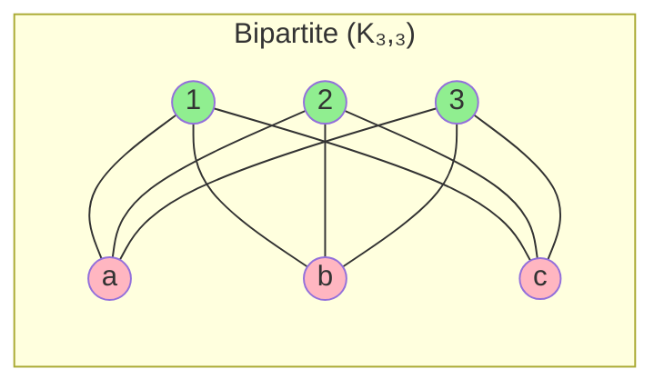
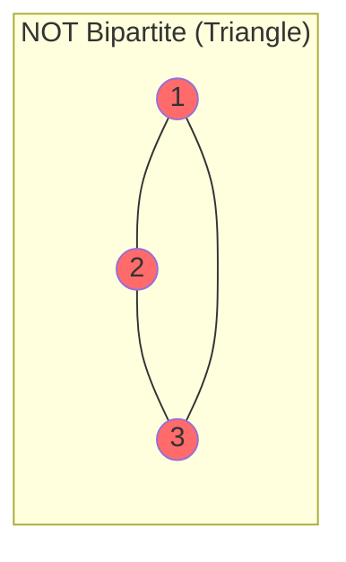
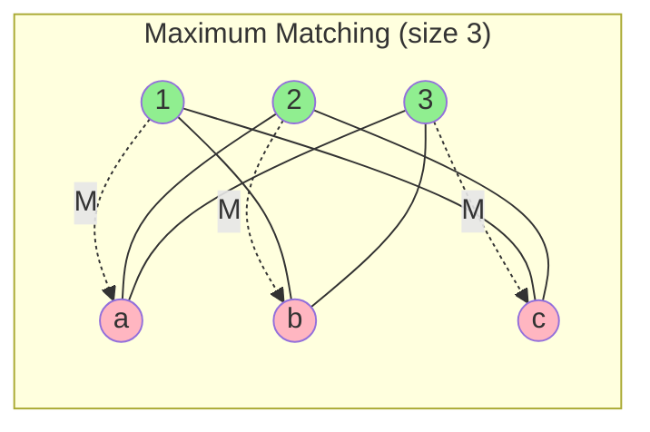

# Chapter 5: Bipartite Graphs and Matching Algorithms

## 🎯 Learning Objectives
- Understand bipartite graphs and their properties
- Master matching terminology and concepts
- Learn augmenting path algorithm for maximum matching
- Implement Hungarian algorithm for weighted matching
- Apply Hall's Marriage Theorem
- Solve assignment problems efficiently

---

## 5.1 Bipartite Graphs

### 📚 **Definition**

A **bipartite graph** G = (X ∪ Y, E) has:
- **Vertex set** partitioned into two disjoint sets X and Y
- **Edges** only between X and Y (no edges within X or Y)

**Notation:** G = (X, Y, E) or G = (L, R, E) (Left, Right)

### 🔑 **Characterization Theorem**

**Theorem:** A graph is bipartite ⟺ It contains no odd-length cycle

**Proof (⇒):** 
- Assume G is bipartite with partition (X, Y)
- Any cycle alternates between X and Y
- Must return to starting partition
- Therefore cycle has even length ✓

**Proof (⇐):**
- Use BFS coloring algorithm
- If no odd cycle, can 2-color the graph
- Each color class forms partition ✓

### 📊 **Examples**



**Complete bipartite graph K₃,₃:** All possible edges between sets



**Triangle (C₃):** Odd cycle, cannot be bipartite

### 💻 **Bipartite Detection Algorithm**

```c
#include <stdio.h>
#include <stdbool.h>
#include <string.h>

#define MAX_V 100

typedef struct {
    int n;  // Number of vertices
    bool adj[MAX_V][MAX_V];
} Graph;

// BFS-based bipartite check
bool is_bipartite(Graph *G, int color[], int partition[2][MAX_V], 
                  int *size_X, int *size_Y) {
    // Initialize colors (-1 = unvisited, 0 = X, 1 = Y)
    for (int i = 0; i < G->n; i++) {
        color[i] = -1;
    }
    
    *size_X = *size_Y = 0;
    
    // Handle disconnected components
    for (int start = 0; start < G->n; start++) {
        if (color[start] != -1) continue;
        
        // BFS from unvisited vertex
        int queue[MAX_V];
        int front = 0, rear = 0;
        
        queue[rear++] = start;
        color[start] = 0;  // Start in partition X
        partition[0][(*size_X)++] = start;
        
        while (front < rear) {
            int u = queue[front++];
            
            for (int v = 0; v < G->n; v++) {
                if (!G->adj[u][v]) continue;
                
                if (color[v] == -1) {
                    // Unvisited: assign opposite color
                    color[v] = 1 - color[u];
                    
                    if (color[v] == 0) {
                        partition[0][(*size_X)++] = v;
                    } else {
                        partition[1][(*size_Y)++] = v;
                    }
                    
                    queue[rear++] = v;
                } else if (color[v] == color[u]) {
                    // Same color: odd cycle found!
                    printf("Odd cycle detected: vertices %d and %d have same color\n", 
                           u, v);
                    return false;
                }
            }
        }
    }
    
    return true;
}

// Example usage
void example_bipartite_detection() {
    Graph G;
    G.n = 6;
    memset(G.adj, false, sizeof(G.adj));
    
    // Create bipartite graph K₃,₃
    // X = {0, 1, 2}, Y = {3, 4, 5}
    for (int i = 0; i < 3; i++) {
        for (int j = 3; j < 6; j++) {
            G.adj[i][j] = G.adj[j][i] = true;
        }
    }
    
    int color[MAX_V];
    int partition[2][MAX_V];
    int size_X, size_Y;
    
    printf("=== Bipartite Detection ===\n");
    
    if (is_bipartite(&G, color, partition, &size_X, &size_Y)) {
        printf("Graph is BIPARTITE!\n\n");
        
        printf("Partition X (%d vertices): ", size_X);
        for (int i = 0; i < size_X; i++) {
            printf("%d ", partition[0][i]);
        }
        printf("\n");
        
        printf("Partition Y (%d vertices): ", size_Y);
        for (int i = 0; i < size_Y; i++) {
            printf("%d ", partition[1][i]);
        }
        printf("\n");
    } else {
        printf("Graph is NOT bipartite (contains odd cycle)\n");
    }
}
```

**Output:**
```
=== Bipartite Detection ===
Graph is BIPARTITE!

Partition X (3 vertices): 0 1 2 
Partition Y (3 vertices): 3 4 5
```

**Time complexity:** O(V + E) using BFS

---

## 5.2 Matching Terminology

### 📚 **Basic Definitions**

**Matching M:** A set of edges with no common vertices

**Formal:** M ⊆ E such that no two edges in M share an endpoint

### 🔑 **Types of Matching**

1. **Maximal Matching:**
   - Cannot add any edge without violating matching property
   - Not necessarily maximum size

2. **Maximum Matching:**
   - Largest possible matching
   - |M| is maximum among all matchings

3. **Perfect Matching:**
   - Every vertex is matched
   - |M| = |V| / 2 (for general graphs)
   - |M| = min(|X|, |Y|) (for bipartite graphs)

### 📊 **Examples**



**Matched edges (M)** shown as dashed arrows
**Unmatched edges** shown as solid lines

### 📚 **Vertex Classification**

For a matching M:
- **Matched vertex:** Endpoint of some edge in M
- **Unmatched vertex (free):** Not endpoint of any edge in M

### 📚 **Alternating and Augmenting Paths**

**Alternating path:** Path that alternates between matched and unmatched edges

**Augmenting path:** Alternating path that:
1. Starts at an unmatched vertex in X
2. Ends at an unmatched vertex in Y
3. Has one more unmatched edge than matched edges

### 🔑 **Berge's Lemma**

**Lemma:** M is maximum matching ⟺ No augmenting path exists

**Proof (⇒):** 
- Suppose M is maximum but augmenting path P exists
- Symmetric difference M ⊕ P gives larger matching (contradiction) ✓

**Proof (⇐):**
- Suppose no augmenting path but M not maximum
- Let M* be larger matching
- M ⊕ M* contains augmenting path (contradiction) ✓

---

## 5.3 Maximum Matching Algorithm

### 📚 **Augmenting Path Algorithm**

```
Maximum-Matching(G = (X, Y, E)):
  1. Start with M = ∅
  
  2. While there exists augmenting path P:
       a. M = M ⊕ P  (symmetric difference)
       b. Update matching
  
  3. Return M
```

### 🔧 **Finding Augmenting Paths (BFS)**

```c
#include <stdio.h>
#include <stdbool.h>
#include <string.h>

#define MAX_V 100
#define NIL -1

typedef struct {
    int n_left, n_right;  // Sizes of X and Y
    bool adj[MAX_V][MAX_V];
} BipartiteGraph;

typedef struct {
    int match_X[MAX_V];  // match_X[u] = v if u matched to v
    int match_Y[MAX_V];  // match_Y[v] = u if v matched to u
    int size;
} Matching;

// BFS to find augmenting path from unmatched vertex in X
bool bfs_augmenting_path(BipartiteGraph *G, Matching *M, 
                         int parent[], int *aug_start) {
    bool visited_X[MAX_V] = {false};
    bool visited_Y[MAX_V] = {false};
    int queue[MAX_V * 2];
    int front = 0, rear = 0;
    
    // Enqueue all unmatched vertices in X
    for (int u = 0; u < G->n_left; u++) {
        if (M->match_X[u] == NIL) {
            queue[rear++] = u;
            visited_X[u] = true;
            parent[u] = NIL;
        }
    }
    
    // BFS
    while (front < rear) {
        int u = queue[front++];
        
        // Try all neighbors in Y
        for (int v = 0; v < G->n_right; v++) {
            if (!G->adj[u][v] || visited_Y[v]) continue;
            
            visited_Y[v] = true;
            
            if (M->match_Y[v] == NIL) {
                // Found augmenting path!
                // Reconstruct path backwards
                *aug_start = u;
                
                // Store path using parent pointers
                int curr_X = u, curr_Y = v;
                while (curr_X != NIL) {
                    int next_Y = parent[curr_X];
                    M->match_X[curr_X] = curr_Y;
                    M->match_Y[curr_Y] = curr_X;
                    
                    if (next_Y == NIL) break;
                    
                    curr_X = M->match_Y[next_Y];
                    curr_Y = next_Y;
                }
                
                return true;
            } else {
                // Matched vertex: continue alternating path
                int next_u = M->match_Y[v];
                if (!visited_X[next_u]) {
                    visited_X[next_u] = true;
                    parent[next_u] = v;
                    queue[rear++] = next_u;
                }
            }
        }
    }
    
    return false;
}

// Maximum Matching Algorithm
Matching maximum_matching(BipartiteGraph *G) {
    Matching M;
    
    // Initialize: all vertices unmatched
    for (int i = 0; i < MAX_V; i++) {
        M.match_X[i] = M.match_Y[i] = NIL;
    }
    M.size = 0;
    
    printf("=== Maximum Matching Algorithm ===\n\n");
    
    int iteration = 0;
    int parent[MAX_V];
    int aug_start;
    
    // Find augmenting paths until none exist
    while (bfs_augmenting_path(G, &M, parent, &aug_start)) {
        iteration++;
        M.size++;
        
        printf("Iteration %d: Found augmenting path starting at X[%d]\n", 
               iteration, aug_start);
        printf("  Matching size: %d\n\n", M.size);
    }
    
    printf("=== Maximum Matching Found ===\n");
    printf("Matching size: %d\n\n", M.size);
    
    printf("Matched pairs:\n");
    for (int u = 0; u < G->n_left; u++) {
        if (M.match_X[u] != NIL) {
            printf("  X[%d] ↔ Y[%d]\n", u, M.match_X[u]);
        }
    }
    
    return M;
}

// Example
int main() {
    BipartiteGraph G;
    G.n_left = 4;
    G.n_right = 4;
    memset(G.adj, false, sizeof(G.adj));
    
    // Create edges
    G.adj[0][0] = true;  // X[0] - Y[0]
    G.adj[0][1] = true;  // X[0] - Y[1]
    G.adj[1][1] = true;  // X[1] - Y[1]
    G.adj[1][2] = true;  // X[1] - Y[2]
    G.adj[2][2] = true;  // X[2] - Y[2]
    G.adj[3][2] = true;  // X[3] - Y[2]
    G.adj[3][3] = true;  // X[3] - Y[3]
    
    printf("Bipartite Graph:\n");
    printf("  X = {0, 1, 2, 3}\n");
    printf("  Y = {0, 1, 2, 3}\n");
    printf("  Edges:\n");
    for (int u = 0; u < G.n_left; u++) {
        for (int v = 0; v < G.n_right; v++) {
            if (G.adj[u][v]) {
                printf("    X[%d] - Y[%d]\n", u, v);
            }
        }
    }
    printf("\n");
    
    Matching M = maximum_matching(&G);
    
    printf("\n--- Complexity Analysis ---\n");
    printf("Each BFS: O(E)\n");
    printf("Number of augmentations: O(min(|X|, |Y|)) = O(V)\n");
    printf("Total: O(VE)\n");
    
    return 0;
}
```

### 📊 **Example Output**

```
Bipartite Graph:
  X = {0, 1, 2, 3}
  Y = {0, 1, 2, 3}
  Edges:
    X[0] - Y[0]
    X[0] - Y[1]
    X[1] - Y[1]
    X[1] - Y[2]
    X[2] - Y[2]
    X[3] - Y[2]
    X[3] - Y[3]

=== Maximum Matching Algorithm ===

Iteration 1: Found augmenting path starting at X[0]
  Matching size: 1

Iteration 2: Found augmenting path starting at X[1]
  Matching size: 2

Iteration 3: Found augmenting path starting at X[2]
  Matching size: 3

Iteration 4: Found augmenting path starting at X[3]
  Matching size: 4

=== Maximum Matching Found ===
Matching size: 4

Matched pairs:
  X[0] ↔ Y[0]
  X[1] ↔ Y[1]
  X[2] ↔ Y[2]
  X[3] ↔ Y[3]

--- Complexity Analysis ---
Each BFS: O(E)
Number of augmentations: O(min(|X|, |Y|)) = O(V)
Total: O(VE)
```

---

## 5.4 Hall's Marriage Theorem

### 📚 **Theorem Statement**

**Hall's Theorem:** A bipartite graph G = (X, Y, E) has a **matching that saturates X** (matches all vertices in X) ⟺ For every subset S ⊆ X:

```
|N(S)| ≥ |S|
```

where N(S) = {y ∈ Y : ∃ x ∈ S with (x, y) ∈ E} (neighbors of S)

### 🔑 **Interpretation**

**"Marriage Condition":**
- X = set of men
- Y = set of women
- Edge (x, y) = x and y are compatible
- Every group of k men must have at least k compatible women

### ✅ **Proof (⇒)**

Assume matching M saturates X. For any S ⊆ X:
- All vertices in S are matched
- They must be matched to distinct vertices in Y
- These matched vertices are in N(S)
- Therefore |N(S)| ≥ |S| ✓

### ✅ **Proof (⇐)**

Assume |N(S)| ≥ |S| for all S ⊆ X. We prove by induction on |X|:

**Base case:** |X| = 1
- Hall's condition: |N({x})| ≥ 1
- So x has a neighbor, can be matched ✓

**Inductive step:**

**Case 1:** |N(S)| > |S| for all ∅ ≠ S ⊂ X (proper subsets)
- Pick any edge (x, y)
- Remove x and y
- Remaining graph G' still satisfies Hall's condition
- By induction, G' has matching M'
- M = M' ∪ {(x, y)} matches all of X ✓

**Case 2:** ∃ S ⊂ X with |N(S)| = |S|
- By induction, S can be matched to N(S)
- Let M₁ be this matching
- Remaining graph: X' = X \ S, Y' = Y \ N(S)
- Show X' satisfies Hall's condition in Y':
  - For any T ⊆ X', neighbors in Y' are N_G(T) \ N(S)
  - |N_G(S ∪ T)| ≥ |S ∪ T| (Hall's condition on G)
  - |N_G(S ∪ T)| ≤ |N(S)| + |N_{Y'}(T)| = |S| + |N_{Y'}(T)|
  - Therefore |N_{Y'}(T)| ≥ |T| ✓
- By induction, X' has matching M₂ to Y'
- M = M₁ ∪ M₂ matches all of X ✓

### 💻 **Hall's Condition Checker**

```c
#include <stdio.h>
#include <stdbool.h>
#include <string.h>

#define MAX_V 20

typedef struct {
    int n_left, n_right;
    bool adj[MAX_V][MAX_V];
} BipartiteGraph;

// Compute neighbors of subset S in X
void compute_neighbors(BipartiteGraph *G, bool S[], bool neighbors[]) {
    memset(neighbors, false, G->n_right * sizeof(bool));
    
    for (int u = 0; u < G->n_left; u++) {
        if (!S[u]) continue;
        
        for (int v = 0; v < G->n_right; v++) {
            if (G->adj[u][v]) {
                neighbors[v] = true;
            }
        }
    }
}

// Check Hall's condition for all subsets of X
bool check_halls_condition(BipartiteGraph *G) {
    printf("=== Checking Hall's Marriage Condition ===\n\n");
    
    int total_subsets = 1 << G->n_left;  // 2^|X|
    
    for (int mask = 1; mask < total_subsets; mask++) {
        bool S[MAX_V] = {false};
        bool neighbors[MAX_V];
        int size_S = 0;
        
        // Build subset S from bitmask
        printf("Subset S = {");
        for (int u = 0; u < G->n_left; u++) {
            if (mask & (1 << u)) {
                S[u] = true;
                size_S++;
                printf("%d", u);
                if (__builtin_popcount(mask) > __builtin_popcount(mask & ((1 << u) - 1)) + 1) {
                    printf(", ");
                }
            }
        }
        printf("}, |S| = %d\n", size_S);
        
        // Compute N(S)
        compute_neighbors(G, S, neighbors);
        int size_neighbors = 0;
        printf("  N(S) = {");
        for (int v = 0; v < G->n_right; v++) {
            if (neighbors[v]) {
                if (size_neighbors > 0) printf(", ");
                printf("%d", v);
                size_neighbors++;
            }
        }
        printf("}, |N(S)| = %d\n", size_neighbors);
        
        // Check condition
        if (size_neighbors < size_S) {
            printf("  ❌ VIOLATION: |N(S)| = %d < %d = |S|\n", 
                   size_neighbors, size_S);
            printf("\nHall's condition FAILED!\n");
            printf("No matching can saturate X.\n");
            return false;
        } else {
            printf("  ✓ |N(S)| ≥ |S|\n");
        }
        printf("\n");
    }
    
    printf("Hall's condition SATISFIED for all subsets!\n");
    printf("A matching saturating X exists.\n");
    return true;
}

// Example usage
int main() {
    BipartiteGraph G;
    G.n_left = 3;
    G.n_right = 3;
    memset(G.adj, false, sizeof(G.adj));
    
    // Example satisfying Hall's condition
    G.adj[0][0] = true;
    G.adj[0][1] = true;
    G.adj[1][1] = true;
    G.adj[1][2] = true;
    G.adj[2][2] = true;
    
    printf("Graph edges:\n");
    for (int u = 0; u < G.n_left; u++) {
        for (int v = 0; v < G.n_right; v++) {
            if (G.adj[u][v]) {
                printf("  X[%d] - Y[%d]\n", u, v);
            }
        }
    }
    printf("\n");
    
    check_halls_condition(&G);
    
    return 0;
}
```

---

## 5.5 Weighted Matching: Hungarian Algorithm

### 📚 **Weighted Bipartite Matching Problem**

**Input:** 
- Bipartite graph G = (X, Y, E)
- Weight function w: E → ℝ

**Output:** Matching M that maximizes Σ_{e ∈ M} w(e)

**Also called:** Assignment Problem

### 🔑 **Hungarian Algorithm Overview**

**Idea:** Use **feasible labelings** to reduce to unweighted matching

**Feasible labeling:** Function ℓ: X ∪ Y → ℝ such that:
```
ℓ(x) + ℓ(y) ≥ w(x, y)  for all (x, y) ∈ E
```

**Equality subgraph G_ℓ:**
```
E_ℓ = {(x, y) ∈ E : ℓ(x) + ℓ(y) = w(x, y)}
```

**Key theorem:** If M is perfect matching in G_ℓ, then M is maximum weight matching in G

### 📚 **Hungarian Algorithm**

```
Hungarian(G, w):
  1. Initialize feasible labeling ℓ:
       ℓ(x) = max{w(x, y) : y ∈ Y} for x ∈ X
       ℓ(y) = 0 for y ∈ Y
  
  2. Find maximum matching M in equality graph G_ℓ
  
  3. While M is not perfect:
       a. Find exposed vertex u ∈ X (not in M)
       b. Build alternating tree from u
       c. If augmenting path found:
            Augment M
          Else:
            Update labeling ℓ to add edges to tree
       d. Update equality graph G_ℓ
  
  4. Return M
```

### 💻 **Hungarian Algorithm Implementation**

```c
#include <stdio.h>
#include <stdbool.h>
#include <string.h>
#include <limits.h>

#define MAX_V 50
#define INF INT_MAX

typedef struct {
    int n;  // Assume |X| = |Y| = n (square matrix)
    int weight[MAX_V][MAX_V];
} WeightedBipartite;

typedef struct {
    int match_X[MAX_V];
    int match_Y[MAX_V];
    int label_X[MAX_V];
    int label_Y[MAX_V];
} HungarianState;

// Find augmenting path using alternating tree
bool find_augmenting_path(WeightedBipartite *G, HungarianState *state, 
                          int start) {
    bool visited_X[MAX_V] = {false};
    bool visited_Y[MAX_V] = {false};
    int parent_Y[MAX_V];
    
    for (int i = 0; i < G->n; i++) {
        parent_Y[i] = -1;
    }
    
    int queue[MAX_V];
    int front = 0, rear = 0;
    
    queue[rear++] = start;
    visited_X[start] = true;
    
    while (front < rear) {
        int u = queue[front++];
        
        for (int v = 0; v < G->n; v++) {
            if (visited_Y[v]) continue;
            
            // Check if edge is in equality graph
            if (state->label_X[u] + state->label_Y[v] != G->weight[u][v]) {
                continue;
            }
            
            visited_Y[v] = true;
            parent_Y[v] = u;
            
            if (state->match_Y[v] == -1) {
                // Found augmenting path! Update matching
                int curr_y = v;
                while (curr_y != -1) {
                    int curr_x = parent_Y[curr_y];
                    int next_y = state->match_X[curr_x];
                    
                    state->match_X[curr_x] = curr_y;
                    state->match_Y[curr_y] = curr_x;
                    
                    curr_y = next_y;
                }
                return true;
            } else {
                // Continue alternating path
                int next_x = state->match_Y[v];
                if (!visited_X[next_x]) {
                    visited_X[next_x] = true;
                    queue[rear++] = next_x;
                }
            }
        }
    }
    
    // No augmenting path: update labeling
    int slack = INF;
    for (int u = 0; u < G->n; u++) {
        if (!visited_X[u]) continue;
        for (int v = 0; v < G->n; v++) {
            if (visited_Y[v]) continue;
            
            int delta = state->label_X[u] + state->label_Y[v] - G->weight[u][v];
            if (delta < slack) {
                slack = delta;
            }
        }
    }
    
    // Update labels
    for (int u = 0; u < G->n; u++) {
        if (visited_X[u]) state->label_X[u] -= slack;
    }
    for (int v = 0; v < G->n; v++) {
        if (visited_Y[v]) state->label_Y[v] += slack;
    }
    
    return false;
}

// Hungarian Algorithm
int hungarian(WeightedBipartite *G) {
    HungarianState state;
    
    printf("=== Hungarian Algorithm ===\n\n");
    
    // Initialize matching
    for (int i = 0; i < G->n; i++) {
        state.match_X[i] = state.match_Y[i] = -1;
    }
    
    // Initialize feasible labeling
    for (int u = 0; u < G->n; u++) {
        state.label_X[u] = 0;
        for (int v = 0; v < G->n; v++) {
            if (G->weight[u][v] > state.label_X[u]) {
                state.label_X[u] = G->weight[u][v];
            }
        }
    }
    for (int v = 0; v < G->n; v++) {
        state.label_Y[v] = 0;
    }
    
    printf("Initial labeling:\n");
    printf("  ℓ(X): ");
    for (int u = 0; u < G->n; u++) {
        printf("%d ", state.label_X[u]);
    }
    printf("\n  ℓ(Y): ");
    for (int v = 0; v < G->n; v++) {
        printf("%d ", state.label_Y[v]);
    }
    printf("\n\n");
    
    // Find perfect matching
    int matched = 0;
    for (int u = 0; u < G->n; u++) {
        printf("Finding match for X[%d]...\n", u);
        
        while (state.match_X[u] == -1) {
            if (find_augmenting_path(G, &state, u)) {
                matched++;
                printf("  Matched! Total: %d\n", matched);
                break;
            } else {
                printf("  Updated labeling\n");
            }
        }
        printf("\n");
    }
    
    // Compute total weight
    int total_weight = 0;
    printf("=== Maximum Weight Matching ===\n");
    for (int u = 0; u < G->n; u++) {
        int v = state.match_X[u];
        printf("X[%d] ↔ Y[%d], weight = %d\n", u, v, G->weight[u][v]);
        total_weight += G->weight[u][v];
    }
    printf("\nTotal weight: %d\n", total_weight);
    
    return total_weight;
}

// Example
int main() {
    WeightedBipartite G;
    G.n = 3;
    
    // Weight matrix
    int weights[3][3] = {
        {4, 2, 3},
        {3, 4, 2},
        {2, 3, 4}
    };
    
    memcpy(G.weight, weights, sizeof(weights));
    
    printf("Weight matrix:\n");
    for (int i = 0; i < G.n; i++) {
        for (int j = 0; j < G.n; j++) {
            printf("%3d ", G.weight[i][j]);
        }
        printf("\n");
    }
    printf("\n");
    
    hungarian(&G);
    
    printf("\n--- Complexity ---\n");
    printf("Time: O(n³) for n×n matrix\n");
    printf("Space: O(n²)\n");
    
    return 0;
}
```

---

## 📋 Summary

### 🎯 **Key Concepts**

1. **Bipartite Graph:** Two-partition graph, no odd cycles
2. **Matching:** Set of edges with no common vertices
3. **Augmenting Path:** Increases matching size by 1
4. **Berge's Lemma:** No augmenting path ⟺ maximum matching
5. **Hall's Theorem:** Matching saturates X ⟺ |N(S)| ≥ |S| for all S
6. **Hungarian Algorithm:** O(n³) weighted matching

### 🔑 **Algorithm Summary**

| Problem | Algorithm | Time Complexity |
|---------|-----------|----------------|
| **Bipartite detection** | BFS coloring | O(V + E) |
| **Maximum matching** | Augmenting paths | O(VE) |
| **Weighted matching** | Hungarian | O(n³) |

### 📊 **Applications**

- ✓ **Job assignment:** Workers to tasks
- ✓ **Student-project matching:** Optimize preferences
- ✓ **Stable marriage:** Dating/housing allocation
- ✓ **Resource allocation:** Minimize cost
- ✓ **Scheduling:** Time slots to events

---

## 📚 References

1. **Cormen, T. H., et al. (2009).** *Introduction to Algorithms* (3rd ed.). MIT Press.
   - Section on matching

2. **Kleinberg, J., & Tardos, É. (2005).** *Algorithm Design*. Pearson.
   - Chapter 7: Network Flow (includes bipartite matching)

3. **Kuhn, H. W. (1955).** "The Hungarian Method for the assignment problem." *Naval Research Logistics Quarterly*.
   - Original Hungarian algorithm paper

4. **Hall, P. (1935).** "On representatives of subsets." *Journal of the London Mathematical Society*.
   - Hall's Marriage Theorem

---

**Next Chapter:** [Max-Flow Min-Cut Theorem →](06_max_flow_min_cut.md)
