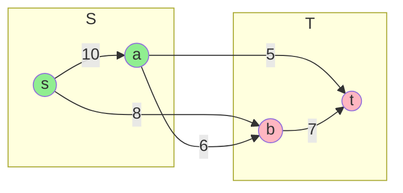
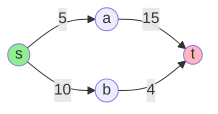
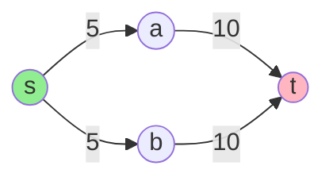

# Chapter 6: Maximum Flow-Minimum Cut Theorem

## 🎯 Learning Objectives
- Understand cuts in flow networks
- Master the Max-Flow Min-Cut Theorem
- Learn duality between flows and cuts
- Apply theorem to prove algorithm correctness
- Solve network reliability problems

---

## 6.1 Cuts in Flow Networks

### 📚 **Definition of Cut**

A **cut** (S, T) in flow network G = (V, E) partitions vertices into two sets:
- **S:** Contains source s
- **T = V \ S:** Contains sink t (T is complement of S)

**Formal:** (S, T) where s ∈ S, t ∈ T, and S ∩ T = ∅, S ∪ T = V

### 🔑 **Cut Capacity**

The **capacity of cut (S, T)** is:
```
c(S, T) = Σ c(u, v)
        u∈S, v∈T
```

**Only forward edges** (from S to T) count toward capacity!

### 📊 **Example Cut**



**Cut (S, T)** where S = {s, a}, T = {b, t}

**Forward edges (S → T):**
- s → b: capacity 8
- a → b: capacity 6
- a → t: capacity 5

**Capacity:** c(S, T) = 8 + 6 + 5 = 19

**Backward edges (T → S):** Do NOT count! (none in this example)

### 📚 **Net Flow Across Cut**

For flow f and cut (S, T):
```
f(S, T) = Σ f(u, v) - Σ f(v, u)
        u∈S,v∈T    u∈S,v∈T
```

**Flow leaving S** minus **flow entering S**

### 🔑 **Key Lemma: Flow Across Any Cut**

**Lemma:** For any flow f and cut (S, T):
```
f(S, T) = |f|
```

**The net flow across ANY cut equals the flow value!**

**Proof:**
```
f(S, T) = Σ f(u, T) - Σ f(T, u)
        u∈S         u∈S

      = Σ [ Σ f(u, v) - Σ f(v, u) ]
        u∈S  v∈V       v∈V

      = f(s, V) - f(V, s)    (by flow conservation for all u ∈ S \ {s})
      
      = |f|  ✓
```

All internal flows cancel out; only source matters!

---

## 6.2 Weak Duality: Flow ≤ Cut

### 📚 **Fundamental Inequality**

**Theorem:** For any flow f and any cut (S, T):
```
|f| ≤ c(S, T)
```

**Proof:**
```
|f| = f(S, T)                    (by flow across cut lemma)

    = Σ f(u, v) - Σ f(v, u)     (definition)
      u∈S,v∈T    v∈T,u∈S

    ≤ Σ f(u, v)                 (removing negative term)
      u∈S,v∈T

    ≤ Σ c(u, v)                 (capacity constraint)
      u∈S,v∈T

    = c(S, T)  ✓
```

### 🔑 **Corollary: Upper Bound on Max Flow**

**Corollary:** 
```
max-flow value ≤ min-cut capacity
```

**Proof:** Max flow ≤ every cut capacity, so ≤ minimum cut ✓

### 📊 **Example: Bounding Max Flow**



**Cut 1:** S = {s}, T = {a, b, t}
- c(S, T) = 5 + 10 = 15

**Cut 2:** S = {s, a, b}, T = {t}
- c(S, T) = 15 + 4 = 19

**Min cut capacity = 15**

Therefore: **max flow ≤ 15**

Can we achieve flow = 15? (Yes! See Max-Flow Min-Cut theorem)

---

## 6.3 Maximum Flow-Minimum Cut Theorem

### 📚 **The Main Theorem**

**Max-Flow Min-Cut Theorem:** The following are **equivalent**:

1. **f is a maximum flow**
2. **Residual network G_f contains no augmenting path** (s  t)
3. **|f| = c(S, T) for some cut (S, T)**

**In other words:**
```
max{|f|} = min{c(S, T)}
```

### ✅ **Proof**

**We prove (1) ⇒ (2) ⇒ (3) ⇒ (1) in a cycle.**

---

#### **(1) ⇒ (2): Max flow ⇒ No augmenting path**

**Proof by contradiction:**
- Assume f is maximum flow
- Suppose augmenting path P exists in G_f
- Can increase flow by min capacity along P
- This contradicts f being maximum ✓

---

#### **(2) ⇒ (3): No augmenting path ⇒ Flow equals some cut**

**Construction:**
- Let f be flow with no augmenting path
- Define S = {v : ∃ path s  v in G_f} (reachable from s)
- Define T = V \ S

**Claim:** s ∈ S (trivially) and t ∈ T (no path s  t)

Therefore (S, T) is a cut.

**Claim:** |f| = c(S, T)

**Proof:**
For any edge (u, v) with u ∈ S, v ∈ T:
- **Forward edge (u, v):** Must have f(u, v) = c(u, v)
  - Why? If f(u, v) < c(u, v), then residual capacity c_f(u, v) > 0
  - This means v is reachable from s (via u)
  - Contradiction to v ∈ T ✓
  
- **Backward edge (v, u):** Must have f(v, u) = 0
  - Why? If f(v, u) > 0, then c_f(u, v) = f(v, u) > 0
  - Again v would be reachable from s
  - Contradiction ✓

Therefore:
```
|f| = f(S, T)
    = Σ f(u, v) - Σ f(v, u)
      u∈S,v∈T    v∈T,u∈S
    
    = Σ c(u, v) - Σ 0      (by above)
      u∈S,v∈T    v∈T,u∈S
    
    = c(S, T)  ✓
```

---

#### **(3) ⇒ (1): Flow equals cut ⇒ Max flow**

**Proof:**
- Suppose |f| = c(S, T) for some cut
- By weak duality (proven earlier): |f'| ≤ c(S, T) for ANY flow f'
- Therefore |f'| ≤ |f| for all flows f'
- Hence f is maximum flow ✓

**QED!** ∎

---

## 6.4 Finding Minimum Cut

### 📚 **Algorithm**

```
Find-Min-Cut(G, s, t):
  1. Run Ford-Fulkerson (or Edmonds-Karp) to find max flow f
  
  2. Construct residual network G_f
  
  3. Find all vertices reachable from s in G_f:
       S = {v : ∃ path s → v in G_f}
  
  4. Set T = V \ S
  
  5. Return cut (S, T)
```

**Correctness:** By proof of (2) ⇒ (3) above, this gives min cut ✓

**Time complexity:** Same as max-flow algorithm + O(V + E) for reachability

### 💻 **C Implementation**

```c
#include <stdio.h>
#include <stdbool.h>
#include <string.h>

#define MAX_V 100

typedef struct {
    int n;
    int capacity[MAX_V][MAX_V];
    int source, sink;
} FlowNetwork;

typedef struct {
    bool in_S[MAX_V];
    int size_S, size_T;
    int capacity_cut;
} MinCut;

// BFS to find reachable vertices in residual network
void find_reachable(FlowNetwork *G, int flow[MAX_V][MAX_V], 
                    bool reachable[]) {
    bool visited[MAX_V] = {false};
    int queue[MAX_V];
    int front = 0, rear = 0;
    
    queue[rear++] = G->source;
    visited[G->source] = true;
    reachable[G->source] = true;
    
    while (front < rear) {
        int u = queue[front++];
        
        for (int v = 0; v < G->n; v++) {
            // Check residual capacity
            int residual = G->capacity[u][v] - flow[u][v];
            
            if (!visited[v] && residual > 0) {
                visited[v] = true;
                reachable[v] = true;
                queue[rear++] = v;
            }
        }
    }
}

// Find minimum cut after running max-flow
MinCut find_min_cut(FlowNetwork *G, int flow[MAX_V][MAX_V]) {
    MinCut cut;
    memset(cut.in_S, false, sizeof(cut.in_S));
    
    printf("=== Finding Minimum Cut ===\n\n");
    
    // Step 1: Find reachable vertices from source in residual network
    printf("Step 1: Find vertices reachable from source in residual network\n");
    find_reachable(G, flow, cut.in_S);
    
    // Count sizes
    cut.size_S = 0;
    cut.size_T = 0;
    
    printf("Set S (reachable from s): {");
    for (int v = 0; v < G->n; v++) {
        if (cut.in_S[v]) {
            if (cut.size_S > 0) printf(", ");
            printf("%d", v);
            cut.size_S++;
        }
    }
    printf("}\n");
    
    printf("Set T (not reachable): {");
    for (int v = 0; v < G->n; v++) {
        if (!cut.in_S[v]) {
            if (cut.size_T > 0) printf(", ");
            printf("%d", v);
            cut.size_T++;
        }
    }
    printf("}\n\n");
    
    // Step 2: Compute cut capacity
    printf("Step 2: Compute cut capacity\n");
    printf("Forward edges (S → T):\n");
    cut.capacity_cut = 0;
    
    for (int u = 0; u < G->n; u++) {
        if (!cut.in_S[u]) continue;
        
        for (int v = 0; v < G->n; v++) {
            if (cut.in_S[v] || G->capacity[u][v] == 0) continue;
            
            printf("  (%d → %d): capacity %d, flow %d\n", 
                   u, v, G->capacity[u][v], flow[u][v]);
            cut.capacity_cut += G->capacity[u][v];
        }
    }
    
    printf("\nMinimum cut capacity: %d\n", cut.capacity_cut);
    
    return cut;
}

// Verify max-flow min-cut theorem
void verify_theorem(int max_flow, MinCut cut) {
    printf("\n=== Max-Flow Min-Cut Theorem Verification ===\n");
    printf("Maximum flow value: %d\n", max_flow);
    printf("Minimum cut capacity: %d\n", cut.capacity_cut);
    
    if (max_flow == cut.capacity_cut) {
        printf("✓ Theorem verified: max-flow = min-cut\n");
    } else {
        printf("✗ ERROR: Values don't match!\n");
    }
}

// Example usage (assuming edmonds_karp is defined elsewhere)
extern int edmonds_karp_get_flow(FlowNetwork *G, int flow[MAX_V][MAX_V]);

int main() {
    FlowNetwork G;
    G.n = 6;
    G.source = 0;
    G.sink = 5;
    
    memset(G.capacity, 0, sizeof(G.capacity));
    
    // Build flow network
    G.capacity[0][1] = 16;
    G.capacity[0][2] = 13;
    G.capacity[1][2] = 10;
    G.capacity[1][3] = 12;
    G.capacity[2][1] = 4;
    G.capacity[2][4] = 14;
    G.capacity[3][2] = 9;
    G.capacity[3][5] = 20;
    G.capacity[4][3] = 7;
    G.capacity[4][5] = 4;
    
    printf("Flow Network:\n");
    printf("  Vertices: 0(s), 1, 2, 3, 4, 5(t)\n");
    printf("  Edges:\n");
    for (int u = 0; u < G.n; u++) {
        for (int v = 0; v < G.n; v++) {
            if (G.capacity[u][v] > 0) {
                printf("    %d → %d: capacity %d\n", u, v, G.capacity[u][v]);
            }
        }
    }
    printf("\n");
    
    // Find max flow
    int flow[MAX_V][MAX_V];
    memset(flow, 0, sizeof(flow));
    
    printf("Running Edmonds-Karp to find maximum flow...\n\n");
    int max_flow = edmonds_karp_get_flow(&G, flow);
    printf("Maximum flow found: %d\n\n", max_flow);
    
    // Find min cut
    MinCut cut = find_min_cut(&G, flow);
    
    // Verify theorem
    verify_theorem(max_flow, cut);
    
    return 0;
}
```

### 📊 **Example Output**

```
Flow Network:
  Vertices: 0(s), 1, 2, 3, 4, 5(t)
  Edges:
    0 → 1: capacity 16
    0 → 2: capacity 13
    1 → 2: capacity 10
    1 → 3: capacity 12
    2 → 1: capacity 4
    2 → 4: capacity 14
    3 → 2: capacity 9
    3 → 5: capacity 20
    4 → 3: capacity 7
    4 → 5: capacity 4

Running Edmonds-Karp to find maximum flow...

Maximum flow found: 23

=== Finding Minimum Cut ===

Step 1: Find vertices reachable from source in residual network
Set S (reachable from s): {0, 1, 2, 4}
Set T (not reachable): {3, 5}

Step 2: Compute cut capacity
Forward edges (S → T):
  (1 → 3): capacity 12, flow 12
  (4 → 3): capacity 7, flow 7
  (4 → 5): capacity 4, flow 4

Minimum cut capacity: 23

=== Max-Flow Min-Cut Theorem Verification ===
Maximum flow value: 23
Minimum cut capacity: 23
✓ Theorem verified: max-flow = min-cut
```

---

## 6.5 Applications of Min-Cut

### 🌍 **1. Network Reliability**

**Problem:** What is the minimum number of edges to remove to disconnect s from t?

**Solution:** 
- Set all capacities to 1
- Find min cut
- Min cut size = minimum edge connectivity

### 🌍 **2. Project Selection Problem**

**Setup:**
- Projects with profits (positive) or costs (negative)
- Dependencies: some projects require others

**Goal:** Select subset maximizing total profit

**Reduction to Min-Cut:**
1. Create graph with source and sink
2. Add edges for projects and dependencies
3. Find min cut → optimal project selection

### 🌍 **3. Image Segmentation**

**Problem:** Partition pixels into foreground/background

**Graph:**
- Vertices = pixels
- Edge weights = similarity between pixels
- Source = foreground seed
- Sink = background seed

**Min cut** = optimal segmentation boundary!

### 🌍 **4. Baseball Elimination** (continued from Chapter 4)

**Can team X still win?**
- Build flow network encoding game outcomes
- Max flow < total games ⟺ X eliminated
- **Min cut shows which teams form "certificate" of elimination**

---

## 6.6 Uniqueness of Min Cut

### 📚 **Multiple Minimum Cuts**

**Question:** Is minimum cut unique?

**Answer:** NO! But all have same capacity.

### 📊 **Example: Two Min Cuts**



**Cut 1:** S = {s}, T = {a, b, t}
- c(S, T) = 5 + 5 = 10 ✓ minimum

**Cut 2:** S = {s, a, b}, T = {t}
- c(S, T) = 10 + 10 = 20 ✗ not minimum

Wait, let's reconsider...

**Actually only one min cut here!** S = {s}, T = {a, b, t}

### 🔑 **Characterizing All Min Cuts**

**Theorem:** (S, T) is a minimum cut ⟺
1. S contains all vertices reachable from s in G_f
2. S contains only vertices reachable from s in G_f (our algorithm)
3. OR: S contains some subset of reachable vertices

**In practice:** Run max-flow, then vary S to get all min cuts.

---

## 6.7 Generalizations

### 🔧 **1. Undirected Networks**

**Problem:** Flow network with undirected edges

**Solution:** Replace each undirected edge with two directed edges

```
u ⟷ v with capacity c
```
becomes
```
u → v with capacity c
v → u with capacity c
```

Max-Flow Min-Cut theorem still holds!

### 🔧 **2. Multiple Sources/Sinks**

**Problem:** S = {s₁, s₂, ...}, T = {t₁, t₂, ...}

**Solution:** Add super-source and super-sink

```
Add super-source s*:
  s* → sᵢ with capacity ∞ for all i

Add super-sink t*:
  tⱼ → t* with capacity ∞ for all j
```

Run standard max-flow on modified network.

### 🔧 **3. Vertex Capacities**

**Problem:** Capacity limits on vertices, not edges

**Solution:** Split each vertex v into v_in and v_out

```
All edges entering v: → v_in
Edge (v_in, v_out): capacity = vertex capacity
All edges leaving v: from v_out
```

---

## 6.8 Duality in Linear Programming

### 📚 **Max-Flow as LP**

**Variables:** f(u, v) for each edge

**Objective:** Maximize Σ f(s, v) - Σ f(v, s)
                          v∈V       v∈V

**Constraints:**
```
1. f(u, v) ≤ c(u, v)          for all (u, v) ∈ E  (capacity)
2. Σ f(v, u) = Σ f(u, w)     for all u ≠ s, t     (conservation)
  v            w
3. f(u, v) ≥ 0                for all (u, v) ∈ E  (non-negative)
```

### 📚 **Min-Cut as Dual LP**

**Variables:** d(u) for each vertex

**Objective:** Minimize Σ c(u, v) · δ(u, v)
                        (u,v)∈E

where δ(u, v) = max(d(u) - d(v), 0)

**Constraints:**
```
d(s) = 1
d(t) = 0
d(u) ∈ [0, 1] for all u
```

**Strong duality theorem:** Optimal values equal!

This is **another proof** of Max-Flow Min-Cut theorem via LP duality.

---

## 📋 Summary

### 🎯 **Key Concepts**

1. **Cut:** Partition (S, T) with s ∈ S, t ∈ T
2. **Cut Capacity:** Sum of forward edge capacities S → T
3. **Weak Duality:** |f| ≤ c(S, T) for any flow and cut
4. **Max-Flow Min-Cut:** max{|f|} = min{c(S, T)}
5. **Finding Min Cut:** Reachable vertices from s in residual network

### 🔑 **Max-Flow Min-Cut Theorem**

**Three equivalent statements:**
1. f is maximum flow
2. No augmenting path in G_f
3. |f| = c(S, T) for some cut

**Proof cycle:** (1) ⇒ (2) ⇒ (3) ⇒ (1)

### 📊 **Applications**

- ✓ **Network reliability:** Min edge/vertex connectivity
- ✓ **Project selection:** Maximize profit with dependencies
- ✓ **Image segmentation:** Foreground/background separation
- ✓ **Baseball elimination:** Certificate of impossibility
- ✓ **Resource allocation:** Bottleneck identification

---

## 📚 References

1. **Cormen, T. H., et al. (2009).** *Introduction to Algorithms* (3rd ed.). MIT Press.
   - Chapter 26.1: Network Flow - Max-Flow Min-Cut Theorem

2. **Kleinberg, J., & Tardos, É. (2005).** *Algorithm Design*. Pearson.
   - Chapter 7.5: Max-Flow Min-Cut Theorem

3. **Ford, L. R., & Fulkerson, D. R. (1956).** "Maximal flow through a network." *Canadian Journal of Mathematics*.
   - Original theorem and proof

4. **Elias, P., Feinstein, A., & Shannon, C. E. (1956).** "A note on the maximum flow through a network." *IRE Transactions on Information Theory*.
   - Independent discovery

---

**Next Chapter:** [Perfect Matching in Bipartite Graphs →](07_perfect_matching.md)
