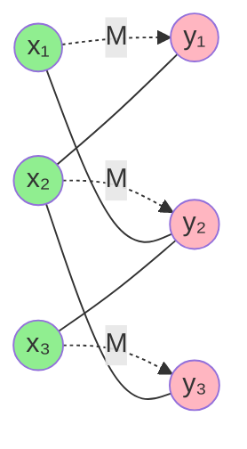

# Chapter 7: Perfect Matching in Bipartite Graphs

## 🎯 Learning Objectives
- Understand perfect matching definition
- Master Hall's Marriage Theorem application
- Learn König's Theorem for vertex covers
- Implement matching algorithms
- Solve assignment problems optimally

---

## 7.1 Perfect Matching Basics

### 📚 **Definition**

A **perfect matching** in bipartite graph G = (X, Y, E) is a matching M where:
```
Every vertex is matched
```

**Formally:**
- |M| = |X| = |Y| (all vertices matched)
- For balanced bipartite graphs only

**Also called:** Complete matching, 1-factor

### 🔑 **Existence Conditions**

**Necessary condition:** |X| = |Y|

**Sufficient condition:** Hall's Marriage Theorem

### 📊 **Example**



**Perfect matching M** (dashed edges):
- x₁ ↔ y₁
- x₂ ↔ y₂
- x₃ ↔ y₃

All 6 vertices are matched ✓

---

## 7.2 Hall's Marriage Theorem (Detailed)

### 📚 **Theorem Statement**

**Hall's Theorem:** Bipartite graph G = (X, Y, E) has perfect matching ⟺

```
|N(S)| ≥ |S|  for all S ⊆ X
```

**AND** |X| = |Y|

where N(S) = {y ∈ Y : ∃ x ∈ S with (x, y) ∈ E}

### ✅ **Complete Proof**

**Direction (⇒):** Perfect matching exists → Hall's condition holds

**Proof:**
- Let M be perfect matching
- For any S ⊆ X, vertices in S are matched to distinct vertices in Y
- These matched vertices are in N(S)
- Therefore |N(S)| ≥ |S| ✓

---

**Direction (⇐):** Hall's condition → Perfect matching exists

**Proof by strong induction on |X|:**

**Base case:** |X| = 1
- Hall's condition: |N({x})| ≥ 1
- So x has at least one neighbor
- Match x to any neighbor
- Perfect matching exists ✓

**Inductive step:** Assume true for all graphs with fewer than n vertices

Consider graph G with |X| = n. Two cases:

---

**Case 1:** |N(S)| ≥ |S| + 1 for all ∅ ≠ S ⊂ X (proper subsets)

**Strategy:** Remove arbitrary edge, use induction

- Pick any edge (x, y) ∈ E
- Remove x and y from G to get G'
- G' has n-1 vertices in each partition

**Claim:** G' satisfies Hall's condition

**Proof of claim:**
For any T ⊆ X \ {x}:
```
|N_{G'}(T)| = |N_G(T) \ {y}|
            ≥ |N_G(T)| - 1           (removed at most 1 vertex)
            ≥ (|T| + 1) - 1          (by assumption on G)
            = |T|  ✓
```

**Therefore:**
- By induction, G' has perfect matching M'
- M = M' ∪ {(x, y)} is perfect matching for G ✓

---

**Case 2:** ∃ S ⊂ X (proper subset) with |N(S)| = |S|

**Strategy:** Solve two smaller subproblems

Let T = N(S) (exactly |S| vertices in Y)

**Subproblem 1:** G₁ = induced subgraph on S ∪ T
- |S| = |T| (by assumption)
- For any A ⊆ S:
  ```
  |N_{G₁}(A)| = |N_G(A)|  (all neighbors of A are in T)
                ≥ |A|      (Hall's condition on G)
  ```
- By induction, G₁ has perfect matching M₁ ✓

**Subproblem 2:** G₂ = induced subgraph on (X \ S) ∪ (Y \ T)

**Claim:** G₂ satisfies Hall's condition

**Proof:**
For any B ⊆ X \ S:
```
|N_{G₂}(B)| = |N_G(B) \ T|
            = |N_G(B ∪ S)| - |N_G(S)|     (since N(S) = T)
            ≥ |N_G(B ∪ S)| - |S|
            ≥ |B ∪ S| - |S|               (Hall's condition on G)
            = |B|  ✓
```

**Therefore:**
- By induction, G₂ has perfect matching M₂
- M = M₁ ∪ M₂ is perfect matching for G ✓

**QED!** ∎

### 💻 **Hall's Condition Verifier**

```c
#include <stdio.h>
#include <stdbool.h>
#include <string.h>

#define MAX_V 20

typedef struct {
    int n;  // |X| = |Y| = n
    bool adj[MAX_V][MAX_V];
} BalancedBipartite;

// Compute neighborhood of subset S
int compute_neighborhood(BalancedBipartite *G, bool S[], bool neighbors[]) {
    memset(neighbors, false, G->n * sizeof(bool));
    int count = 0;
    
    for (int u = 0; u < G->n; u++) {
        if (!S[u]) continue;
        
        for (int v = 0; v < G->n; v++) {
            if (G->adj[u][v] && !neighbors[v]) {
                neighbors[v] = true;
                count++;
            }
        }
    }
    
    return count;
}

// Check Hall's condition for perfect matching
bool check_perfect_matching_condition(BalancedBipartite *G) {
    printf("=== Checking Hall's Condition for Perfect Matching ===\n\n");
    
    // First check: |X| = |Y|
    printf("Balanced graph: |X| = |Y| = %d ✓\n\n", G->n);
    
    // Check Hall's condition for all subsets
    int total_subsets = (1 << G->n) - 1;  // 2^n - 1 (exclude empty set)
    
    for (int mask = 1; mask <= total_subsets; mask++) {
        bool S[MAX_V] = {false};
        int size_S = 0;
        
        printf("Subset S = {");
        for (int u = 0; u < G->n; u++) {
            if (mask & (1 << u)) {
                S[u] = true;
                if (size_S > 0) printf(", ");
                printf("%d", u);
                size_S++;
            }
        }
        printf("}, |S| = %d\n", size_S);
        
        bool neighbors[MAX_V];
        int size_N = compute_neighborhood(G, S, neighbors);
        
        printf("  N(S) = {");
        int printed = 0;
        for (int v = 0; v < G->n; v++) {
            if (neighbors[v]) {
                if (printed > 0) printf(", ");
                printf("%d", v);
                printed++;
            }
        }
        printf("}, |N(S)| = %d\n", size_N);
        
        if (size_N < size_S) {
            printf("  ❌ VIOLATION: |N(S)| = %d < %d = |S|\n", size_N, size_S);
            printf("\n=== Hall's Condition FAILED ===\n");
            printf("No perfect matching exists.\n");
            printf("\nCertificate of impossibility:\n");
            printf("  Subset S of size %d has only %d neighbors\n", 
                   size_S, size_N);
            printf("  Cannot match all vertices in S\n");
            return false;
        }
        
        printf("  ✓ |N(S)| ≥ |S|\n\n");
    }
    
    printf("=== Hall's Condition SATISFIED ===\n");
    printf("Perfect matching EXISTS!\n");
    return true;
}

// Example usage
int main() {
    BalancedBipartite G;
    G.n = 3;
    memset(G.adj, false, sizeof(G.adj));
    
    // Example: Graph with perfect matching
    printf("Example 1: Graph with perfect matching\n");
    printf("======================================\n\n");
    
    G.adj[0][0] = true;  // x₀ - y₀
    G.adj[0][1] = true;  // x₀ - y₁
    G.adj[1][1] = true;  // x₁ - y₁
    G.adj[1][2] = true;  // x₁ - y₂
    G.adj[2][2] = true;  // x₂ - y₂
    
    printf("Edges:\n");
    for (int u = 0; u < G.n; u++) {
        for (int v = 0; v < G.n; v++) {
            if (G.adj[u][v]) {
                printf("  x%d - y%d\n", u, v);
            }
        }
    }
    printf("\n");
    
    check_perfect_matching_condition(&G);
    
    printf("\n\n");
    
    // Example 2: Graph without perfect matching
    printf("Example 2: Graph without perfect matching\n");
    printf("==========================================\n\n");
    
    BalancedBipartite G2;
    G2.n = 3;
    memset(G2.adj, false, sizeof(G2.adj));
    
    G2.adj[0][0] = true;  // x₀ - y₀
    G2.adj[1][0] = true;  // x₁ - y₀
    G2.adj[2][1] = true;  // x₂ - y₁
    
    printf("Edges:\n");
    for (int u = 0; u < G2.n; u++) {
        for (int v = 0; v < G2.n; v++) {
            if (G2.adj[u][v]) {
                printf("  x%d - y%d\n", u, v);
            }
        }
    }
    printf("\n");
    
    check_perfect_matching_condition(&G2);
    
    return 0;
}
```

---

## 7.3 Finding Perfect Matching

### 📚 **Algorithm: Reduction to Max-Flow**

**Construction:**
1. Add source s connecting to all vertices in X (capacity 1)
2. Add sink t connecting from all vertices in Y (capacity 1)
3. All original edges have capacity 1

**Theorem:** Perfect matching exists ⟺ Max flow = |X| = |Y|

### 💻 **Implementation**

```c
#include <stdio.h>
#include <stdbool.h>
#include <string.h>
#include <limits.h>

#define MAX_V 100

typedef struct {
    int n;  // n = |X| = |Y|
    bool adj[MAX_V][MAX_V];
} BipartiteGraph;

typedef struct {
    int n_total;  // n_total = n + n + 2 (X + Y + s + t)
    int capacity[MAX_V][MAX_V];
    int source, sink;
} FlowNetwork;

// Convert bipartite graph to flow network
FlowNetwork build_flow_network(BipartiteGraph *G) {
    FlowNetwork F;
    F.n_total = 2 * G->n + 2;
    F.source = 0;
    F.sink = 2 * G->n + 1;
    
    memset(F.capacity, 0, sizeof(F.capacity));
    
    // X vertices: 1 to n
    // Y vertices: n+1 to 2n
    
    // Source to X (capacity 1)
    for (int i = 0; i < G->n; i++) {
        F.capacity[F.source][i + 1] = 1;
    }
    
    // X to Y (capacity 1 if edge exists)
    for (int u = 0; u < G->n; u++) {
        for (int v = 0; v < G->n; v++) {
            if (G->adj[u][v]) {
                F.capacity[u + 1][G->n + v + 1] = 1;
            }
        }
    }
    
    // Y to sink (capacity 1)
    for (int i = 0; i < G->n; i++) {
        F.capacity[G->n + i + 1][F.sink] = 1;
    }
    
    return F;
}

// BFS for augmenting path (from Chapter 4)
bool bfs_augmenting_path(FlowNetwork *F, int flow[MAX_V][MAX_V], 
                         int parent[]) {
    bool visited[MAX_V] = {false};
    int queue[MAX_V];
    int front = 0, rear = 0;
    
    queue[rear++] = F->source;
    visited[F->source] = true;
    parent[F->source] = -1;
    
    while (front < rear) {
        int u = queue[front++];
        
        for (int v = 0; v < F->n_total; v++) {
            int residual = F->capacity[u][v] - flow[u][v];
            
            if (!visited[v] && residual > 0) {
                visited[v] = true;
                parent[v] = u;
                queue[rear++] = v;
                
                if (v == F->sink) {
                    return true;
                }
            }
        }
    }
    
    return false;
}

// Edmonds-Karp max-flow
int edmonds_karp(FlowNetwork *F, int flow[MAX_V][MAX_V]) {
    memset(flow, 0, sizeof(int) * MAX_V * MAX_V);
    
    int max_flow = 0;
    int parent[MAX_V];
    
    while (bfs_augmenting_path(F, flow, parent)) {
        // Find bottleneck
        int bottleneck = INT_MAX;
        int v = F->sink;
        
        while (v != F->source) {
            int u = parent[v];
            int residual = F->capacity[u][v] - flow[u][v];
            if (residual < bottleneck) {
                bottleneck = residual;
            }
            v = u;
        }
        
        // Augment flow
        v = F->sink;
        while (v != F->source) {
            int u = parent[v];
            flow[u][v] += bottleneck;
            flow[v][u] -= bottleneck;
            v = u;
        }
        
        max_flow += bottleneck;
    }
    
    return max_flow;
}

// Extract perfect matching from flow
typedef struct {
    int match_X[MAX_V];  // match_X[i] = j if xᵢ matched to yⱼ
    int match_Y[MAX_V];
    bool exists;
} PerfectMatching;

PerfectMatching find_perfect_matching(BipartiteGraph *G) {
    PerfectMatching M;
    memset(M.match_X, -1, sizeof(M.match_X));
    memset(M.match_Y, -1, sizeof(M.match_Y));
    M.exists = false;
    
    printf("=== Finding Perfect Matching via Max-Flow ===\n\n");
    
    // Build flow network
    FlowNetwork F = build_flow_network(G);
    
    printf("Flow network constructed:\n");
    printf("  Total vertices: %d\n", F.n_total);
    printf("  Source: %d\n", F.source);
    printf("  Sink: %d\n", F.sink);
    printf("  X vertices: 1 to %d\n", G->n);
    printf("  Y vertices: %d to %d\n\n", G->n + 1, 2 * G->n);
    
    // Run max-flow
    int flow[MAX_V][MAX_V];
    int max_flow = edmonds_karp(&F, flow);
    
    printf("Maximum flow: %d\n", max_flow);
    printf("Required for perfect matching: %d\n\n", G->n);
    
    if (max_flow == G->n) {
        M.exists = true;
        printf("✓ Perfect matching EXISTS!\n\n");
        
        // Extract matching from flow
        printf("Extracting matching from flow:\n");
        for (int u = 0; u < G->n; u++) {
            for (int v = 0; v < G->n; v++) {
                if (flow[u + 1][G->n + v + 1] == 1) {
                    M.match_X[u] = v;
                    M.match_Y[v] = u;
                    printf("  x%d ↔ y%d\n", u, v);
                }
            }
        }
    } else {
        printf("✗ No perfect matching exists.\n");
        printf("Only %d vertices can be matched.\n", max_flow);
    }
    
    return M;
}

// Example
int main() {
    BipartiteGraph G;
    G.n = 4;
    memset(G.adj, false, sizeof(G.adj));
    
    // Build graph
    G.adj[0][0] = true;
    G.adj[0][1] = true;
    G.adj[1][1] = true;
    G.adj[1][2] = true;
    G.adj[2][2] = true;
    G.adj[2][3] = true;
    G.adj[3][0] = true;
    G.adj[3][3] = true;
    
    printf("Bipartite graph:\n");
    printf("  |X| = |Y| = %d\n", G.n);
    printf("  Edges:\n");
    for (int u = 0; u < G.n; u++) {
        for (int v = 0; v < G.n; v++) {
            if (G.adj[u][v]) {
                printf("    x%d - y%d\n", u, v);
            }
        }
    }
    printf("\n");
    
    PerfectMatching M = find_perfect_matching(&G);
    
    return 0;
}
```

---

## 7.4 König's Theorem

### 📚 **Vertex Cover**

**Vertex cover** C in graph G: Set of vertices such that every edge is incident to at least one vertex in C

**Minimum vertex cover:** Smallest such set

### 🔑 **König's Theorem**

**Theorem:** In bipartite graph:
```
Size of maximum matching = Size of minimum vertex cover
```

**This is a special case of max-flow min-cut!**

### ✅ **Proof Using Max-Flow Min-Cut**

**Setup:** Use flow network from perfect matching

**Min-cut (S, T):**
- Edges crossing cut have capacity 1
- Min-cut capacity = max-flow = size of max matching

**Construct vertex cover C:**
```
C = (X ∩ T) ∪ (Y ∩ S)
```

**Claim:** C is vertex cover

**Proof:**
Consider any edge (x, y) where x ∈ X, y ∈ Y:
- If x ∈ S and y ∈ T: Edge (x, y) crosses cut, has capacity 1
- Since finite cut, can't have all edges between S ∩ X and T ∩ Y
- Therefore: x ∈ T or y ∈ S
- Hence: x ∈ C or y ∈ C ✓

**Size of C:**
- |C| = |(X ∩ T) ∪ (Y ∩ S)|
- = |X ∩ T| + |Y ∩ S|
- = capacity of cut
- = max matching size ✓

**QED!** ∎

---

## 📋 Summary

### 🎯 **Key Theorems**

1. **Hall's Marriage Theorem:** Perfect matching exists ⟺ |N(S)| ≥ |S| for all S ⊆ X
2. **König's Theorem:** Max matching size = Min vertex cover size (bipartite)
3. **Max-Flow Connection:** Perfect matching ⟺ Max-flow = |X|

### 🔑 **Algorithms**

| Task | Algorithm | Time |
|------|-----------|------|
| **Check Hall's condition** | Enumerate subsets | O(2ⁿ × m) |
| **Find perfect matching** | Max-flow reduction | O(VE²) |
| **Min vertex cover** | From min-cut | O(VE²) |

### 📊 **Applications**

- ✓ **Job assignment:** Every worker gets exactly one job
- ✓ **Student housing:** Every student matched to room
- ✓ **Stable marriage:** Matching with preferences
- ✓ **Scheduling:** Time slots to events (1-to-1)

---

## 📚 References

1. **Hall, P. (1935).** "On representatives of subsets." *Journal of the London Mathematical Society*.
   - Original Hall's Marriage Theorem

2. **König, D. (1931).** "Gráfok és mátrixok." *Matematikai és Fizikai Lapok*.
   - König's theorem on bipartite graphs

3. **Kleinberg, J., & Tardos, É. (2005).** *Algorithm Design*. Pearson.
   - Chapter 7: Network Flow and bipartite matching

4. **Lovász, L., & Plummer, M. D. (1986).** *Matching Theory*. North-Holland.
   - Comprehensive text on matching theory

---

**Next Chapter:** [TSP NP-Hardness →](08_tsp_np_hardness.md)
