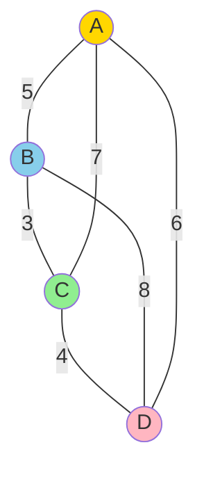

# Chapter 8: NP-Hardness of Traveling Salesman Problem

## 🎯 Learning Objectives
- Understand the Traveling Salesman Problem (TSP)
- Prove TSP is NP-Complete
- Learn reduction from Hamilton Cycle
- Study approximation algorithms for metric TSP
- Understand inapproximability results

---

## 8.1 The Traveling Salesman Problem

### 📚 **Problem Definition**

**Input:** 
- Complete graph G = (V, E) with n vertices
- Distance function d: V × V → ℝ⁺ (edge weights)

**Output:** 
- Tour T visiting each vertex exactly once
- Minimizing total distance Σ d(vᵢ, vᵢ₊₁)

**Formal:**
```
TSP = {(G, d, k) : G has tour of total distance ≤ k}
```

### 🔑 **TSP Variants**

| Variant | Constraint | Complexity |
|---------|-----------|------------|
| **General TSP** | No constraints on distances | NP-Complete |
| **Metric TSP** | d satisfies triangle inequality | NP-Complete (but approximable) |
| **Euclidean TSP** | Points in ℝ² with Euclidean distance | NP-Complete |
| **Symmetric TSP** | d(u, v) = d(v, u) | NP-Complete |
| **Asymmetric TSP** | d(u, v) ≠ d(v, u) possible | NP-Complete |

### 📊 **Example TSP Instance**



**Distances:**
- d(A, B) = 5, d(B, C) = 3, d(C, D) = 4, d(D, A) = 6
- d(A, C) = 7, d(B, D) = 8

**Optimal tour:** A → B → C → D → A
**Total distance:** 5 + 3 + 4 + 6 = 18

---

## 8.2 Hamilton Cycle Problem

### 📚 **Definition**

**Hamilton Cycle:** Simple cycle visiting each vertex exactly once

**Decision problem:**
```
HAM-CYCLE = {G : G contains a Hamilton cycle}
```

**Known result:** HAM-CYCLE is NP-Complete (proven via reduction from 3-SAT)

### 🔑 **Relationship to TSP**

**Key insight:** TSP generalizes Hamilton Cycle
- Hamilton Cycle: Does tour exist?
- TSP: What is shortest tour?

**Strategy:** Reduce HAM-CYCLE ≤_p TSP

---

## 8.3 TSP is NP-Complete

### ✅ **Step 1: TSP ∈ NP**

**Certificate:** A tour T = (v₁, v₂, ..., vₙ, v₁)

**Verifier:**
```c
bool verify_tsp(Graph *G, int tour[], int n, int k) {
    // Check 1: Tour visits each vertex exactly once
    bool visited[MAX_V] = {false};
    for (int i = 0; i < n; i++) {
        if (visited[tour[i]]) return false;  // Duplicate
        visited[tour[i]] = true;
    }
    
    // Check 2: Tour is closed (returns to start)
    if (tour[n] != tour[0]) return false;
    
    // Check 3: Total distance ≤ k
    int total_dist = 0;
    for (int i = 0; i < n; i++) {
        total_dist += distance(tour[i], tour[i+1]);
        if (total_dist > k) return false;  // Early termination
    }
    
    return total_dist <= k;
}
```

**Time:** O(n) to verify ✓

**Conclusion:** TSP ∈ NP ✓

---

### ✅ **Step 2: Reduction HAM-CYCLE ≤_p TSP**

**Theorem:** HAM-CYCLE ≤_p TSP, therefore TSP is NP-Hard

**Reduction construction:**

**Input:** Graph G = (V, E) (Hamilton Cycle instance)

**Output:** TSP instance (K_n, d) where:
- K_n = complete graph on V
- Distance function:
  ```
  d(u, v) = {
    1   if (u, v) ∈ E  (edge exists in G)
    2   if (u, v) ∉ E  (edge does not exist)
  }
  ```

**Threshold:** k = n (number of vertices)

**Claim:** G has Hamilton cycle ⟺ TSP instance has tour of length ≤ n

### ✅ **Proof of Correctness**

**Direction (⇒):** G has Hamilton cycle → TSP solution exists

**Proof:**
- Let H = (v₁, v₂, ..., vₙ, v₁) be Hamilton cycle in G
- All edges (vᵢ, vᵢ₊₁) ∈ E (by definition of H)
- Therefore d(vᵢ, vᵢ₊₁) = 1 for all i
- Total distance = n × 1 = n ✓
- TSP has tour of length ≤ n ✓

**Direction (⇐):** TSP has tour ≤ n → G has Hamilton cycle

**Proof:**
- Let T be TSP tour with distance ≤ n
- T visits n vertices with n edges
- Each edge contributes distance ≥ 1
- If any edge has distance 2, total ≥ n + 1 (contradiction)
- Therefore all edges have distance 1
- By construction, distance 1 means edge exists in G
- So T uses only edges from E
- T is Hamilton cycle in G ✓

**QED!** ∎

### 💻 **C Implementation of Reduction**

```c
#include <stdio.h>
#include <stdbool.h>
#include <string.h>

#define MAX_V 100

typedef struct {
    int n;
    bool adj[MAX_V][MAX_V];
} Graph;

typedef struct {
    int n;
    int dist[MAX_V][MAX_V];
} TSPInstance;

// Reduce Hamilton Cycle to TSP
TSPInstance reduce_ham_to_tsp(Graph *G) {
    TSPInstance tsp;
    tsp.n = G->n;
    
    printf("=== Reduction: HAM-CYCLE to TSP ===\n\n");
    printf("Original graph G:\n");
    printf("  Vertices: %d\n", G->n);
    printf("  Edges:\n");
    
    for (int u = 0; u < G->n; u++) {
        for (int v = u + 1; v < G->n; v++) {
            if (G->adj[u][v]) {
                printf("    (%d, %d)\n", u, v);
            }
        }
    }
    
    printf("\nConstructing TSP instance:\n");
    printf("  Complete graph K_%d with distance function:\n", tsp.n);
    
    // Build distance matrix
    for (int u = 0; u < G->n; u++) {
        for (int v = 0; v < G->n; v++) {
            if (u == v) {
                tsp.dist[u][v] = 0;
            } else if (G->adj[u][v]) {
                tsp.dist[u][v] = 1;  // Edge exists
            } else {
                tsp.dist[u][v] = 2;  // No edge
            }
        }
    }
    
    printf("\nDistance matrix:\n");
    printf("     ");
    for (int v = 0; v < tsp.n; v++) {
        printf("%3d ", v);
    }
    printf("\n");
    
    for (int u = 0; u < tsp.n; u++) {
        printf("%3d: ", u);
        for (int v = 0; v < tsp.n; v++) {
            if (tsp.dist[u][v] == 0) {
                printf("  - ");
            } else {
                printf("%3d ", tsp.dist[u][v]);
            }
        }
        printf("\n");
    }
    
    printf("\nThreshold k = %d\n", tsp.n);
    printf("\nReduction complete!\n");
    printf("G has Hamilton cycle ⟺ TSP has tour of length ≤ %d\n", tsp.n);
    
    return tsp;
}

// Brute-force TSP solver (exponential time, for verification)
typedef struct {
    int tour[MAX_V + 1];
    int length;
    bool found;
} TSPSolution;

void tsp_search(TSPInstance *tsp, int tour[], bool visited[], 
                int pos, int dist, int k, TSPSolution *best) {
    if (pos == tsp->n) {
        // Complete tour: return to start
        int total = dist + tsp->dist[tour[pos-1]][tour[0]];
        
        if (total <= k && (!best->found || total < best->length)) {
            memcpy(best->tour, tour, tsp->n * sizeof(int));
            best->tour[tsp->n] = tour[0];  // Close tour
            best->length = total;
            best->found = true;
        }
        return;
    }
    
    // Try each unvisited vertex
    for (int v = 0; v < tsp->n; v++) {
        if (visited[v]) continue;
        
        int new_dist = dist + tsp->dist[tour[pos-1]][v];
        
        // Pruning: if already over threshold, skip
        if (new_dist > k) continue;
        
        tour[pos] = v;
        visited[v] = true;
        
        tsp_search(tsp, tour, visited, pos + 1, new_dist, k, best);
        
        visited[v] = false;
    }
}

TSPSolution solve_tsp(TSPInstance *tsp, int k) {
    TSPSolution solution;
    solution.found = false;
    solution.length = INT_MAX;
    
    printf("\n=== Solving TSP ===\n");
    printf("Searching for tour with length ≤ %d...\n\n", k);
    
    int tour[MAX_V + 1];
    bool visited[MAX_V] = {false};
    
    // Start from vertex 0
    tour[0] = 0;
    visited[0] = true;
    
    tsp_search(tsp, tour, visited, 1, 0, k, &solution);
    
    if (solution.found) {
        printf("TSP solution found!\n");
        printf("Tour: ");
        for (int i = 0; i <= tsp->n; i++) {
            printf("%d", solution.tour[i]);
            if (i < tsp->n) printf(" → ");
        }
        printf("\n");
        printf("Total length: %d\n", solution.length);
    } else {
        printf("No tour with length ≤ %d exists.\n", k);
    }
    
    return solution;
}

// Example usage
int main() {
    Graph G;
    G.n = 4;
    memset(G.adj, false, sizeof(G.adj));
    
    // Create a graph with Hamilton cycle: 0-1-2-3-0
    G.adj[0][1] = G.adj[1][0] = true;
    G.adj[1][2] = G.adj[2][1] = true;
    G.adj[2][3] = G.adj[3][2] = true;
    G.adj[3][0] = G.adj[0][3] = true;
    
    // Add extra edge
    G.adj[0][2] = G.adj[2][0] = true;
    
    // Reduce to TSP
    TSPInstance tsp = reduce_ham_to_tsp(&G);
    
    // Solve TSP
    TSPSolution sol = solve_tsp(&tsp, tsp.n);
    
    // Verify reduction
    printf("\n=== Verification ===\n");
    if (sol.found && sol.length == tsp.n) {
        printf("✓ TSP has tour of length %d\n", tsp.n);
        printf("✓ Therefore, G has Hamilton cycle\n");
        
        printf("\nHamilton cycle in G: ");
        for (int i = 0; i <= tsp.n; i++) {
            printf("%d", sol.tour[i]);
            if (i < tsp.n) printf(" → ");
        }
        printf("\n");
    } else if (!sol.found) {
        printf("✗ No TSP tour of length ≤ %d\n", tsp.n);
        printf("✗ Therefore, G has no Hamilton cycle\n");
    }
    
    return 0;
}
```

### 📊 **Example Output**

```
=== Reduction: HAM-CYCLE to TSP ===

Original graph G:
  Vertices: 4
  Edges:
    (0, 1)
    (0, 2)
    (0, 3)
    (1, 2)
    (2, 3)

Constructing TSP instance:
  Complete graph K_4 with distance function:

Distance matrix:
       0   1   2   3 
  0:   -   1   1   1 
  1:   1   -   1   2 
  2:   1   1   -   1 
  3:   1   2   1   - 

Threshold k = 4

Reduction complete!
G has Hamilton cycle ⟺ TSP has tour of length ≤ 4

=== Solving TSP ===
Searching for tour with length ≤ 4...

TSP solution found!
Tour: 0 → 1 → 2 → 3 → 0
Total length: 4

=== Verification ===
✓ TSP has tour of length 4
✓ Therefore, G has Hamilton cycle

Hamilton cycle in G: 0 → 1 → 2 → 3 → 0
```

---

## 8.4 Metric TSP and Approximation

### 📚 **Triangle Inequality**

**Metric TSP:** Distances satisfy **triangle inequality**:
```
d(u, w) ≤ d(u, v) + d(v, w)  for all u, v, w
```

**Interpretation:** Direct path never longer than detour

### 🔑 **Why Metric TSP?**

**General TSP:** No polynomial-time approximation exists (unless P = NP)

**Metric TSP:** 2-approximation algorithm exists!

---

## 8.5 2-Approximation for Metric TSP

### 📚 **Algorithm: MST-Based Tour**

```
TSP-2-Approx(G, d):
  1. Compute Minimum Spanning Tree T of G
  
  2. Perform DFS on T starting from arbitrary vertex r
  
  3. Output vertices in DFS visitation order (shortcutting)
  
  4. Return to r to close tour
```

### 💻 **C Implementation**

```c
#include <stdio.h>
#include <stdbool.h>
#include <limits.h>

#define MAX_V 100

typedef struct {
    int n;
    int dist[MAX_V][MAX_V];
} MetricTSP;

// Prim's MST algorithm
typedef struct {
    int parent[MAX_V];
    int mst_weight;
} MST;

MST compute_mst(MetricTSP *tsp) {
    MST mst;
    bool in_mst[MAX_V] = {false};
    int key[MAX_V];
    
    // Initialize
    for (int i = 0; i < tsp->n; i++) {
        key[i] = INT_MAX;
        mst.parent[i] = -1;
    }
    
    key[0] = 0;  // Start from vertex 0
    mst.mst_weight = 0;
    
    for (int count = 0; count < tsp->n; count++) {
        // Find minimum key vertex
        int min_key = INT_MAX, u = -1;
        for (int v = 0; v < tsp->n; v++) {
            if (!in_mst[v] && key[v] < min_key) {
                min_key = key[v];
                u = v;
            }
        }
        
        in_mst[u] = true;
        mst.mst_weight += key[u];
        
        // Update keys
        for (int v = 0; v < tsp->n; v++) {
            if (!in_mst[v] && tsp->dist[u][v] < key[v]) {
                key[v] = tsp->dist[u][v];
                mst.parent[v] = u;
            }
        }
    }
    
    printf("MST computed with weight: %d\n", mst.mst_weight);
    return mst;
}

// DFS to build tour
void dfs_tour(int mst_adj[MAX_V][MAX_V], int n, int u, 
              bool visited[], int tour[], int *tour_len) {
    visited[u] = true;
    tour[(*tour_len)++] = u;
    
    for (int v = 0; v < n; v++) {
        if (mst_adj[u][v] && !visited[v]) {
            dfs_tour(mst_adj, n, v, visited, tour, tour_len);
        }
    }
}

// 2-Approximation algorithm
typedef struct {
    int tour[MAX_V + 1];
    int length;
} ApproxTour;

ApproxTour tsp_2_approx(MetricTSP *tsp) {
    printf("\n=== 2-Approximation Algorithm ===\n\n");
    
    // Step 1: Compute MST
    printf("Step 1: Compute MST\n");
    MST mst = compute_mst(tsp);
    
    // Build MST adjacency
    int mst_adj[MAX_V][MAX_V] = {0};
    for (int v = 0; v < tsp->n; v++) {
        if (mst.parent[v] != -1) {
            int u = mst.parent[v];
            mst_adj[u][v] = mst_adj[v][u] = 1;
        }
    }
    
    // Step 2: DFS to build tour
    printf("\nStep 2: DFS traversal of MST\n");
    bool visited[MAX_V] = {false};
    int tour[MAX_V + 1];
    int tour_len = 0;
    
    dfs_tour(mst_adj, tsp->n, 0, visited, tour, &tour_len);
    tour[tour_len] = 0;  // Close tour
    
    // Step 3: Compute tour length
    ApproxTour result;
    result.length = 0;
    
    for (int i = 0; i < tour_len; i++) {
        result.tour[i] = tour[i];
        result.length += tsp->dist[tour[i]][tour[i+1]];
    }
    result.tour[tour_len] = 0;
    
    printf("Tour: ");
    for (int i = 0; i <= tour_len; i++) {
        printf("%d", tour[i]);
        if (i < tour_len) printf(" → ");
    }
    printf("\n");
    printf("Tour length: %d\n", result.length);
    
    return result;
}

// Example
int main() {
    MetricTSP tsp;
    tsp.n = 4;
    
    // Distance matrix (metric: satisfies triangle inequality)
    int dist[4][4] = {
        {0, 10, 15, 20},
        {10, 0, 35, 25},
        {15, 35, 0, 30},
        {20, 25, 30, 0}
    };
    
    memcpy(tsp.dist, dist, sizeof(dist));
    
    printf("Metric TSP instance:\n");
    printf("Distance matrix:\n");
    for (int i = 0; i < tsp.n; i++) {
        for (int j = 0; j < tsp.n; j++) {
            printf("%4d ", tsp.dist[i][j]);
        }
        printf("\n");
    }
    
    ApproxTour tour = tsp_2_approx(&tsp);
    
    printf("\n--- Approximation Guarantee ---\n");
    printf("Tour length: %d\n", tour.length);
    printf("Guarantee: length ≤ 2 × OPT\n");
    printf("(Actual OPT requires checking all tours)\n");
    
    return 0;
}
```

### ✅ **Approximation Guarantee Proof**

**Theorem:** The algorithm produces tour T with length ≤ 2 × OPT

**Proof:**

Let:
- T* = optimal TSP tour with length OPT
- T_MST = MST with weight w(T_MST)
- T_DFS = tour from DFS (our output) with length w(T_DFS)

**Step 1:** w(T_MST) ≤ OPT

**Proof:**
- Remove one edge from T* to get spanning tree
- MST is minimum spanning tree
- Therefore w(T_MST) ≤ w(T*) = OPT ✓

**Step 2:** DFS traversal creates walk of length 2 × w(T_MST)

**Proof:**
- DFS traverses each MST edge twice (down and up)
- Total length = 2 × w(T_MST) ✓

**Step 3:** Shortcutting preserves or reduces length (triangle inequality!)

**Proof:**
- DFS walk may visit vertices multiple times
- Shortcut: skip repeated vertices
- By triangle inequality: direct edge ≤ path through middle
- Therefore w(T_DFS) ≤ 2 × w(T_MST) ✓

**Conclusion:**
```
w(T_DFS) ≤ 2 × w(T_MST) ≤ 2 × OPT  ✓
```

**QED!** ∎

---

## 8.6 Christofides Algorithm (1.5-Approximation)

### 📚 **Better Approximation**

**Christofides algorithm** achieves 1.5-approximation for metric TSP!

### 🔧 **Algorithm Sketch**

```
Christofides(G, d):
  1. Compute MST T
  
  2. Find vertices V_odd with odd degree in T
  
  3. Find minimum-weight perfect matching M on V_odd
  
  4. Combine T and M to get Eulerian graph
  
  5. Find Eulerian tour
  
  6. Shortcut to get Hamilton tour
```

**Guarantee:** Tour length ≤ 1.5 × OPT

**Still the best known!** (Until recently: slight improvements to ~1.49999)

---

## 📋 Summary

### 🎯 **Key Results**

1. **TSP ∈ NP:** Certificate is tour, verify in O(n)
2. **HAM-CYCLE ≤_p TSP:** Distance 1 for edges, 2 for non-edges
3. **TSP is NP-Complete:** Combines above results
4. **General TSP:** Inapproximable (unless P = NP)
5. **Metric TSP:** 2-approximation via MST-DFS
6. **Christofides:** 1.5-approximation

### 🔑 **Complexity Summary**

| Problem | Exact Solution | Approximation |
|---------|---------------|---------------|
| **General TSP** | O(n!) brute-force | None (unless P=NP) |
| **Metric TSP** | O(n!) brute-force | 2-approx in O(n²) |
| **Metric TSP** | - | 1.5-approx (Christofides) |
| **Euclidean TSP** | O(n!) | PTAS exists |

### 📊 **Important Theorems**

✓ **NP-Completeness:** TSP is NP-Complete  
✓ **Inapproximability:** General TSP has no constant-factor approximation  
✓ **MST Lower Bound:** OPT ≥ w(MST)  
✓ **2-Approximation:** MST-DFS gives 2 × OPT for metric TSP  

---

## 📚 References

1. **Cormen, T. H., et al. (2009).** *Introduction to Algorithms* (3rd ed.). MIT Press.
   - Chapter 35.2: The Traveling-Salesman Problem

2. **Kleinberg, J., & Tardos, É. (2005).** *Algorithm Design*. Pearson.
   - Chapter 8: NP and Computational Intractability

3. **Christofides, N. (1976).** "Worst-case analysis of a new heuristic for the travelling salesman problem." *Technical Report*.
   - 1.5-approximation algorithm

4. **Karp, R. M. (1972).** "Reducibility among combinatorial problems." *Complexity of Computer Computations*.
   - TSP in Karp's 21 NP-Complete problems

---

**Next Chapter:** [Randomized Min-Cut (Karger's Algorithm) →](09_randomized_min_cut.md)
