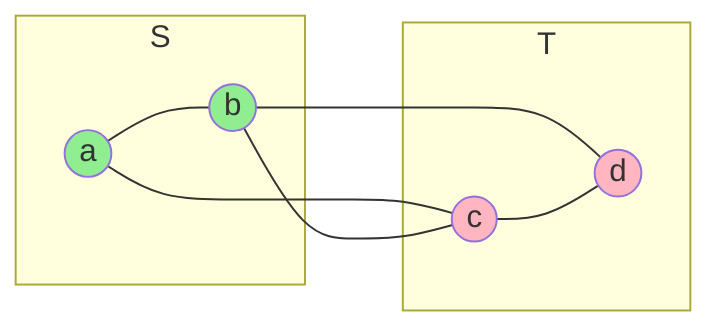
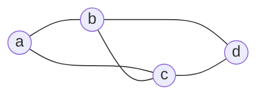
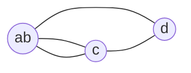

# Chapter 9: Randomized Algorithm for Min-Cut Problem

## 🎯 Learning Objectives
- Understand randomized algorithms and probability
- Master Karger's contraction algorithm
- Analyze success probability using probability theory
- Learn amplification by repeated trials
- Apply to network reliability problems

---

## 9.1 Introduction to Randomized Algorithms

### 📚 **What is a Randomized Algorithm?**

**Definition:** Algorithm that makes random choices during execution

**Types:**
1. **Las Vegas:** Always correct, random running time (e.g., Randomized QuickSort)
2. **Monte Carlo:** Random answer, bounded running time (may be incorrect)

**Karger's algorithm:** Monte Carlo with tunable success probability

### 🔑 **Why Randomization?**

**Advantages:**
- Simpler algorithms
- Better average-case performance
- Solve problems where deterministic solution unknown
- Probabilistic guarantees often sufficient

---

## 9.2 The Min-Cut Problem

### 📚 **Problem Definition**

**Input:** Undirected graph G = (V, E)

**Output:** Cut (S, T) minimizing |E(S, T)|

where E(S, T) = {{u, v} ∈ E : u ∈ S, v ∈ T}

**Notation:** 
- **Cut size** = number of edges crossing cut
- **Min-cut** = cut with minimum size

### 📊 **Example**



**Cut (S={a,b}, T={c,d}):**
- Crossing edges: {a,c}, {b,c}, {b,d}
- Cut size = 3

**Is this minimum?** Need to check all cuts!

### 🔑 **Deterministic Algorithms**

**Max-flow based:** 
- Run max-flow n-1 times (for each sink)
- Time: O(n) × O(VE²) = O(V²E²)

**Stoer-Wagner:**
- Deterministic min-cut algorithm
- Time: O(VE + V² log V)

**Karger's randomized:**
- Time: O(n² log n) with high probability
- Simpler implementation!

---

## 9.3 Edge Contraction

### 📚 **Contraction Operation**

**Contract edge {u, v}:**
1. Merge u and v into single vertex
2. Remove self-loops
3. Keep parallel edges

**Effect:** Reduces number of vertices by 1

### 📊 **Example: Contracting Edge**

**Before contraction:**


**Contract edge {a, b} → new vertex ab:**


**Note:** Two edges ab-c (parallel edges), kept as is!

### 💻 **C Implementation: Contraction**

```c
#include <stdio.h>
#include <stdlib.h>
#include <time.h>
#include <string.h>

#define MAX_V 100
#define MAX_E 1000

typedef struct {
    int u, v;
} Edge;

typedef struct {
    int n_vertices;
    int n_edges;
    Edge edges[MAX_E];
    int vertex_map[MAX_V];  // Maps original vertices to contracted
} Graph;

// Initialize graph
void init_graph(Graph *G, int n) {
    G->n_vertices = n;
    G->n_edges = 0;
    for (int i = 0; i < n; i++) {
        G->vertex_map[i] = i;  // Initially identity
    }
}

// Add edge
void add_edge(Graph *G, int u, int v) {
    G->edges[G->n_edges].u = u;
    G->edges[G->n_edges].v = v;
    G->n_edges++;
}

// Find representative (for union-find like structure)
int find_vertex(Graph *G, int v) {
    while (G->vertex_map[v] != v) {
        v = G->vertex_map[v];
    }
    return v;
}

// Contract a random edge
void contract_edge(Graph *G, int edge_idx) {
    Edge e = G->edges[edge_idx];
    int u = find_vertex(G, e.u);
    int v = find_vertex(G, e.v);
    
    printf("  Contracting edge {%d, %d}\n", u, v);
    
    // Merge v into u
    G->vertex_map[v] = u;
    
    // Update all edges
    for (int i = 0; i < G->n_edges; i++) {
        int eu = find_vertex(G, G->edges[i].u);
        int ev = find_vertex(G, G->edges[i].v);
        G->edges[i].u = eu;
        G->edges[i].v = ev;
    }
    
    G->n_vertices--;
}

// Remove self-loops (edges within same super-vertex)
void remove_self_loops(Graph *G) {
    int new_count = 0;
    for (int i = 0; i < G->n_edges; i++) {
        int u = find_vertex(G, G->edges[i].u);
        int v = find_vertex(G, G->edges[i].v);
        
        if (u != v) {
            G->edges[new_count++] = G->edges[i];
        }
    }
    G->n_edges = new_count;
}

// Select random edge (excluding self-loops)
int select_random_edge(Graph *G) {
    // Build list of valid edges
    int valid[MAX_E];
    int count = 0;
    
    for (int i = 0; i < G->n_edges; i++) {
        int u = find_vertex(G, G->edges[i].u);
        int v = find_vertex(G, G->edges[i].v);
        if (u != v) {
            valid[count++] = i;
        }
    }
    
    if (count == 0) return -1;
    
    return valid[rand() % count];
}
```

---

## 9.4 Karger's Contraction Algorithm

### 📚 **Algorithm**

```
Karger-MinCut(G):
  1. While number of vertices > 2:
       a. Pick random edge e uniformly
       b. Contract e
       c. Remove self-loops
  
  2. Return cut defined by remaining two super-vertices
```

**Output:** A cut (size = remaining edges)

**Guarantee:** With probability ≥ 1/n², output is minimum cut

### 💻 **Complete C Implementation**

```c
// Karger's Min-Cut Algorithm (single run)
int karger_min_cut(Graph *G_orig) {
    // Make copy
    Graph G;
    memcpy(&G, G_orig, sizeof(Graph));
    
    printf("\nKarger's Contraction Algorithm:\n");
    printf("Starting vertices: %d, edges: %d\n", G.n_vertices, G.n_edges);
    
    int iteration = 0;
    
    // Contract until 2 vertices remain
    while (G.n_vertices > 2) {
        iteration++;
        printf("\nIteration %d (vertices: %d, edges: %d):\n", 
               iteration, G.n_vertices, G.n_edges);
        
        // Select random edge
        int edge_idx = select_random_edge(&G);
        if (edge_idx == -1) {
            printf("  No valid edges remaining!\n");
            break;
        }
        
        // Contract edge
        contract_edge(&G, edge_idx);
        
        // Remove self-loops
        remove_self_loops(&G);
    }
    
    // Count remaining edges (cut size)
    int cut_size = 0;
    for (int i = 0; i < G.n_edges; i++) {
        int u = find_vertex(&G, G.edges[i].u);
        int v = find_vertex(&G, G.edges[i].v);
        if (u != v) cut_size++;
    }
    
    printf("\nFinal cut size: %d\n", cut_size);
    return cut_size;
}

// Example usage
int main() {
    srand(time(NULL));
    
    Graph G;
    init_graph(&G, 4);
    
    // Build example graph (4-vertex cycle)
    add_edge(&G, 0, 1);
    add_edge(&G, 1, 2);
    add_edge(&G, 2, 3);
    add_edge(&G, 3, 0);
    add_edge(&G, 0, 2);  // Diagonal
    
    printf("Original graph:\n");
    printf("  Vertices: {0, 1, 2, 3}\n");
    printf("  Edges: ");
    for (int i = 0; i < G.n_edges; i++) {
        printf("{%d,%d} ", G.edges[i].u, G.edges[i].v);
    }
    printf("\n");
    
    int cut = karger_min_cut(&G);
    
    printf("\n=== Result ===\n");
    printf("Cut size found: %d\n", cut);
    printf("(Min-cut for this graph is 2)\n");
    
    return 0;
}
```

### 📊 **Example Output**

```
Original graph:
  Vertices: {0, 1, 2, 3}
  Edges: {0,1} {1,2} {2,3} {3,0} {0,2} 

Karger's Contraction Algorithm:
Starting vertices: 4, edges: 5

Iteration 1 (vertices: 4, edges: 5):
  Contracting edge {1, 2}

Iteration 2 (vertices: 3, edges: 4):
  Contracting edge {0, 12}

Final cut size: 2

=== Result ===
Cut size found: 2
(Min-cut for this graph is 2)
```

---

## 9.5 Probability Analysis

### 📚 **Success Probability**

**Question:** What is probability that Karger's algorithm finds min-cut?

**Answer:** ≥ 1/n² (surprisingly good!)

### ✅ **Lower Bound Proof**

**Setup:**
- Let C = min-cut with size k
- Graph G has n vertices

**Key observation:** Every vertex has degree ≥ k

**Why?** 
- If vertex v has degree < k, then {v} vs rest is cut of size < k
- This contradicts C being minimum ✓

**Therefore:** Total edges ≥ nk/2 (sum of degrees / 2)

### 🔑 **Probability Calculation**

**Event Eᵢ:** Iteration i does NOT contract min-cut edge

**Goal:** Show P(E₁ ∩ E₂ ∩ ... ∩ E_{n-2}) ≥ 1/n²

**Iteration 1:** (n vertices, ≥ nk/2 edges)
```
P(E₁) = P(don't pick min-cut edge)
      = (total edges - k) / (total edges)
      ≥ (nk/2 - k) / (nk/2)
      = (n - 2) / n
```

**Iteration 2:** (n-1 vertices remain)
```
P(E₂ | E₁) ≥ (n - 3) / (n - 1)
```

**General pattern:**
```
P(Eᵢ | E₁ ∩ ... ∩ E_{i-1}) ≥ (n - i - 1) / (n - i + 1)
```

**Overall success probability:**
```
P(success) = P(E₁ ∩ E₂ ∩ ... ∩ E_{n-2})
           = P(E₁) · P(E₂|E₁) · ... · P(E_{n-2}|E₁∩...∩E_{n-3})
           
           ≥ (n-2)/n · (n-3)/(n-1) · (n-4)/(n-2) · ... · 2/4 · 1/3
           
           = [(n-2)(n-3)...(2)(1)] / [n(n-1)(n-2)...(4)(3)]
           
           = 2! / [n(n-1)]
           
           = 2 / (n² - n)
           
           ≥ 1/n²  (for n ≥ 2)
```

**QED!** ∎

### 📊 **Visualization of Probability**

| n (vertices) | Success Prob | Trials for 99% |
|--------------|--------------|----------------|
| 10 | ≥ 1/100 | ~460 |
| 100 | ≥ 1/10,000 | ~46,000 |
| 1,000 | ≥ 1/1,000,000 | ~4,600,000 |

---

## 9.6 Amplification by Repetition

### 📚 **Repeated Trials**

**Idea:** Run Karger's algorithm multiple times, take minimum

**Question:** How many times to run for high success probability?

### 🔑 **Analysis**

**Single run:** P(success) ≥ 1/n²

**Single run:** P(failure) ≤ 1 - 1/n² < 1

**k independent runs:**
```
P(all fail) ≤ (1 - 1/n²)^k
```

**Bound using (1 - x) ≤ e^{-x}:**
```
P(all fail) ≤ e^{-k/n²}
```

**For 99% success:** Want P(all fail) ≤ 0.01
```
e^{-k/n²} ≤ 0.01
-k/n² ≤ ln(0.01)
k ≥ n² · ln(100)
k ≥ 4.6 n²
```

**Choose k = n² ln n** for even higher confidence!

### 💻 **Repeated Trials Implementation**

```c
#include <math.h>

// Run Karger's algorithm multiple times
int karger_min_cut_repeated(Graph *G, int trials) {
    int min_cut = INT_MAX;
    
    printf("=== Running Karger's Algorithm %d Times ===\n\n", trials);
    
    for (int t = 0; t < trials; t++) {
        int cut = karger_min_cut(G);
        
        printf("Trial %d: cut size = %d\n", t + 1, cut);
        
        if (cut < min_cut) {
            min_cut = cut;
            printf("  → New minimum!\n");
        }
        printf("\n");
    }
    
    printf("=== Final Result ===\n");
    printf("Minimum cut found: %d\n", min_cut);
    printf("(over %d trials)\n", trials);
    
    return min_cut;
}

// Main with repeated trials
int main() {
    srand(time(NULL));
    
    Graph G;
    init_graph(&G, 6);
    
    // Build 6-vertex graph
    add_edge(&G, 0, 1);
    add_edge(&G, 0, 2);
    add_edge(&G, 1, 2);
    add_edge(&G, 1, 3);
    add_edge(&G, 2, 4);
    add_edge(&G, 3, 4);
    add_edge(&G, 3, 5);
    add_edge(&G, 4, 5);
    
    printf("Graph: 6 vertices, 8 edges\n\n");
    
    // Calculate recommended trials
    int n = G.n_vertices;
    int trials = (int)(n * n * log(n)) + 1;
    
    printf("Recommended trials for high probability: n² ln(n) = %d\n\n", trials);
    
    // For demo, use fewer trials
    int demo_trials = 10;
    printf("Using %d trials for demo\n\n", demo_trials);
    
    int min_cut = karger_min_cut_repeated(&G, demo_trials);
    
    return 0;
}
```

---

## 9.7 Time Complexity Analysis

### 📚 **Single Run**

**Per iteration:**
- Select random edge: O(m) to enumerate
- Contract edge: O(m) to update edges
- Remove self-loops: O(m)

**Total per iteration:** O(m)

**Number of iterations:** n - 2

**Single run:** O(nm)

### 📚 **Repeated Trials**

**k = n² ln n trials:**

**Total time:** O(n²m ln n) = O(n⁴ ln n) for dense graphs

**Compare to deterministic:**
- Max-flow: O(V²E²) = O(n⁶) for dense
- Karger: O(n⁴ ln n)

**Karger is faster!**

### 🔧 **Improvements**

**Karger-Stein (1996):**
- Recursive contraction
- Time: O(n² log³ n)
- Higher success probability

**Algorithm:**
```
Recursive-Contract(G, t):
  If G has ≤ t vertices:
    Return contract to 2 vertices
  Else:
    Contract to n/√2 vertices
    Recursively call twice
    Return minimum of two results
```

---

## 📋 Summary

### 🎯 **Key Concepts**

1. **Min-cut problem:** Find minimum edge cut
2. **Edge contraction:** Merge two vertices
3. **Karger's algorithm:** Randomized contraction
4. **Success probability:** ≥ 1/n² per run
5. **Amplification:** Repeat O(n² log n) times
6. **Time complexity:** O(n² log³ n) with Karger-Stein

### 🔑 **Main Results**

| Algorithm | Time | Success Prob |
|-----------|------|--------------|
| **Karger (single)** | O(n²) | ≥ 1/n² |
| **Karger (repeated)** | O(n⁴ log n) | ≥ 1 - 1/n |
| **Karger-Stein** | O(n² log³ n) | ≥ 1 - 1/n |
| **Stoer-Wagner (det)** | O(nm + n² log n) | 100% |

### 📊 **When to Use**

- ✓ **Simple implementation** needed
- ✓ **Good average-case** performance acceptable
- ✓ **Probabilistic guarantees** sufficient
- ✓ **Multiple runs** feasible

---

## 📚 References

1. **Karger, D. R. (1993).** "Global min-cuts in RNC, and other ramifications of a simple min-cut algorithm." *SODA*.
   - Original Karger's algorithm

2. **Karger, D. R., & Stein, C. (1996).** "A new approach to the minimum cut problem." *Journal of the ACM*.
   - Improved O(n² log³ n) algorithm

3. **Kleinberg, J., & Tardos, É. (2005).** *Algorithm Design*. Pearson.
   - Chapter 13: Randomized Algorithms

4. **Motwani, R., & Raghavan, P. (1995).** *Randomized Algorithms*. Cambridge University Press.
   - Comprehensive randomized algorithms text

---

**Next Chapter:** [Counting Inversions using Merge Sort →](10_counting_inversions.md)
