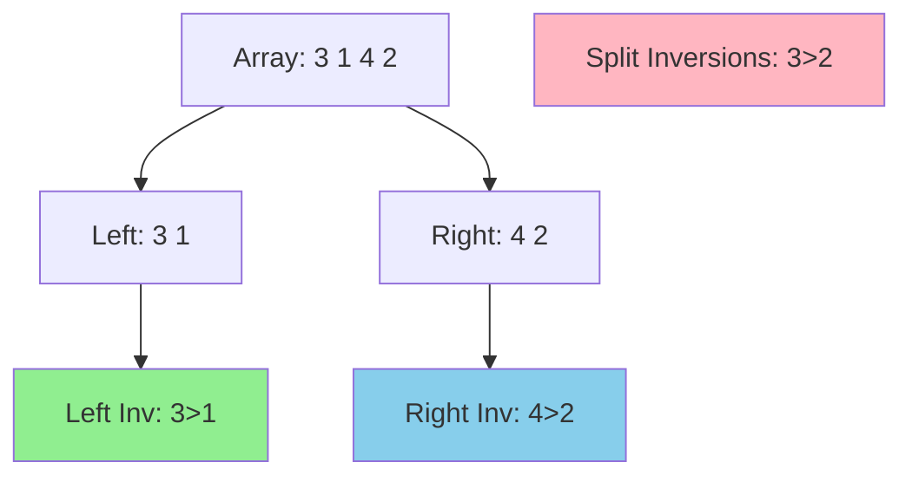

# Chapter 10: Counting Inversions using Merge Sort

## 🎯 Learning Objectives
- Understand inversions in arrays
- Master divide-and-conquer technique
- Learn modified merge sort for counting
- Analyze O(n log n) complexity
- Apply to ranking similarity problems

---

## 10.1 The Inversion Problem

### 📚 **Definition**

An **inversion** in array A[1..n] is a pair of indices (i, j) such that:
```
i < j  AND  A[i] > A[j]
```

**Interpretation:** Elements that are "out of order"

### 📊 **Examples**

**Array:** [3, 1, 4, 2]

**Inversions:**
- (0, 1): A[0] = 3 > A[1] = 1 ✓
- (0, 3): A[0] = 3 > A[3] = 2 ✓
- (2, 3): A[2] = 4 > A[3] = 2 ✓

**Total inversions:** 3

### 🔑 **Properties**

**Sorted array:** 0 inversions

**Reverse sorted:** Maximum inversions = n(n-1)/2

**Permutation distance:** Inversions measure "how far from sorted"

---

## 10.2 Naive Algorithm

### 📚 **Brute Force**

```c
int count_inversions_naive(int arr[], int n) {
    int count = 0;
    
    for (int i = 0; i < n - 1; i++) {
        for (int j = i + 1; j < n; j++) {
            if (arr[i] > arr[j]) {
                count++;
            }
        }
    }
    
    return count;
}
```

**Time complexity:** O(n²)
**Space complexity:** O(1)

### 📊 **Example Trace**

**Array:** [3, 1, 4, 2]

```
i=0, j=1: 3 > 1 → count = 1
i=0, j=2: 3 > 4? No
i=0, j=3: 3 > 2 → count = 2
i=1, j=2: 1 > 4? No
i=1, j=3: 1 > 2? No
i=2, j=3: 4 > 2 → count = 3
```

**Result:** 3 inversions

**Problem:** Too slow for large arrays!

---

## 10.3 Divide-and-Conquer Approach

### 📚 **Key Insight**

**Three types of inversions:**

1. **Left inversions:** Both i, j in left half
2. **Right inversions:** Both i, j in right half  
3. **Split inversions:** i in left, j in right



**Strategy:**
1. Recursively count left inversions
2. Recursively count right inversions
3. Count split inversions during merge

**Total = Left + Right + Split**

### 🔑 **Counting Split Inversions**

**Key observation:** During merge, when we pick from right:

```
If right[j] < left[i], then:
  right[j] forms inversion with left[i], left[i+1], ..., left[end]
  Number of inversions = (remaining elements in left)
```

---

## 10.4 Modified Merge Sort Algorithm

### 📚 **Algorithm**

```
Count-Inversions(arr, left, right):
  If left >= right:
    Return 0
  
  mid = (left + right) / 2
  
  inv_left = Count-Inversions(arr, left, mid)
  inv_right = Count-Inversions(arr, mid+1, right)
  inv_split = Merge-And-Count(arr, left, mid, right)
  
  Return inv_left + inv_right + inv_split
```

### 💻 **Complete C Implementation**

```c
#include <stdio.h>
#include <stdlib.h>
#include <string.h>

#define MAX_N 100000

// Merge two sorted halves and count split inversions
long long merge_and_count(int arr[], int temp[], int left, int mid, int right) {
    int i = left;      // Left subarray index
    int j = mid + 1;   // Right subarray index
    int k = left;      // Merged array index
    long long inv_count = 0;
    
    printf("  Merging [%d..%d] and [%d..%d]\n", left, mid, mid+1, right);
    
    // Merge process
    while (i <= mid && j <= right) {
        if (arr[i] <= arr[j]) {
            temp[k++] = arr[i++];
        } else {
            // arr[j] is smaller than arr[i]
            // So arr[j] forms inversion with arr[i], arr[i+1], ..., arr[mid]
            temp[k++] = arr[j++];
            
            inv_count += (mid - i + 1);
            
            printf("    Split inversions: %d elements from left > arr[%d]=%d\n", 
                   mid - i + 1, j - 1, arr[j - 1]);
        }
    }
    
    // Copy remaining elements
    while (i <= mid) {
        temp[k++] = arr[i++];
    }
    
    while (j <= right) {
        temp[k++] = arr[j++];
    }
    
    // Copy back to original array
    for (i = left; i <= right; i++) {
        arr[i] = temp[i];
    }
    
    printf("  Split inversions in this merge: %lld\n", inv_count);
    
    return inv_count;
}

// Recursive function to count inversions
long long merge_sort_count(int arr[], int temp[], int left, int right) {
    long long inv_count = 0;
    
    if (left < right) {
        int mid = left + (right - left) / 2;
        
        printf("\nDivide: [%d..%d] into [%d..%d] and [%d..%d]\n", 
               left, right, left, mid, mid + 1, right);
        
        // Count inversions in left half
        inv_count += merge_sort_count(arr, temp, left, mid);
        
        // Count inversions in right half
        inv_count += merge_sort_count(arr, temp, mid + 1, right);
        
        // Count split inversions
        inv_count += merge_and_count(arr, temp, left, mid, right);
    }
    
    return inv_count;
}

// Main function to count inversions
long long count_inversions(int arr[], int n) {
    int *temp = (int *)malloc(n * sizeof(int));
    
    printf("=== Counting Inversions using Merge Sort ===\n");
    printf("\nOriginal array: ");
    for (int i = 0; i < n; i++) {
        printf("%d ", arr[i]);
    }
    printf("\n");
    
    long long result = merge_sort_count(arr, temp, 0, n - 1);
    
    free(temp);
    
    printf("\n=== Result ===\n");
    printf("Total inversions: %lld\n", result);
    
    printf("\nSorted array: ");
    for (int i = 0; i < n; i++) {
        printf("%d ", arr[i]);
    }
    printf("\n");
    
    return result;
}

// Example usage
int main() {
    int arr[] = {3, 1, 4, 2, 5};
    int n = sizeof(arr) / sizeof(arr[0]);
    
    printf("Array size: %d\n", n);
    printf("Expected inversions: (3>1), (3>2), (4>2) = 3\n\n");
    
    long long inversions = count_inversions(arr, n);
    
    // Verify with naive approach for small arrays
    printf("\n--- Verification (naive O(n²) method) ---\n");
    int arr2[] = {3, 1, 4, 2, 5};  // Restore original
    int count_naive = 0;
    
    printf("Inversions found:\n");
    for (int i = 0; i < n - 1; i++) {
        for (int j = i + 1; j < n; j++) {
            if (arr2[i] > arr2[j]) {
                printf("  (%d, %d): arr[%d]=%d > arr[%d]=%d\n", 
                       i, j, i, arr2[i], j, arr2[j]);
                count_naive++;
            }
        }
    }
    
    printf("\nNaive count: %d\n", count_naive);
    
    if (inversions == count_naive) {
        printf("✓ Results match!\n");
    } else {
        printf("✗ Mismatch!\n");
    }
    
    return 0;
}
```

### 📊 **Example Output**

```
Array size: 5
Expected inversions: (3>1), (3>2), (4>2) = 3

=== Counting Inversions using Merge Sort ===

Original array: 3 1 4 2 5 

Divide: [0..4] into [0..2] and [3..4]

Divide: [0..2] into [0..1] and [2..2]

Divide: [0..1] into [0..0] and [1..1]
  Merging [0..0] and [1..1]
    Split inversions: 1 elements from left > arr[1]=1
  Split inversions in this merge: 1

  Merging [0..1] and [2..2]
  Split inversions in this merge: 0

Divide: [3..4] into [3..3] and [4..4]
  Merging [3..3] and [4..4]
  Split inversions in this merge: 0

  Merging [0..2] and [3..4]
    Split inversions: 2 elements from left > arr[3]=2
  Split inversions in this merge: 2

=== Result ===
Total inversions: 3

Sorted array: 1 2 3 4 5 

--- Verification (naive O(n²) method) ---
Inversions found:
  (0, 1): arr[0]=3 > arr[1]=1
  (0, 3): arr[0]=3 > arr[3]=2
  (2, 3): arr[2]=4 > arr[3]=2

Naive count: 3
✓ Results match!
```

---

## 10.5 Correctness Proof

### ✅ **Theorem:** Algorithm correctly counts all inversions

**Proof by induction on array size n:**

**Base case:** n = 1
- No pairs, 0 inversions
- Algorithm returns 0 ✓

**Inductive step:** Assume correct for arrays of size < n

Consider array A[1..n] with mid = n/2:

**Left half:** A[1..mid]
- By IH, recursive call counts all left inversions correctly ✓

**Right half:** A[mid+1..n]
- By IH, recursive call counts all right inversions correctly ✓

**Split inversions:**
- Claim: merge_and_count counts all split inversions

**Proof of claim:**
- When right[j] < left[i] during merge:
  - left[i], left[i+1], ..., left[mid] are all > right[j]
  - All these form inversions with right[j]
  - Count = (mid - i + 1) ✓
- No split inversions missed (all comparisons made) ✓

**Conclusion:** Total = Left + Right + Split (all counted) ✓

**QED!** ∎

---

## 10.6 Time Complexity Analysis

### 📚 **Recurrence Relation**

```
T(n) = 2T(n/2) + O(n)
```

**Where:**
- 2T(n/2): Two recursive calls on half-sized arrays
- O(n): Merge and count split inversions

### 🔑 **Solving Recurrence**

**Method 1: Recursion tree**

```
         cn              Level 0: cn
        /  \
      cn/2 cn/2          Level 1: cn
      / \   / \
    cn/4 ...  cn/4       Level 2: cn
    ...
```

**Levels:** log₂ n
**Work per level:** cn
**Total:** O(n log n) ✓

**Method 2: Master Theorem**

T(n) = 2T(n/2) + O(n)

Compare with: T(n) = aT(n/b) + f(n)
- a = 2, b = 2, f(n) = O(n)
- n^(log_b a) = n^(log_2 2) = n^1 = n
- f(n) = Θ(n) = Θ(n^(log_b a))

**Case 2 applies:** T(n) = Θ(n log n) ✓

### 📊 **Comparison with Naive**

| Algorithm | Time | Space |
|-----------|------|-------|
| **Naive** | O(n²) | O(1) |
| **Merge Sort** | O(n log n) | O(n) |

**Speedup for n = 1,000,000:**
- Naive: ~10¹² operations
- Merge: ~2×10⁷ operations
- **~50,000× faster!**

---

## 10.7 Applications

### 🌍 **1. Ranking Similarity**

**Problem:** Measure how similar two rankings are

**Example:** Movie rankings by two critics

**Critic A:** [Movie1, Movie2, Movie3, Movie4]
**Critic B:** [Movie3, Movie1, Movie4, Movie2]

**Convert B to indices in A's ordering:**
- Movie3 is at position 2 in A → 2
- Movie1 is at position 0 in A → 0
- Movie4 is at position 3 in A → 3
- Movie2 is at position 1 in A → 1

**Array:** [2, 0, 3, 1]

**Inversions:** Number of disagreements

### 🌍 **2. Kendall Tau Distance**

**Definition:** Minimum number of adjacent swaps to transform one ranking to another

**Theorem:** Kendall tau distance = number of inversions!

**Application:** Measure agreement between rankers

### 🌍 **3. Collaborative Filtering**

**Problem:** Find users with similar preferences

**Method:**
1. Represent each user's ranking as array
2. Compute inversions between pairs
3. Low inversions → similar users

### 🌍 **4. Sorting Algorithm Analysis**

**Bubble Sort:** Each pass removes one inversion

**Number of swaps** = number of inversions

**Time complexity** of bubble sort = O(n + inversions)

---

## 10.8 Variations

### 🔧 **1. Count Inversions in Two Arrays**

**Problem:** Given arrays A and B, count pairs (i, j) where:
- i < j
- A[i] > A[j]
- B[i] > B[j]

**Application:** Stock market analysis (two indicators)

### 🔧 **2. Significant Inversions**

**Problem:** Count pairs (i, j) where:
- i < j
- A[i] > 2 × A[j] (significant difference)

**Modification:** Change comparison in merge

```c
if (arr[i] > 2 * arr[j]) {
    // Significant inversion
}
```

### 🔧 **3. Local Inversions vs Global**

**Local inversion:** Adjacent elements (i, i+1)
**Global inversion:** Any pair (i, j) with i < j

**Question:** When are they equal?

**Answer:** When array is "almost sorted"

---

## 10.9 Practice Problems

### 📝 **Problem 1: Maximum Inversions**

**Question:** For array of n distinct elements, what's maximum inversions?

**Answer:** n(n-1)/2 (reverse sorted)

**Proof:** Every pair (i, j) with i < j is an inversion ✓

---

### 📝 **Problem 2: Minimum Swaps to Sort**

**Question:** Minimum adjacent swaps to sort array?

**Answer:** Number of inversions

**Proof:** Each swap removes exactly one inversion ✓

---

### 📝 **Problem 3: Binary String Inversions**

**Question:** Count inversions in binary string (1's before 0's)

**Example:** "10110" → inversions at (0,1), (0,3), (2,3) = 3

**Solution:** Same algorithm, treat as array of 0's and 1's

---

## 📋 Summary

### 🎯 **Key Concepts**

1. **Inversion:** Pair (i, j) with i < j and A[i] > A[j]
2. **Divide-and-conquer:** Split into left, right, split inversions
3. **Modified merge sort:** Count during merge step
4. **Time complexity:** O(n log n) using master theorem
5. **Applications:** Ranking similarity, collaborative filtering

### 🔑 **Algorithm Summary**

```
Count-Inversions(arr, n):
  1. Divide array into two halves
  2. Recursively count inversions in each half
  3. Count split inversions during merge
  4. Return sum of all three counts
  
Time: O(n log n)
Space: O(n) for temporary array
```

### 📊 **When to Use**

- ✓ **Measure ranking similarity**
- ✓ **Analyze sorting difficulty**
- ✓ **Collaborative filtering**
- ✓ **Compare permutations**
- ✓ **Any problem involving "out-of-order" pairs**

---

## 📚 References

1. **Cormen, T. H., et al. (2009).** *Introduction to Algorithms* (3rd ed.). MIT Press.
   - Chapter 2: Divide-and-Conquer

2. **Kleinberg, J., & Tardos, É. (2005).** *Algorithm Design*. Pearson.
   - Chapter 5.3: Counting Inversions

3. **Kendall, M. G. (1938).** "A new measure of rank correlation." *Biometrika*.
   - Kendall tau distance

4. **Dasgupta, S., Papadimitriou, C. H., & Vazirani, U. V. (2006).** *Algorithms*. McGraw-Hill.
   - Section on divide-and-conquer

---

**Next Chapter:** [Karatsuba Algorithm (Integer Multiplication) →](11_karatsuba_algorithm.md)
