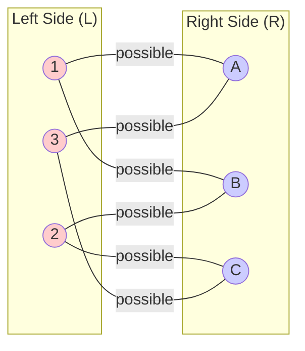
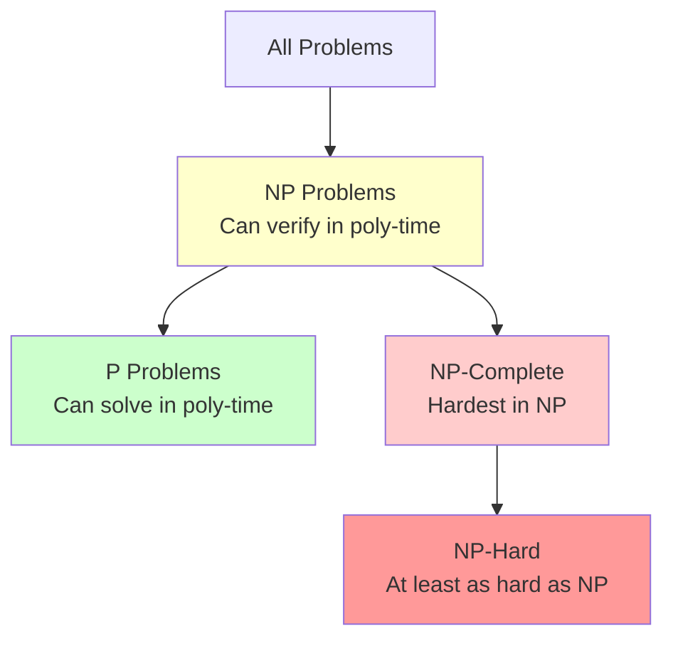
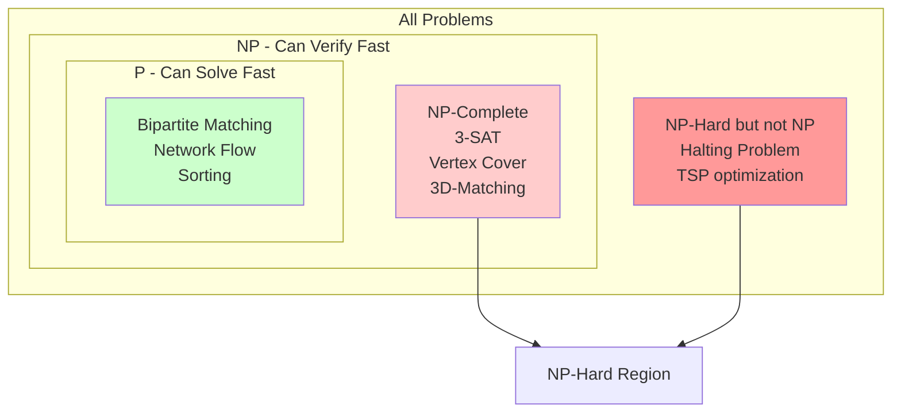
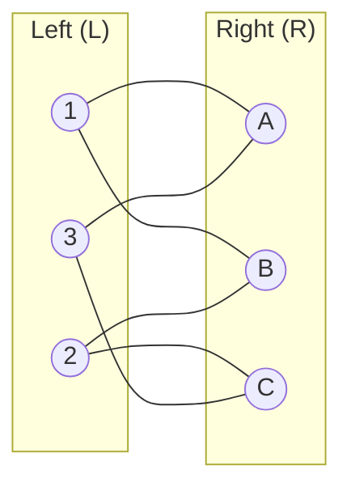
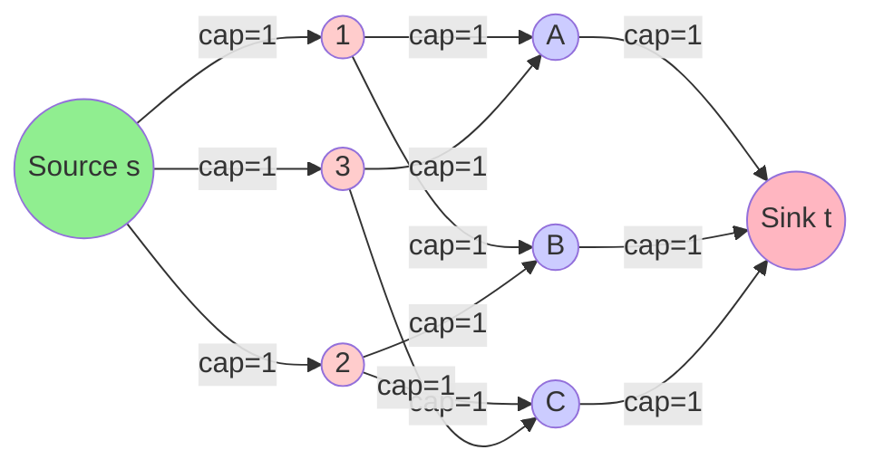
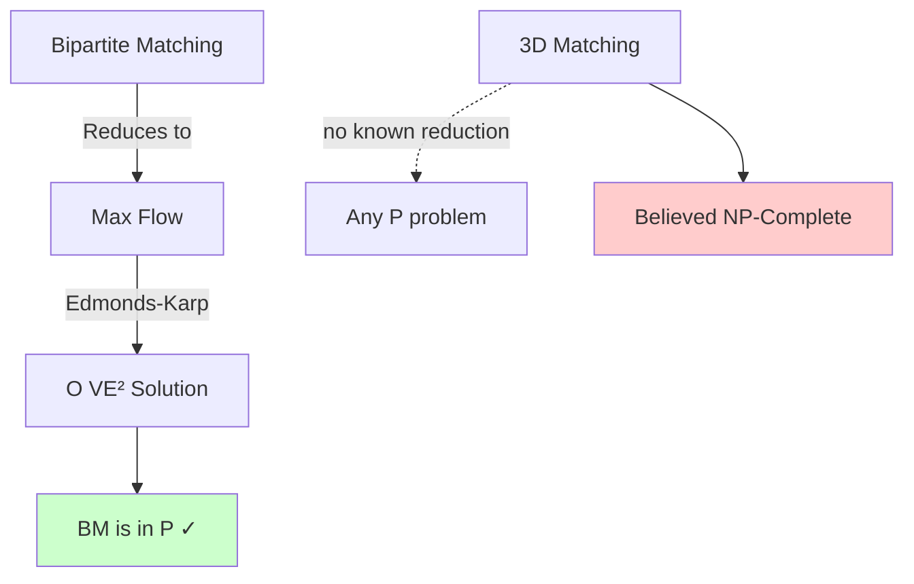
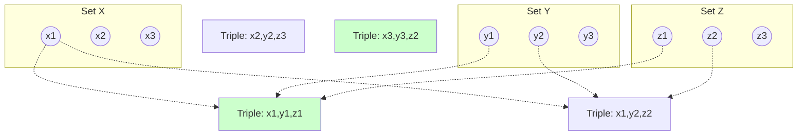
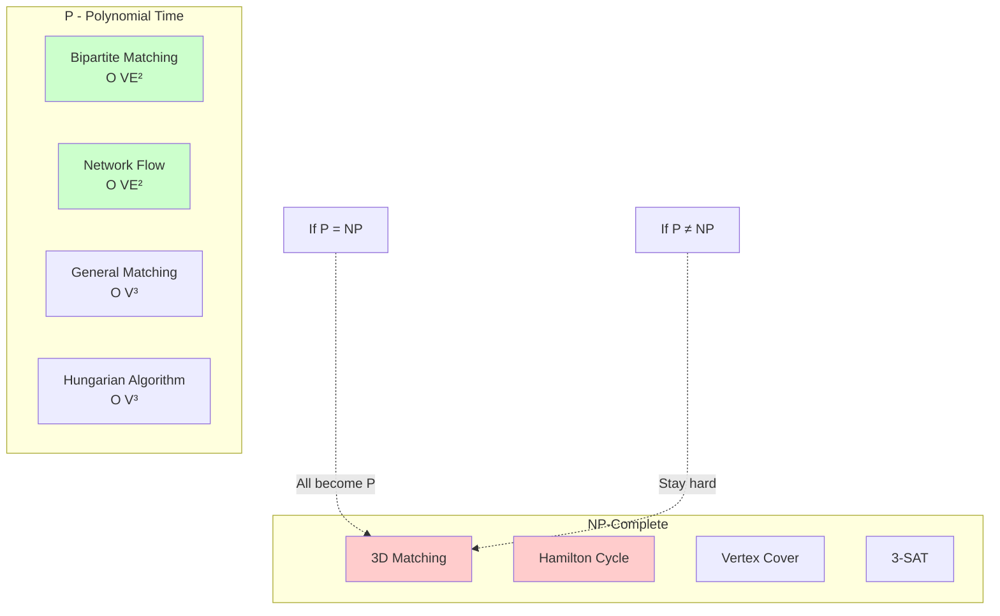
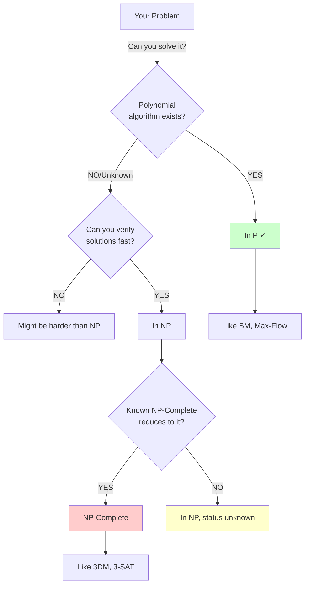

# Deep Dive: Understanding NP-Completeness Through Bipartite Matching

## 🎯 Learning Objectives
- Understand P, NP, NP-Complete, NP-Hard through a concrete example
- Master the Bipartite Matching ≤_p Network Flow reduction
- Learn why BM is in P (NOT NP-Complete)
- Explore related NP-Complete variants
- Understand the difference between polynomial and hard problems

---

## 📚 Table of Contents
1. [The Central Example: Bipartite Matching](#1-the-central-example)
2. [Complexity Class Definitions](#2-complexity-classes)
3. [Bipartite Matching to Network Flow Reduction](#3-the-reduction)
4. [Why Bipartite Matching is in P](#4-why-bm-is-in-p)
5. [NP-Complete Variants of Matching](#5-np-complete-variants)
6. [The Big Picture: P vs NP](#6-the-big-picture)
7. [Practice Problems](#7-practice-problems)

---

## 1. The Central Example: Bipartite Matching

### 📚 **Problem Definition**

**Bipartite Matching (BM):**
- **Input:** Bipartite graph G = (L ∪ R, E) where L and R are disjoint vertex sets
- **Question (Decision):** Does G have a perfect matching? (All vertices matched)
- **Question (Optimization):** What is the maximum matching?

**Matching:** A set of edges M ⊆ E where no two edges share a vertex

**Perfect Matching:** A matching that covers all vertices (|M| = |L| = |R|)

### 📊 **Visual Example**



**One Perfect Matching:** {(1,A), (2,B), (3,C)} or {(1,B), (2,C), (3,A)}

### 🎯 **Real-World Applications**

1. **Job Assignment:** Workers (L) to Tasks (R)
2. **Dating/Marriage:** Men (L) to Women (R) - Hall's Marriage Theorem
3. **Resource Allocation:** Servers (L) to Requests (R)
4. **Course Scheduling:** Students (L) to Time Slots (R)

---

## 2. Complexity Classes: Formal Definitions

### 📚 **Class P (Polynomial Time)**

**Definition:** P = {L | L is decidable in polynomial time by deterministic TM}

**Intuition:** Problems we can **solve efficiently**

**Examples:**
- Sorting: O(n log n)
- Shortest Path (Dijkstra): O(E log V)
- **Bipartite Matching: O(VE)** ✓
- Network Flow (Ford-Fulkerson): O(VE²)

```mermaid
graph TD
    A[Problem in P] --> B[Can SOLVE in O(n^k)]
    B --> C[Examples:<br/>Sort, Search,<br/>Matching, Flow]
    
    style A fill:#ccffcc
    style B fill:#ccffcc
```

### 📚 **Class NP (Nondeterministic Polynomial)**

**Definition:** NP = {L | L has polynomial-time verifier}

**Intuition:** Problems where solutions can be **verified quickly**

**Verifier Perspective:**
```
For problem in NP:
  - Certificate: Proposed solution
  - Verifier: Algorithm that checks certificate in poly-time
  - If solution exists, certificate exists
  - Verifier runs in O(n^k)
```

**Examples:**
- SAT: Certificate = variable assignment, verify in O(n)
- Hamilton Cycle: Certificate = vertex sequence, verify in O(n)
- **Bipartite Matching: Certificate = set of edges, verify in O(E)** ✓

### 🔑 **Key Relationship**

**Theorem:** P ⊆ NP

**Proof:** 
- If we can solve in poly-time, we can verify in poly-time
- Verifier: Just solve the problem, ignore certificate
- Therefore, every P problem is also in NP ✓



### 📚 **NP-Complete**

**Definition:** L is NP-Complete if:
1. **L ∈ NP** (can verify solutions in polynomial time)
2. **L is NP-hard** (every problem in NP reduces to L)

**Practical Definition:** L is NP-Complete if:
1. L ∈ NP
2. Some known NP-Complete problem reduces to L

**Examples:**
- 3-SAT (Cook-Levin theorem - first NP-Complete problem)
- Vertex Cover
- Clique
- Hamilton Cycle
- **3-Dimensional Matching** (BM variant!) ✓

### 📚 **NP-Hard**

**Definition:** L is NP-Hard if:
- Every problem in NP reduces to L
- **Note:** L does NOT need to be in NP!

**Examples:**
- Halting Problem (not even decidable)
- Traveling Salesman Problem (optimization version)
- **General Graph Matching** (on non-bipartite graphs is harder)

### 📊 **Venn Diagram**



---

## 3. The Reduction: Bipartite Matching ≤_p Network Flow

### 🔑 **Why This Reduction Matters**

**Purpose:** Show that if we can solve Network Flow, we can solve Bipartite Matching

**Significance:**
- BM is "easier" than or "equal to" NF in difficulty
- Since NF is in P, BM is in P
- This is an **algorithm design** reduction (not hardness proof)

### 🔧 **The Transformation**

**Given:** Bipartite graph G = (L ∪ R, E)

**Construct:** Flow network G' = (V', E') where:

1. **Vertices:**
   - V' = {s} ∪ L ∪ R ∪ {t}
   - s = source (new vertex)
   - t = sink (new vertex)

2. **Edges:**
   - E' = {(s, l) : l ∈ L} ∪ E ∪ {(r, t) : r ∈ R}
   - All edges directed left-to-right

3. **Capacities:**
   - c(s, l) = 1 for all l ∈ L
   - c(l, r) = 1 for all (l, r) ∈ E
   - c(r, t) = 1 for all r ∈ R

### 📊 **Detailed Visualization**

**Original Bipartite Graph:**



**After Reduction to Network Flow:**



### ✅ **Correctness Proof**

**Claim:** G has a matching of size k ⟺ G' has a flow of value k

**Proof (⇒): Matching of size k → Flow of value k**

Given: Matching M = {(l₁,r₁), (l₂,r₂), ..., (lₖ,rₖ)} in G

Construct flow f in G':
```
For each (lᵢ, rᵢ) ∈ M:
  f(s, lᵢ) = 1
  f(lᵢ, rᵢ) = 1
  f(rᵢ, t) = 1

For all other edges:
  f(e) = 0
```

**Verify f is valid flow:**
1. **Capacity constraints:** f(e) ≤ c(e) = 1 ✓
2. **Flow conservation at l ∈ L:**
   - If l is matched: in-flow = 1 (from s), out-flow = 1 (to matched r) ✓
   - If l is unmatched: in-flow = 0, out-flow = 0 ✓
3. **Flow conservation at r ∈ R:**
   - If r is matched: in-flow = 1 (from matched l), out-flow = 1 (to t) ✓
   - If r is unmatched: in-flow = 0, out-flow = 0 ✓
4. **Flow value:** |f| = k (k edges leaving s with flow 1) ✓

**Proof (⇐): Flow of value k → Matching of size k**

Given: Flow f in G' with value k

Construct matching M:
```
M = {(l, r) ∈ E : f(l, r) = 1}
```

**Verify M is valid matching:**
1. **M ⊆ E:** Only include edges that exist ✓
2. **No vertex appears twice:**
   - For l ∈ L: Flow conservation says Σf(s,l) = Σf(l,r)
     - Since f(s,l) ≤ 1, at most one edge (l,r) can have f(l,r) = 1 ✓
   - For r ∈ R: Flow conservation says Σf(l,r) = Σf(r,t)
     - Since f(r,t) ≤ 1, at most one edge (l,r) can have f(l,r) = 1 ✓
3. **Size:** |f| = k means k units flow from s to t
   - Each unit takes path s → l → r → t
   - Therefore |M| = k ✓

### 💻 **C Implementation**

```c
#include <stdio.h>
#include <stdbool.h>
#include <string.h>

#define MAX_V 200
#define INF 1000000

typedef struct {
    int n_left;   // |L|
    int n_right;  // |R|
    bool adj[MAX_V][MAX_V];  // Bipartite adjacency
} BipartiteGraph;

typedef struct {
    int n;  // Total vertices including s and t
    int capacity[MAX_V][MAX_V];
    int source;
    int sink;
} FlowNetwork;

// Reduce Bipartite Matching to Network Flow
FlowNetwork reduce_BM_to_Flow(BipartiteGraph G) {
    printf("=== Reduction: Bipartite Matching → Network Flow ===\n\n");
    
    FlowNetwork F;
    
    // Setup vertices: {s} ∪ L ∪ R ∪ {t}
    // Indexing: s=0, L={1..n_left}, R={n_left+1..n_left+n_right}, t=n_left+n_right+1
    F.n = G.n_left + G.n_right + 2;
    F.source = 0;
    F.sink = F.n - 1;
    
    printf("Original Bipartite Graph:\n");
    printf("  Left vertices: %d\n", G.n_left);
    printf("  Right vertices: %d\n", G.n_right);
    printf("  Edges: ");
    int edge_count = 0;
    for (int l = 0; l < G.n_left; l++) {
        for (int r = 0; r < G.n_right; r++) {
            if (G.adj[l][r]) {
                printf("(L%d,R%d) ", l+1, r+1);
                edge_count++;
            }
        }
    }
    printf("\n  Total edges: %d\n\n", edge_count);
    
    // Initialize capacity matrix
    memset(F.capacity, 0, sizeof(F.capacity));
    
    printf("Constructing Flow Network:\n");
    
    // Step 1: Add edges from source to left vertices
    printf("\n1. Source to Left vertices (capacity 1):\n");
    for (int l = 0; l < G.n_left; l++) {
        int left_vertex = l + 1;  // Vertices 1..n_left
        F.capacity[F.source][left_vertex] = 1;
        printf("   (s → L%d) capacity = 1\n", l+1);
    }
    
    // Step 2: Add edges from bipartite graph (left to right)
    printf("\n2. Left to Right vertices (capacity 1):\n");
    for (int l = 0; l < G.n_left; l++) {
        for (int r = 0; r < G.n_right; r++) {
            if (G.adj[l][r]) {
                int left_vertex = l + 1;
                int right_vertex = G.n_left + r + 1;
                F.capacity[left_vertex][right_vertex] = 1;
                printf("   (L%d → R%d) capacity = 1\n", l+1, r+1);
            }
        }
    }
    
    // Step 3: Add edges from right vertices to sink
    printf("\n3. Right vertices to Sink (capacity 1):\n");
    for (int r = 0; r < G.n_right; r++) {
        int right_vertex = G.n_left + r + 1;
        F.capacity[right_vertex][F.sink] = 1;
        printf("   (R%d → t) capacity = 1\n", r+1);
    }
    
    printf("\nFlow Network Created:\n");
    printf("  Total vertices: %d (s + %d left + %d right + t)\n", 
           F.n, G.n_left, G.n_right);
    printf("  Source: vertex 0\n");
    printf("  Sink: vertex %d\n", F.sink);
    printf("  All capacities: 1\n");
    
    return F;
}

// Simple BFS for Ford-Fulkerson (finds augmenting path)
bool bfs(FlowNetwork *F, int flow[MAX_V][MAX_V], int parent[MAX_V]) {
    bool visited[MAX_V] = {false};
    int queue[MAX_V], front = 0, rear = 0;
    
    queue[rear++] = F->source;
    visited[F->source] = true;
    parent[F->source] = -1;
    
    while (front < rear) {
        int u = queue[front++];
        
        for (int v = 0; v < F->n; v++) {
            // If not visited and residual capacity exists
            if (!visited[v] && F->capacity[u][v] - flow[u][v] > 0) {
                visited[v] = true;
                parent[v] = u;
                queue[rear++] = v;
                
                if (v == F->sink) {
                    return true;  // Found path to sink
                }
            }
        }
    }
    
    return false;  // No augmenting path
}

// Ford-Fulkerson algorithm (using BFS = Edmonds-Karp)
int max_flow(FlowNetwork *F) {
    int flow[MAX_V][MAX_V] = {0};
    int parent[MAX_V];
    int max_flow_value = 0;
    
    printf("\n=== Computing Maximum Flow (Edmonds-Karp) ===\n");
    
    int iteration = 0;
    while (bfs(F, flow, parent)) {
        iteration++;
        
        // Find minimum residual capacity along path
        int path_flow = INF;
        printf("\nIteration %d: Found augmenting path: ", iteration);
        
        // Print path and find bottleneck
        int path[MAX_V], path_len = 0;
        for (int v = F->sink; v != F->source; v = parent[v]) {
            path[path_len++] = v;
            int u = parent[v];
            int residual = F->capacity[u][v] - flow[u][v];
            if (residual < path_flow) {
                path_flow = residual;
            }
        }
        path[path_len++] = F->source;
        
        // Print path in reverse
        for (int i = path_len - 1; i >= 0; i--) {
            printf("%d", path[i]);
            if (i > 0) printf(" → ");
        }
        printf("\n  Bottleneck capacity: %d\n", path_flow);
        
        // Update flow along path
        for (int v = F->sink; v != F->source; v = parent[v]) {
            int u = parent[v];
            flow[u][v] += path_flow;
            flow[v][u] -= path_flow;  // Reverse edge
        }
        
        max_flow_value += path_flow;
        printf("  Current flow value: %d\n", max_flow_value);
    }
    
    printf("\n=== Maximum Flow Found: %d ===\n", max_flow_value);
    
    // Extract matching from flow
    printf("\nMatching edges (flow = 1 on L→R edges):\n");
    for (int l = 1; l <= F->source + 1 && l < F->sink; l++) {
        for (int r = l + 1; r < F->sink; r++) {
            if (flow[l][r] == 1) {
                printf("  L%d matched to R%d\n", l, r - F->source - 1);
            }
        }
    }
    
    return max_flow_value;
}

int main() {
    // Example: 3x3 bipartite graph
    BipartiteGraph G = {3, 3};
    
    // Define edges
    G.adj[0][0] = true;  // L1 - R1
    G.adj[0][1] = true;  // L1 - R2
    G.adj[1][1] = true;  // L2 - R2
    G.adj[1][2] = true;  // L2 - R3
    G.adj[2][0] = true;  // L3 - R1
    G.adj[2][2] = true;  // L3 - R3
    
    // Reduce to flow network
    FlowNetwork F = reduce_BM_to_Flow(G);
    
    // Solve using max flow
    int matching_size = max_flow(&F);
    
    printf("\n=== Result ===\n");
    printf("Maximum matching size: %d\n", matching_size);
    if (matching_size == G.n_left && matching_size == G.n_right) {
        printf("Perfect matching EXISTS ✓\n");
    } else {
        printf("Perfect matching does NOT exist ✗\n");
    }
    
    printf("\n--- Time Complexity ---\n");
    printf("Reduction: O(V + E) - just copy graph structure\n");
    printf("Max Flow (Edmonds-Karp): O(VE²)\n");
    printf("Total: O(VE²) = POLYNOMIAL\n");
    
    return 0;
}
```

### 📊 **Complexity Analysis**

| Step | Operation | Time Complexity |
|------|-----------|-----------------|
| **1. Construct G'** | Add O(V) vertices and O(E) edges | O(V + E) |
| **2. Set capacities** | Assign 1 to all edges | O(E) |
| **3. Run max-flow** | Ford-Fulkerson with BFS (Edmonds-Karp) | O(VE²) |
| **4. Extract matching** | Check flow on bipartite edges | O(E) |
| **Total** | Dominated by max-flow | **O(VE²)** |

**Conclusion:** Reduction is polynomial ✓

---

## 4. Why Bipartite Matching is in P (NOT NP-Complete)

### ✅ **Bipartite Matching is in P**

**Proof:**

1. **Reduction to Max-Flow:** BM ≤_p Max-Flow (shown above) in O(V+E)
2. **Max-Flow is in P:** Ford-Fulkerson runs in O(VE²)
3. **Composition:** Solve BM by solving Max-Flow
4. **Total time:** O(V+E) + O(VE²) = O(VE²) = polynomial ✓

**Therefore:** BM ∈ P

### 🔑 **Key Insights**

**Why BM is "Easy":**

1. **Bipartite Structure:** Graph splits into two sides
   - No odd cycles
   - Matching can be found greedily in layers

2. **Reduction to Flow:** 
   - Max-flow has efficient algorithms
   - BM inherits this efficiency

3. **Augmenting Path Theorem:**
   - Matching is maximum ⟺ No augmenting path exists
   - Can check this in polynomial time

### 📊 **Comparison Table**

| Problem | Complexity Class | Why? |
|---------|------------------|------|
| **Bipartite Matching** | **P** | Reduces to max-flow (poly-time) |
| **3D Matching** | **NP-Complete** | No known poly algorithm |
| **General Graph Matching** | **P** | Edmonds' blossom algorithm O(V³) |
| **Weighted Matching (Hungarian)** | **P** | O(V³) algorithm exists |

### 🎯 **The P vs NP Distinction**



**Key Difference:**
- **BM:** We found polynomial algorithm (via max-flow)
- **3D-Matching:** No polynomial algorithm known despite decades of research

---

## 5. NP-Complete Variants of Matching

### 📚 **3-Dimensional Matching (3DM) - NP-Complete**

**Problem:**
- **Input:** Three disjoint sets X, Y, Z (each size n), and set T ⊆ X × Y × Z of triples
- **Question:** Does there exist M ⊆ T such that:
  - |M| = n (n triples selected)
  - Each element of X ∪ Y ∪ Z appears in exactly one triple

**Why NP-Complete:**

1. **In NP:** Certificate = set of triples, verify in O(n)
2. **NP-Hard:** Reduction from 3-SAT (Cook's theorem)

### 📊 **Visualization**



**Difference from Bipartite Matching:**
- BM: 2 sets, edges are pairs → **P**
- 3DM: 3 sets, edges are triples → **NP-Complete**

### 🔑 **Why Extra Dimension Matters**

**Bipartite (2D):**
```
Match L to R:
  - Can use alternating paths
  - Flow network models this perfectly
  - Polynomial algorithm exists
```

**3-Dimensional:**
```
Match X to Y to Z:
  - Constraints interact in complex ways
  - No simple flow network reduction
  - Requires trying exponential combinations
```

### 📚 **Other NP-Complete Matching Variants**

#### **1. Hamiltonian Cycle (Special Matching)**

**Problem:** Find cycle visiting each vertex exactly once

**Why NP-Complete:**
- Certificate: Sequence of vertices
- NP-Hard: Classic NP-Complete problem

**Relation to Matching:**
- Hamilton Cycle = Perfect matching + connectivity constraint
- Extra constraint makes it hard!

#### **2. 3-SAT Reduced to Matching**

**Reduction Sketch:**
```
3-SAT formula φ with m clauses, n variables
    ↓
3D-Matching instance:
  - X = variables
  - Y = clauses
  - Z = truth values
  - Triples encode "variable x appears in clause C with value v"
```

---

## 6. The Big Picture: P vs NP Through Matching

### 📊 **Complexity Landscape**



### 🔑 **Key Lessons from Matching Problems**

#### **Lesson 1: Structure Matters**

**Bipartite vs General:**
- **Bipartite:** Two-sided structure → Efficient
- **General:** Can have odd cycles → More complex (but still P!)
- **3D:** Three-way constraints → NP-Complete

#### **Lesson 2: Small Changes, Big Impact**

**Dimension increase:**
- 2D Matching: **P**
- 3D Matching: **NP-Complete**

**Constraint addition:**
- Matching: **P**
- Matching + must form cycle (Hamilton): **NP-Complete**

#### **Lesson 3: Reductions Reveal Relationships**

```
BM ≤_p Max-Flow  →  BM is at most as hard as Max-Flow
                 →  Max-Flow solver → BM solver
                 →  Both in P
```

### 📊 **Decision Tree: Is My Problem Hard?**



---

## 7. Practice Problems

### 🧪 **Problem 1: Prove BM ∈ NP**

**Task:** Show Bipartite Matching is in NP (even though it's in P)

**Solution:**

**Certificate:** Set of edges M
**Verifier:** Check in O(E) time:
1. All edges in M exist in G ✓
2. No two edges share a vertex ✓
3. |M| = n (for perfect matching) ✓

**Conclusion:** BM ∈ NP ✓
**Bonus:** Since BM ∈ P, we have P ⊆ NP ✓

### 🧪 **Problem 2: Why is 3DM hard but BM easy?**

**Analysis:**

**Bipartite Matching (Easy):**
- Two sides create natural "flow" structure
- Augmenting path has simple form: L-R-L-R...
- Can always extend or block in polynomial time

**3D Matching (Hard):**
- Three sets create complex dependencies
- Choosing triple (x,y,z) affects:
  - All triples containing x
  - All triples containing y
  - All triples containing z
- No simple "alternating path" concept
- Must consider global configuration

### 🧪 **Problem 3: Reduce Vertex Cover to BM?**

**Question:** Can we show Vertex Cover ≤_p Bipartite Matching?

**Answer:** **NO!** This would prove VC is in P (since BM is in P)
- But VC is NP-Complete
- If VC ≤_p BM and BM ∈ P → VC ∈ P → P = NP
- Since P ≠ NP (believed), reduction cannot exist

**Lesson:** Reduction direction matters!
- BM ≤_p VC: Possible (doesn't help us)
- VC ≤_p BM: Impossible (unless P = NP)

### 🧪 **Problem 4: Design a Certificate Verifier**

**Problem:** Write verifier for Perfect Bipartite Matching

```c
bool verify_perfect_matching(BipartiteGraph G, EdgeSet M) {
    // Step 1: Check all edges exist
    for each edge (l, r) in M:
        if not G.adj[l][r]:
            return false;  // Edge doesn't exist
    
    // Step 2: Check no vertex appears twice
    bool left_used[MAX_V] = {false};
    bool right_used[MAX_V] = {false};
    
    for each edge (l, r) in M:
        if left_used[l] or right_used[r]:
            return false;  // Vertex used twice
        left_used[l] = true;
        right_used[r] = true;
    
    // Step 3: Check all vertices covered
    if |M| != G.n_left or |M| != G.n_right:
        return false;  // Not perfect
    
    return true;  // Valid perfect matching ✓
}
```

**Time Complexity:** O(|M| + |L| + |R|) = O(V) = Polynomial ✓

---

## 📋 Summary

### 🎯 **Key Takeaways**

1. **Bipartite Matching is in P**
   - Reduces to Max-Flow in polynomial time
   - Can be solved efficiently with O(VE²) algorithm

2. **BM to Flow Reduction**
   - Add source and sink
   - All capacities = 1
   - Max flow value = Maximum matching size

3. **NP-Complete Variants**
   - 3D Matching: Three sets instead of two
   - Hamilton Cycle: Matching with connectivity
   - Small changes make big difference!

4. **P vs NP Insight**
   - P: Can solve fast (BM, Flow)
   - NP: Can verify fast (BM, 3DM, SAT)
   - NP-Complete: Hardest problems in NP (3DM, SAT)

5. **Reduction Direction Matters**
   - BM ≤_p Flow: Shows BM is easy (both in P)
   - VC ≤_p BM: Would show VC is easy (impossible!)

### 📊 **Complexity Hierarchy**

```
P ⊆ NP
  ↓
P: {BM, Flow, Matching, Sorting, ...}
  ↓
NP-Complete: {3DM, 3-SAT, VC, HC, ...}
  ↓
NP-Hard: {Everything in NP-Complete + more}
```

### 🔑 **When to Use BM Reduction**

**Use BM → Flow when:**
- Solving bipartite matching problems
- Need maximum matching size
- Want to leverage existing flow algorithms

**Don't use for:**
- Proving NP-hardness (BM is in P!)
- General graphs (need Edmonds' algorithm)
- More than 2 sets (becomes 3DM)

---

## 📚 References

1. **Cormen, T. H., et al. (2009).** *Introduction to Algorithms* (3rd ed.). MIT Press.
   - Chapter 26: Maximum Flow
   - Chapter 34: NP-Completeness

2. **Kleinberg, J., & Tardos, É. (2005).** *Algorithm Design*. Pearson.
   - Chapter 7: Network Flow
   - Chapter 8: NP and Computational Intractability

3. **Hopcroft, J. E., & Karp, R. M. (1973).** "An n^5/2 algorithm for maximum matchings in bipartite graphs." *SIAM Journal on Computing*.
   - Original efficient bipartite matching algorithm

4. **Karp, R. M. (1972).** "Reducibility among combinatorial problems."
   - Lists 21 NP-Complete problems including 3D Matching

5. **Garey, M. R., & Johnson, D. S. (1979).** *Computers and Intractability*.
   - Comprehensive NP-Completeness reference
   - Proof that 3D Matching is NP-Complete

6. **Edmonds, J. (1965).** "Paths, trees, and flowers." *Canadian Journal of Mathematics*.
   - General graph matching (Blossom algorithm)

---

**Related Chapters:**
- [← Polynomial Time Reductions](01_polynomial_time_reductions.md)
- [← NP-Completeness](02_np_completeness.md)
- [→ Network Flow Algorithms](04_network_flow.md)
- [→ Bipartite Graphs and Matching](05_bipartite_matching.md)
